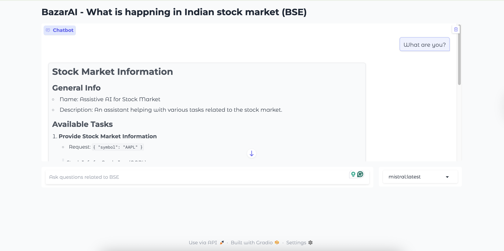

**As always, I am late to the party…**

I wanted to experiment with the agentic capacity of language models. The last time I used an agent was when I built the [RAG from scratch](/blog/google-search-with-llm/). We used a search tool to build, but it was not free (Google serpAPI 🤧), so I did some monkey patching.

Anyway…

## Agents

To get a feel for agentic models, I decided to start with something simple — using a stock market API to fetch real-time (or near real-time) data and let an LLM answer questions about it.

I found a free BSE API with limited features, which was perfect for this experiment.

The plan was straightforward: wrap these APIs using LangChain tools so an LLM could call them. Some newer models are already optimized for tool use, making this setup even easier.

| **Model Name** | **Model Size** | **Notable Properties** | **Typical Use Cases** |
| --- | --- | --- | --- |
| **GPT-4 / GPT-4.5** | ~175B+ parameters | Full multi-tool orchestration, fewest hallucinations | All-purpose agentic workflows, tool-rich assistants |
| **Anthropic Claude 4** | ~100B+ parameters | Strong safety and contextual understanding | Complex agents, sensitive applications |
| **Google Gemini 2.5 Pro** | ~100B+ parameters | Strong Google ecosystem integration and multimodal | Advanced AI workflows with vision & aux tools |
| **DeepSeek V3 / R1** | ~7B - 13B | Fine-tuned for function/tool use, fast inference | Agentic reasoning, code tools, research workflows |
| **Kimi K2** | 1T parameters + MoE | Multilingual, code/tools | Open weights |

For best results, models like Claude and the recent Kimi K2 are great at tool calling. But given my limited storage and budget, I opted for more lightweight, accessible options, Qwen3-1.7B from Hugging Face, and DeepSeek and Mistral via Ollama.

## Tools

<mark>An agent is an LLM that can use external tools or functions we provide. Based on the prompt, it decides which tool to call to get the right answer.</mark>

For instance. I will define a tool below.

```python
from langchain.tools import StructuredTool
...
def get_top_losers() -> dict:
    """
    Gets the List of all top losers of the day. return a list of dict
    inputs:
        _
    outputs:
        top_losers: list[dict]
    """
    return bse.topLosers()

top_losers = StructuredTool.from_function(
    func=get_top_losers,
    name="get_top_losers",
    description="Get top losers of the day",
)
```

***When the users ask what the top losers are for today***, the agent needs to pick the `top_losers`.

`bse.topLosers()` is an API from the BSE library that retrieves the day's top losing stocks. This function is wrapped inside a `StructuredTool` to make it usable by an LLM agent. For best results, include a detailed docstring when defining the tool. This helps the LLM understand the tool’s purpose and select it appropriately during inference.

Similarly, define more tools.

## Langchain

How does the model use the tools?

The model uses tools by calling them based on the prompt and available options. LangChain makes this easy by letting you define tools and build prompt workflows or graphs around them with minimal setup. Even the simplest of models can use the tool with LangChain. It sets up all the system prompts, graphs, enables invoking tools, and handles most things for you.

### Agent

Initilize your agent with tools and choise of your LLM.

```python
# https://python.langchain.com/api_reference/langchain/agents.html
# https://python.langchain.com/api_reference/core/tools.html

from langchain.agents import initialize_agent, AgentType
...

tools = [company_details, company_scrip_code, top_gainers, top_losers] # all tools

agent = initialize_agent(
            self.tools,
            llm,
            agent=AgentType.STRUCTURED_CHAT_ZERO_SHOT_REACT_DESCRIPTION, # https://python.langchain.com/api_reference/langchain/agents/langchain.agents.agent_types.AgentType.html
            verbose=True,
            return_intermediate_steps=True,
            handle_parsing_errors=True,
            memory=self.memory,
        )

return agent
```

### Model

LLM can be anything that supports tool calling. I have used both the Ollama model and the HF models.

```python
# HF model

tokenizer = AutoTokenizer.from_pretrained(model_name, cache_dir="src/models")
model = AutoModelForCausalLM.from_pretrained(
            model_name,
            cache_dir="src/models",
            torch_dtype=torch.float32,
            device_map="cpu")

pipe = pipeline("text-generation",
                model=model,
                tokenizer=tokenizer)

llm = HuggingFacePipeline( pipeline=pipe, pipeline_kwargs={"enable_thinking": True})

# Ollama model

llm = ChatOllama(model=model_name)
```

## UI



This is a simple chat based gradio UI, keeps history of user messages and agent ouput. You can ask question related to BSE, most of the times it crashes 😌, gets the job done for presentation.

Chat system is still not good, memory can be imporoved and chat ability. More compatable models etc. I was trying to add the reasoning the model does in UI but streaming is bit copmlicated to current scope.

link to the full code → [Github](https://github.com/8bitnand/BazaarAI).

%[https://youtu.be/TCwNhwMUE4k]

Stay tuned for the next one.
