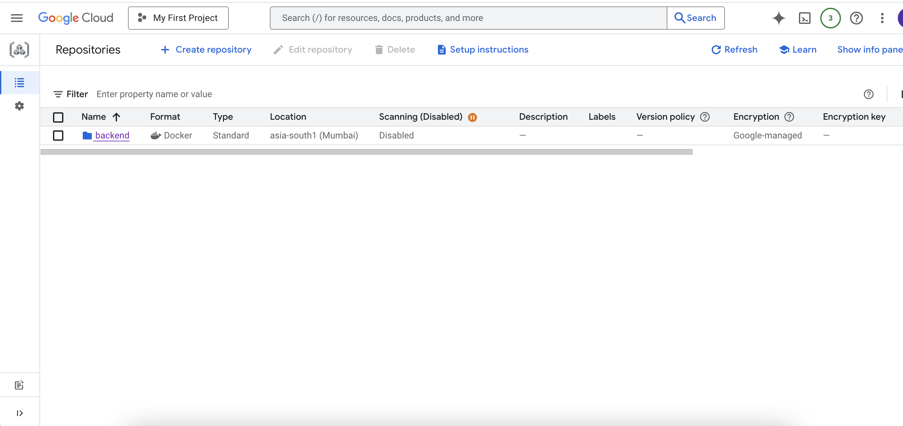
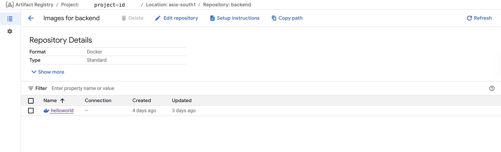
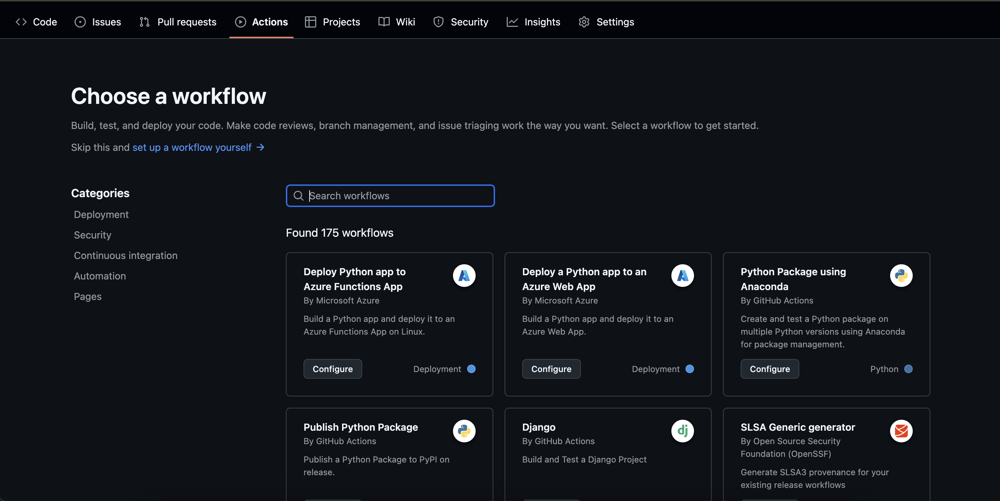
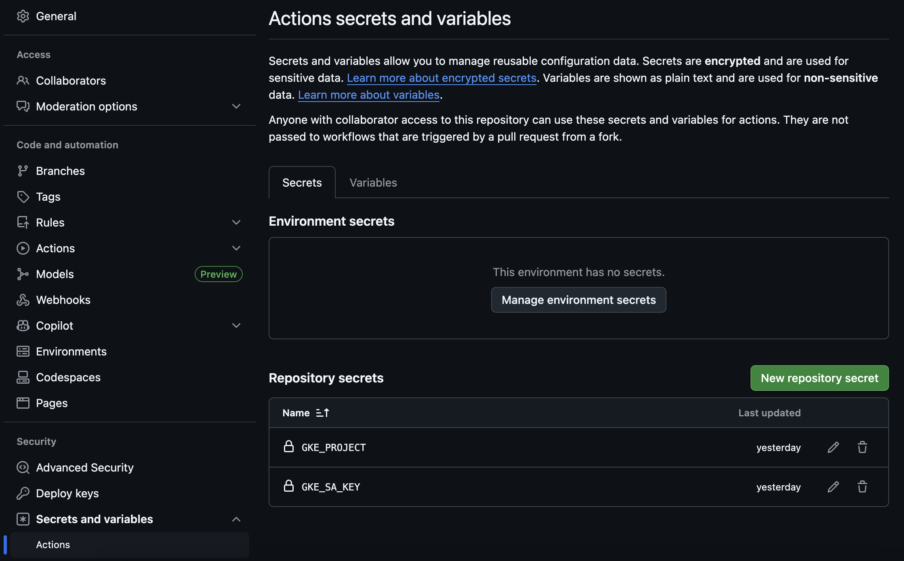
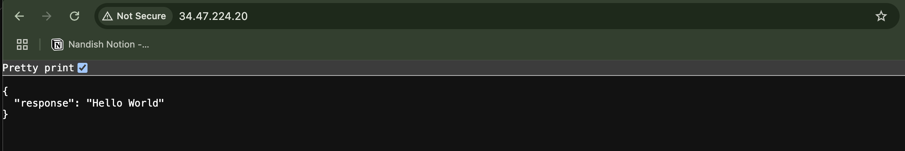
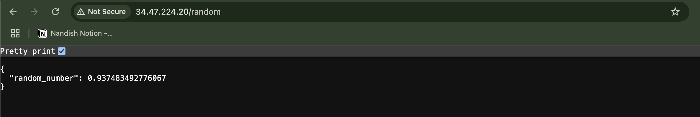
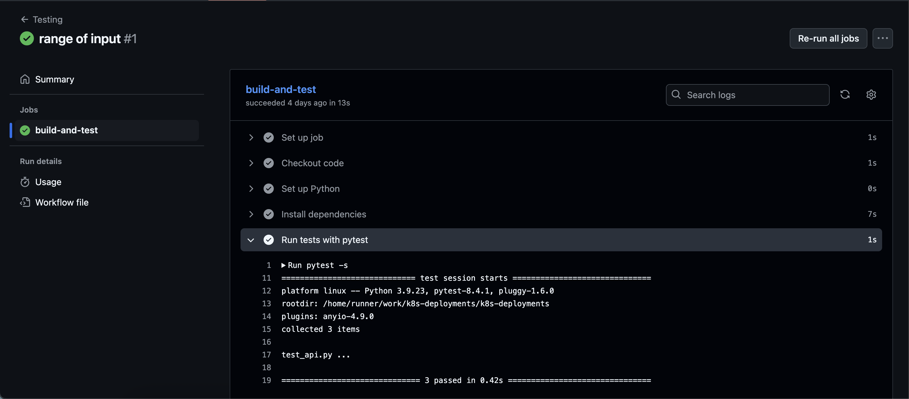

In this era of AI copilots like GPT and Gemini, I decided — for reasons even I don’t fully understand — to build a CI/CD pipeline the old way: just me, Google, and a sea of Stack Overflow tabs. And somewhere between cryptic errors and outdated docs, I rediscovered something I’d forgotten — the raw, frustrating, *fun* of coding. The thrill of chasing a bug for hours, of finally getting something to work after sheer persistence, felt like solving a mystery. It reminded me that while AI makes things faster and easier, it sometimes steals the joy that comes from truly *struggling* and learning the hard way.

Anyways.
The goal was to set up a complete CI CD pipeline with Kubernetes on Google Cloud. Let’s go.

### Google Cloud setup

We need to set up an account first. Fill in your details, and you will get a free $300 credit from Google for the first time usage for 90 days. There you go, I saved you $300. For now, we need

1. [Kubernetes](https://console.cloud.google.com/kubernetes) Engine - For running clusters and hosting

2. [Artifact Registry](https://console.cloud.google.com/artifacts?hl=en&inv=1&invt=Ab1PfA&project=proud-storm-464205-p3) - To store your custom Docker images

3. [IAM & Admin](https://console.cloud.google.com/iam-admin?inv=1&invt=Ab1PUw&project=proud-storm-464205-p3) - For access management


GKE supports both CLI and UI for many tasks, and it is by far the easiest one to get started with compared to AWS EKS or Azure.

Create a cluster first \[[doc](https://cloud.google.com/kubernetes-engine/docs/how-to/creating-a-zonal-cluster#console)\]. I suggest using the UI for this.
Install dependencies like [**gcloud**](https://cloud.google.com/sdk/docs/install) **CLI,** [**kubectl**](https://kubernetes.io/docs/tasks/tools/)

%[https://youtu.be/1NtwPa66_ro]

```powershell
# Set up cluster access in your local environment
gcloud container clusters get-credentials [CLUSTER_NAME] --region [CLUSTER_REGION] \
    --project [PROJECT_NAME]

# Get cluster info
## Using gcloud
gcloud container clusters describe [CLUSTER_NAME] --zone [COMPUTE_ZONE]
## using kubectl
kubectl get cluster
# Output should look like
Kubernetes control plane is running at https:[IP]
GLBCDefaultBackend is running at https://[IP]/api/v1/namespaces/kube-system/services/default-http-backend:http/proxy
KubeDNS is running at https://[IP]/api/v1/namespaces/kube-system/services/kube-dns:dns/proxy
Metrics-server is running at https://[IP]/api/v1/namespaces/kube-system/services/https:metrics-server:/proxy
```

Create namespaces for services, it is not necessary for a simple Hello-world app I’m building, but it is a standard practice to make a separation between services. According to teams. like backend, frontend, and database. According to environments like production, staging and preprod.

```powershell
# kubectl create namespace [NAME]

k8s-deployments % kubectl create namespace backend-prod
k8s-deployments % kubectl get namespaces
NAME                           STATUS   AGE
backend-prod                   Active   24h  # one we created
default                        Active   24h  # others are created by kubernetes
gke-gmp-system                 Active   24h
gke-managed-cim                Active   24h
gke-managed-filestorecsi       Active   24h
gke-managed-parallelstorecsi   Active   24h
gke-managed-system             Active   24h
gke-managed-volumepopulator    Active   24h
gmp-public                     Active   24h
kube-node-lease                Active   24h
kube-public                    Active   24h
kube-system                    Active   24h
```

Now lets create Model Artifact Registry and **create repository** to store your custom Docker images. You can push your models with docker push command later.



### Application

I [created](https://console.cloud.google.com/artifacts?hl=en&inv=1&invt=Ab1PfA&project=proud-storm-464205-p3) a small Hello-world API that returns just that. For now next I’ll add two more functions to showcase CI/CD pipeline and test cases that will be triggered automatically on merge request. Full code can be found [here](https://github.com/8bitnand/k8s-deployments).
Lets first manually do all the steps and then see how we can automate it.
Build docker image for your application. Tag the image and push to registry ([doc](https://cloud.google.com/artifact-registry/docs/docker/pushing-and-pulling)).

```dockerfile
FROM  python:3.9
WORKDIR /app
COPY ./requirements.txt /app/requirements.txt
RUN pip install --no-cache-dir --upgrade -r /app/requirements.txt
COPY . .
CMD ["fastapi", "run", "app.py", "--port", "80", "--host", "0.0.0.0"]
```

```bash
docker build  -t helloworld:latest -f Dockerfile .
# docker tag [SOURCE-IMAGE] [LOCATION]-docker.pkg.dev/[PROJECT-ID]/[REPOSITORY]/[IMAGE]:[TAG]
docker tag helloworld:latest asia-south1-docker.pkg.dev/project-id-123/backend/helloworld:prod
# docker push [LOCATION]-docker.pkg.dev/[PROJECT-ID]/[REPOSITORY]/[IMAGE]:[TAG]
docker push asia-south1-docker.pkg.dev/project-id-123/backend/helloworld:prod
```

You should see something like this in your repo.



Build a deployment yaml. kind: **Deployment** specifies the deployment configs to Kubernetes. While **Service** gives an endpoint or ingress server so we get an external IP to ping the API**.**

```yaml
# deploy-hw.yaml
apiVersion: apps/v1
kind: Deployment
metadata:
  name: backend-1
  namespace: backend-prod

spec:
  replicas: 1
  selector:
    matchLabels:
      app: helloworld
  template:
    metadata:
      labels:
        app: helloworld
    spec:
      containers:
      - name: helloworld
        image: asia-south1-docker.pkg.dev/project-id-123/backend/helloworld:prod
        ports:
        - containerPort: 80
---
apiVersion: v1
kind: Service
metadata:
  name: helloworld-service
  namespace: backend-prod
spec:
  selector:
    app: helloworld
  ports:
    - port: 80
      targetPort: 80
  type: LoadBalancer
```

Lets apply these changes to cluster.

```bash
k8s-deployments % kubectl apply -f deploy-hw.yaml

k8s-deployments % kubectl get pods -n backend-prod
NAME                        READY   STATUS    RESTARTS   AGE
backend-1-ccb7c46f5-ms8rn   1/1     Running   0          35h
(base) nand@Nandish k8s-deployments %
```

This will deploy to the code to clusters in namespace **backend-prod**. Now using this and Github actions lets build CI CD pipelines. Many people have already built these we will use one of them and make changes according to our use case.

### Github Actions

Lets define a workflow that defines what to do when there is a new code added to main folder. This we will be the source of truth or our production code. All the code must me tested before pushing to prod. We will trigger a workflow to as well.



But before we will define some env and secrets variable that are accessed while running the workflows. The Google cloud project id, IEM json values. ***GKE\_PROJECT*** is the project id/name. ***GKE\_SA\_KEY*** is the key from `IAM & Admin / service accounts / keys`. Create a new key. You will get a json file. Add both to **repository secrets.**



Lets use an existing workflow and make changes.

```yaml
# .github/workflows/helloworld-deploy.yml
name: Build and Deploy to GKE
on:
  # on push to main branch
  push:
    branches:
      - main
  # manual trigger
  workflow_dispatch:

# define evn variables
env:
  PROJECT_ID: ${{ secrets.GKE_PROJECT }}
  GKE_CLUSTER: backend-1
  GKE_ZONE: asia-south1   # cluster zone
  IMAGE: helloworld # image name
  IMAGE_TAG: prod # image tag
  GAR_ZONE: asia-south1 # artifact registry zone
  GAR_REPO: backend # artifact registry repository
  NAMESPACE: backend-prod

# define steps to build, push and deploy
jobs:
  setup-build-publish-deploy:
    name: Setup, Build, Publish, and Deploy
    runs-on: ubuntu-latest
    environment: production

    steps:
    - name: Checkout
      uses: actions/checkout@v3

    # Setup gcloud CLI
    - id: 'auth'
      uses: 'google-github-actions/auth@v0'
      with:
        credentials_json: '${{ secrets.GKE_SA_KEY }}'

    # Configure Docker to use the gcloud command-line tool as a credential
    # helper for authentication
    - name: Docker configuration
      run: |-
        gcloud auth print-access-token | docker login -u oauth2accesstoken --password-stdin https://$GAR_ZONE-docker.pkg.dev

    # Get the GKE credentials so we can deploy to the cluster
    - name: Set up GKE credentials
      uses: google-github-actions/get-gke-credentials@v0
      with:
        cluster_name: ${{ env.GKE_CLUSTER }}
        location: ${{ env.GKE_ZONE }}

    # Build the Docker image
    - name: Build
      run: |-
        docker build \
          --tag "$GAR_ZONE-docker.pkg.dev/$PROJECT_ID/$GAR_REPO/$IMAGE:$IMAGE_TAG" \
          --build-arg GITHUB_SHA="$GITHUB_SHA" \
          --build-arg GITHUB_REF="$GITHUB_REF" \
          .
    # Push the Docker image to Google Container Registry
    - name: Publish
      run: |-
        docker push "$GAR_ZONE-docker.pkg.dev/$PROJECT_ID/$GAR_REPO/$IMAGE:$IMAGE_TAG"

    # Deploy the Docker image to the GKE cluster
    - name: Deploy
      run: |-
        kubectl apply -f deploy-hw.yaml
        kubectl get pods -n $NAMESPACE
        kubectl get services -n $NAMESPACE
```

This will build image with latest code → push to artifact → deploy the docker to k8s.

When ever you push or merge the code to main this workflow will begin and deploy latest code to Kubernetes.

%[https://youtu.be/0xXh7-SF60o]

The service will get us a public endpoint where you can send your request.

```bash
k8s-deployments % kubectl get services -n backend-prod
NAME                 TYPE           CLUSTER-IP      EXTERNAL-IP    PORT(S)        AGE
helloworld-service   LoadBalancer   34.118.236.14   34.47.224.20   80:31577/TCP   3d17h
```





Now lets write one more workflow to trigger automated testing when merging to main. For this we need to create a test file with Pytest, you can use any other library otherwise.

```yaml
name:  Testing
on:
  pull_request:
    branches:
      - main
  workflow_dispatch:

jobs:
  build-and-test:
    runs-on: ubuntu-latest # Or a specific runner like 'self-hosted' if needed

    steps:
    - name: Checkout code
      uses: actions/checkout@v4

    - name: Set up Python
      uses: actions/setup-python@v5
      with:
        python-version: '3.9' # Or your desired Python version

    - name: Install dependencies
      run: |
        python -m pip install --upgrade pip
        pip install -r requirements.txt

    - name: Run tests with pytest
      run: |
        pytest -s
```

```python
# test_api.py
from fastapi import FastAPI
from fastapi.testclient import TestClient
from app import app

client = TestClient(app)

def test_read_root():
    response = client.get("/")
    assert response.status_code == 200
    assert response.json() == {"response": "Hello World"}

def test_read_random():
    response = client.get("/random")
    assert response.status_code == 200
    number = response.json()["random_number"]
    assert 0 < number < 1

def test_read_random_with_range():
    response = client.get("/random/100")
    assert response.status_code == 200
    number = response.json()["random_number"]
    assert 0 <= number <= 100
```

Push the workflow to Github. When ever you create a PR or merge request to main branch the test cases will run and it will be merged to main. You can also add conditions like whenever all test cases pass then only merge and then deploy.



There you go. You have a simple and working CI/CD setup for your application.
