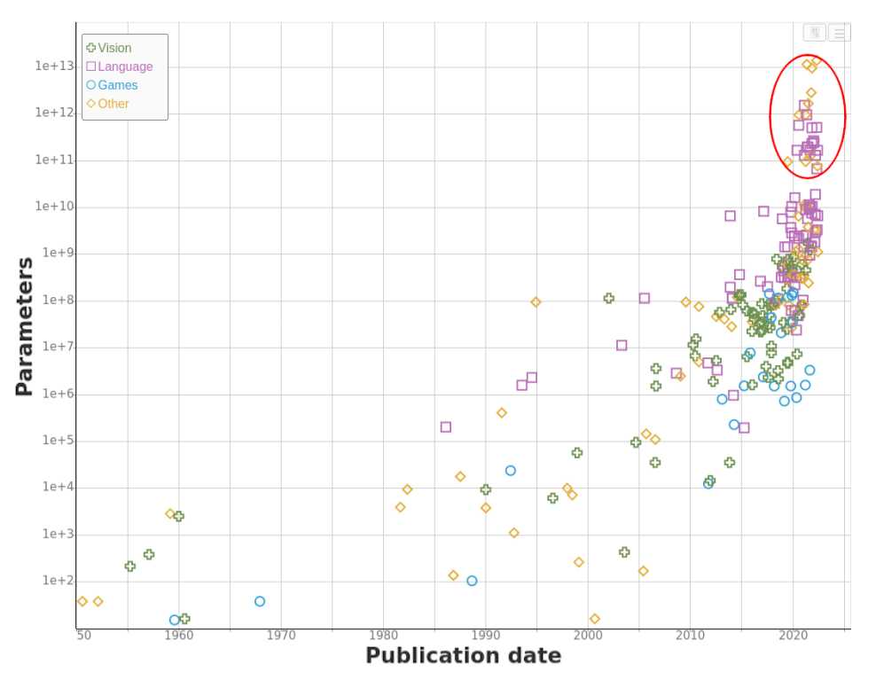

[](https://arxiv.org/pdf/2207.02852.pdf)

Since the inception of the Deep Neural Network, their complexity has been increasing. For a small comparison, look at the table below \[[1](https://paperswithcode.com/sota/image-classification-on-imagenet)\].

<table><tbody><tr><td colspan="1" rowspan="1"><p><strong>Architecture</strong></p></td><td colspan="1" rowspan="1"><p><strong>Model parameters (in Millions)</strong></p></td></tr><tr><td colspan="1" rowspan="1"><p>Alex-Net</p></td><td colspan="1" rowspan="1"><p>60</p></td></tr><tr><td colspan="1" rowspan="1"><p>Basic-L</p></td><td colspan="1" rowspan="1"><p>2440</p></td></tr></tbody></table>

**Alex-Net** was introduced in 2012. The current model with the highest top 1 accuracy on ImageNet is **Basic-L,** with a 40X increase in model complexity. If you look at the current LLMs like GPT-3/4, BERT has billions of parameters. It's all well if you have a GPU like V100 to run the inference. But many do not have that much computation power when it comes to day-to-day use cases. So the ML community has introduced conceptions to get the same performance from smaller and less computationally intensive models. In this series of blogs, I will cover some of them with the code ([Here](https://github.com/8bitnand/Blogs/blob/main/Compression%20of%20DNN/compression_of_NNs_P1.ipynb)) and explanation.

### Pruning

Many SOA architectures depend on over-parametrized models that are hard to deploy and train. These models have more parameters or connections than necessary to achieve a given level of accuracy on a particular task.

Pruning addresses this problem by selectively removing or reducing the number of connections in a neural network. Doing so reduces the number of parameters in the network, making it more compact and efficient.

I used a pre-trained [YOLOP](https://pytorch.org/hub/hustvl_yolop/) model from [Pytorch Hub](https://pytorch.org/hub/) for my experiments. **YOLOP** is trained on [BDD100K](https://www.vis.xyz/bdd100k/) data. I used a subset of this data in colab, which I collected from Kaggle [BDD10K](https://www.kaggle.com/datasets/aadityadamle/bdd10k).

Pytorch provides built-in support for pruning models ([Doc](https://pytorch.org/tutorials/intermediate/pruning_tutorial.html)). You can create custom pruning algorithms by extending `torch.nn.utils.prune` Class. Here I'm going to use the Pytorch built-in methods to prune the **YOLOP** model.

Pytorch provides 3 main types of pruning: 1. Unstructured, 2. Iterative, 3. Global pruning.

If you inspect the YOLOP model with torchinfo's summary, it has a total of 7,940,846 trainable parameters. One conv module (`Conv2d: 3-32`) has about 14% of the total model parameters.

```python
===========================================================================
Layer (type:depth-idx)                             Param #
===========================================================================
MCnet                                              --
├─Sequential: 1-1
     .....
│    └─Conv: 2-8                                   --
│    │    └─Conv2d: 3-32                           1,179,648
│    │    └─BatchNorm2d: 3-33                      1024
│    │    └─Hardswish: 3-34                        --
     .....
===========================================================================
Total params: 7,940,846
Trainable params: 7,940,846
Non-trainable params: 0
===========================================================================
```

#UnstructuredPruning

Let's see if pruning this module results in any better performance, without loss of accuracy.

| Model layer | % of pruning | Time (Sec) |
| --- | --- | --- |
| Base model | 0.0 | 0.564 |
| model.7.conv | 0.2 | 0.562 |
| model.7.conv | 0.5 | 0.561 |

```python
import torch
import torch.nn.utils.prune as prune
# code ...
yolop = torch.hub.load('hustvl/yolop', 'yolop', pretrained=True)
# more code ...
# randomly prune 50% of weights of layer yolop.model.7.conv
prune.random_unstructured(yolop.model[7].conv , name="weight", amount=0.5)
```

On pruning the layer `"yolop.model.7.conv"` weights, I got variable time running inference on a single image. It did not make any significant difference running on a single image in colab CPU. But model trainable parameters changed as,

```python
# at 50 % pruning
===========================================================================
Layer (type:depth-idx)                                 Param #
===========================================================================
MCnet                                                  --
├─Sequential: 1-1
            .....
│    │    └─Conv: 2-8                                  --
│    │        └─Conv2d: 3-32                           589,824
│    │        └─BatchNorm2d: 3-33                      1024
│    │        └─Hardswish: 3-34                        --
           ......
===========================================================================
Total params: 7,351,022
Trainable params: 7,351,022
Non-trainable params: 0
===========================================================================
```

Change in weight distribution after pruning

[](https://images.pexels.com/photos/16409415/pexels-photo-16409415.png?auto=compress&cs=tinysrgb&w=1260&h=750&dpr=2)

From the above graphs, it's evident that 20% and 50% of the weights were pushed to zero. As the model was trained on BDD data, I tested some images at random with the base model and pruned model and the output was unaltered to the human (My) eye.

#GlobalPruning

Let's go back to the summary of the model and check what are the layers with more than half a million (500,000) parameters.

These layers had more than half a million parameters

```markdown
model.7.conv.weight
model.8.cv2.conv.weight
model.9.m.0.cv2.conv.weight
model.21.conv.weight
model.23.m.0.cv2.conv.weight
```

We will prune these layers at random so that the combined sparsity or reduction in parameters in all the parameters we filter will be 40%.

```python
parameters_to_prune = (
    (yolop.model[7].conv, "weight"),
    (yolop.model[8].cv2.conv, "weight"),
    (yolop.model[9].m[0].cv2.conv, "weight"),
    (yolop.model[21].conv, "weight"),
    (yolop.model[23].m[0].cv2.conv, "weight" )
    )

prune.global_unstructured(
    parameters_to_prune,
    pruning_method=prune.L1Unstructured,
    amount=0.4,
)
```

Change in weight distribution after global pruning


Again, the output was not that affected. I did not try recording the accuracy on batches of images. It would be a better measure to tell if there was any change in the final model accuracy. But again, pruning acts as (kind of) a regularization method, like a dropout. Once you retrain/fine-tune the model, it would gain back some accuracy if it had lost any in the pruning process.

[Pytorch](https://pytorch.org/tutorials/intermediate/pruning_tutorial.html#pruning-a-module) documentation says pruning does not delete the weights, It generates a mask on weights that are pruned and saves the weights as 'weight\_orig' in the state\_dict. During the forward pass, pruning is applied to each weight with pytorch's \_**forward\_pre\_hook.** If you inspect any module to which we applied pruning, you can see the `torch.nn.utils.prune.CustomFromMask` object is used for pruning before the forward function is run.

```python
print(yolop.model[7].conv._forward_pre_hooks)
>>> OrderedDict([(0, <torch.nn.utils.prune.CustomFromMask object at 0x7f01de332fd0>)])
```

One thing I noticed is that an additional weight matrix to store masks adds unnecessary storage space. It's a compromise on if you need fast inference or save memory.

Observe the shift in the weight distribution after unstructured pruning and global pruning. There are no weights near the vicinity of zero with global pruning, but not in the case of unstructured pruning.
