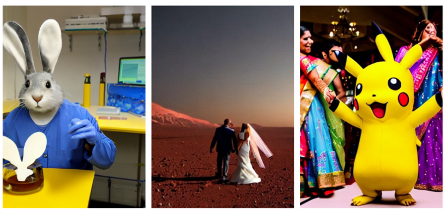
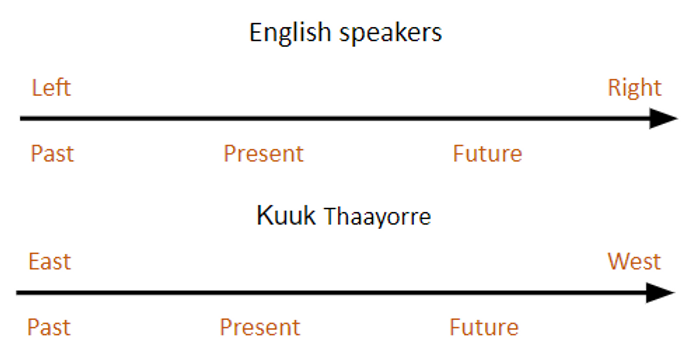
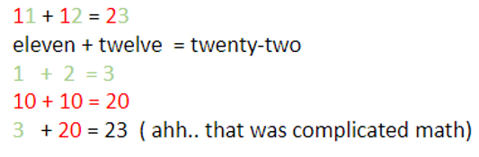

If you are reading this, you probably know one or more language. Language is this awesome tool that facilitates exchange of ideas, thoughts. In fact, let me put a couple of bizarre English sentences before you and see what you think.

## Think about an Indian wedding where a pikachu is dancing

or a wedding on mars.

or professional rabbit working in a lab.

Many pictures and thoughts might pass your intellect other than the one shown. Wonder whose cognition imagined those? They were imagined by machine or shall say a computer.

Coming back to our topic. Did those English sentences make you think or imagine something?

What if I say, for someone who's not an English speaker, the same sentence trigger completely different thoughts? Yes. But not these exact sentences.

Studies from researches show that a scene shown to different audience who speak different language describe the event differently, remembers different aspects of the event and trigger different parts of the brain altogether.

As is widely known that birds are magnificent at navigation without google maps, of course. But can a human being be able to navigate to such accuracy? Let's do a test. Try pointing out at north-east or east at least (without your phone!). Did you find the northeast? I know it might be hard if you are not used to it.

But there is a community found by researches (Lera Boroditsky and et al.) called "Kuuk Thaayorre". They are capable of navigating the woods without any maps. They even communicate with language and words like north-west, east. Instead of using words like left and right. Their culture trains them to keep track of direction with such accuracy. Their language is such that their thought process have changed to inculcate accurate information of direction.

The thought related to the frame of reference of time is one more thing which is influenced by language. As most of us think and relate time flow as a past-present-future, or as left to right

But for the community, the time frame is locked on the landscape. They do not use words like left and rights. For them, the time goes from east to east. It's a dramatically different way of thinking about time.

Another real cool result from the study is the way of storing information about events.

People who speak different languages will pay attention to different things, depending on what their language usually requires them to do. In English, we say things like "he/she did it" if it were an event of an accident. But in languages like Spanish, Kannada, people are not likely to remember who caused the accident, but remember that the event was an accident. They're more likely to remember the intention. So, two people watch the same event, witness the same crime, but end up remembering different things about that event.

Asians are good at math. You might have heard this frace often. Especially Chinese, because their language makes it easy to represent numbers.

But in Chinese, their language or representation of numbers makes it easier to do calculations. Here 11 (eleven) is represented as ten-one, 12 (twelve) as ten-two, 23 (twenty-three) which is a sum of 11 and 12 as two-tens-three. Their language already made half of the calculations easy, converting from numbers to English.

We saw that language plays a prominent role in how we think, influences our thoughts. How does the language/s you speak influence the way you think?

All the info was sourced from the researcher, Lera Boroditsky. YouTube.
