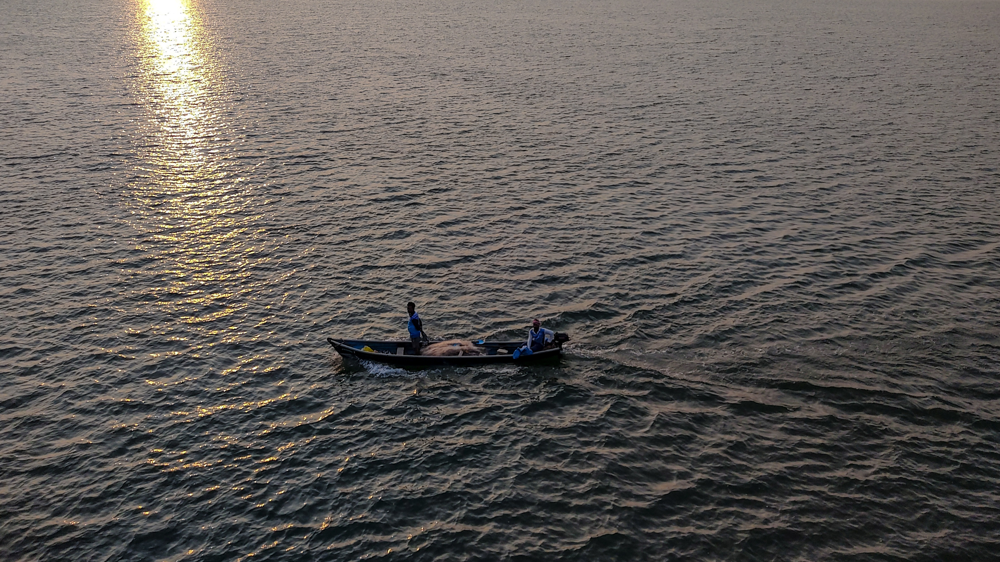
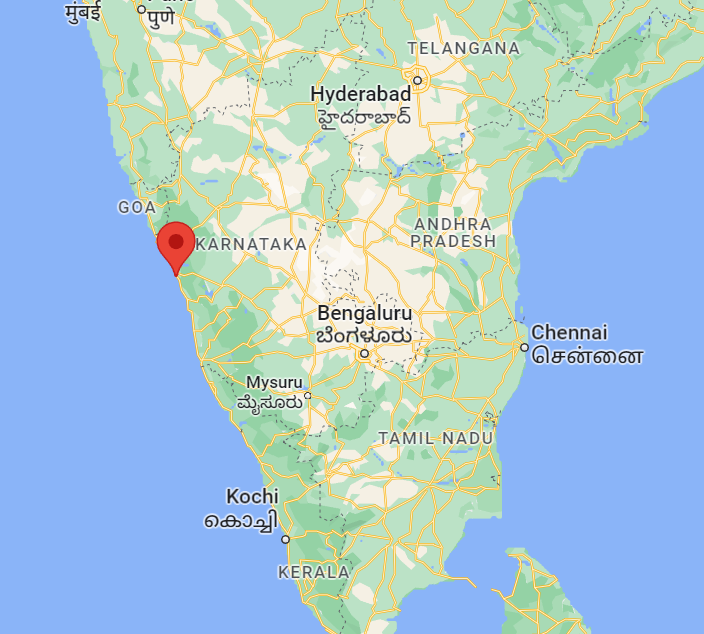

## #Honnavara #YEAR2023

On the new year's eve, our plan to celebrate 2023 had begun. Unsure of where to go or what to do, we scrambled all the information on the internet for a destination. We left from Hubli at around 7 pm.

But 12 hours ago I was on a bus, shivering from the chilly breeze coming through the windows. I was going to Belagavi from Home town to meet my friends and celebrate 2023.

We left for Hubli at around 12 pm. Met my friends in Hubli and we hung out and roasted each other. But no one has the answer to the big question. Where do we go? We had a car and fuel in it, but no idea of where to go or what to do. The search continues for the destination. Where had we not been in the nearby places? in the last 4+2 years of engineering.

What better place could there be, to celebrate new year other than a beach?. It's decided then. We had already been to Gokarna, so the place left for us to be was Honnavar.

Our car left for Honnavar, planning on the go, for stay and food. We took a break and it was 12:00,"Happy new year". We had fun, and the drive continued.

Honnavar is the destination for many people who want to celebrate the new year, many of whom have planned it weeks before. We were out there trying to get a room for us at 1 am. Finally! We were at the destination.

The night sky is truly a spectacle of the beach. I could feel the icy breeze. The moon was hiding somewhere in the night sky above the sea, which felt like a canvas of bright twinkling stars and a deep velvet blackness. Which I have been dying to see once again. The sound of the waves crashing against the shore is a soothing background melody. Not a soul nearby. It's delight witnessing all wonders at once.

It was almost 6 in the morning. I glanced around, no sign of the sunlight. I was waiting for the rise of the first shine of the year 2023, to capture the sunrise over the river Sharavati which merges into the Arabian sea. (pin location 14°16'27.3"N 74°26'33.2"E). There was still time left for the sunrise. So I waited.

The sun continued to rise, and the colors of the sky changed. The river was slowly coming to life, boats were getting ready and people started fishing. But the city behind me was slowly waking up, the sound of cars and people becoming louder. But here, near the river, it's still peaceful. We took pictures and left to visit the beach.

I had felt the sea yesterday, but as I stood in front of it, the same sea now appeared different. The place which felt peaceful, scary and haunted last night somehow felt welcoming us. Waves crash against the shore with a roar. The sound is both mesmerizing and intimidating. The sun shines through the water as if it's going to dive out from the sea anytime.

We moved to see another beach, expecting to see estuary, a place where river melts into the sea. On one side, waves of sea hitting the land and on the other end the river. But nature had a different plan. It was not what I expected. And I was like "okay, some other time".

It was time for us to return. Traveling through the western ghats of India is an experience in itself. Everywhere you look, it's green. The curves of the road are as intimidating at night as they are mesmerizing in the morning. As I sat in the car, watching the sea, trees and the road recede, I couldn't help but feel a sense of sadness that my journey was coming to an end. But there is still so much more to explore and witness to all that nature has to offer.

Thanks to my friends who survived my tortures and presence throughout the journey. Accompanied me on a memorable journey of the year.

Rise of the first shine of the year.
