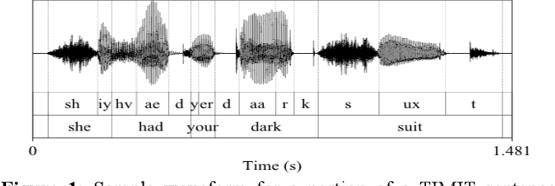

I recently needed to work with the audio alignment problem. The most prominent candidates for the task were MFA and NeMo from Nvidia. Both have extensive documentation to follow. So why not another for tasks that are custom. This post will be a tutorial kind on MFA. If you just want the main part jump to main part 😁.

What is Force alignment?

Force alignment is a process that synchronizes text with corresponding audio. It involves matching specific segments of a text transcript to the corresponding time intervals within an audio recording. Extensively used in audio engineering. If you want the entire working behind, check this out.

Now you saw the above image, you can imagine all the tasks this can be used. For instance, tag a part of audio, lip syncing, etc.

In audio ML, we need it for Subtitle generation (Speech to text), Text to audio generation. In all the cases, we need a model that has been trained on pair of audio and the text that the audio says. This is where systems like MFA and NeMo come into the picture. These guys have archive of so many models for all of your tasks you can pick any models from here.

## Main Part

Most of this part is influenced by this tutorial and my trial and error.

Let's see how we can use a plethora of dictionaries, G2P models, acoustic models. Each acoustic model is used to generate alignment files. These files are stored as .TextGrid files. These models use the g2p models to convert English text to phonemes. These g2p models use the dictionaries to save the phonemes for each word of that language.

These models have been trained on a vast amount of data. Let's check out to use each one of these.

## Before getting started,

Install mfa (I prefer Conda but if anything I suggest is go with the docker) Check what kind of method is suitable for your problem. Here are all available ways to use the mfa.

## Acoustic model

Let's consider use case 1 for now. Which means you have a model that is already trained on the task you want. Here I want to get alignments of my audio with ARPABET symbols. They offer a pre-trained model for this task, the english_us_arpa model that can generate alignments of audio into ARPABET symbols. If it has an acoustic model, it will have all the dependencies.

## Steps - doc

## Download the models and dictionary

## mfa model download acoustic english_us_arpa mfa model download dictionary english_us_arpa

## Make sure that the dataset is in the proper format for MFA

## mfa validate ~/mfa_data/my_corpus english_us_arpa english_us_arpa

~/mfa_data/my_corpus dir is where all your audio and text are stored.

The dir structure matters if there are multiple speakers. The duration might be different for the same text but for a different person. recording1.txt is the transcript for recording1.wav audio file. I have not checked if formats other than .wav work or not but for transcript I used .txt, even .lab format works.

+-- ~/mfa_data/my_corpus/ | +-- speaker1 | --- recording1.wav | --- recording1.txt | --- recording2.wav | --- recording2.txt | +-- speaker2 | --- recording3.wav | --- recording3.txt | --- ...

If your audio is stored in multiple folders for any reason, run the alignment command for each folder individually. There are more customizations you can check here.

Once you’ve validated the data, we can align it via the mfa align command, doc.

mfa align ~/mfa_data/my_corpus english_us_arpa english_us_arpa ~/mfa_data/my_corpus_aligned

If you have multiple folders in ~/mfa_data/my_corpus but each folder is having the audio from the same speaker, sometimes you might get some error in running above command. Try this.

mfa align ~/mfa_data/my_corpus/folder_1 english_us_arpa english_us_arpa ~/mfa_data/my_corpus_aligned_folder_1 mfa align ~/mfa_data/my_corpus/folder_2 english_us_arpa english_us_arpa ~/mfa_data/my_corpus_aligned_folder_2

## english_us_arpa (1 arg): path to the dictionary you download

## english_us_arpa (2 arg): path to the acoustic model

~/mfa_data/my_corpus_aligned: output dir of aligned text grid files.

If you wish to use the default dictionary and model that you have downloaded, just specify the name, mfa will load from default dir where is has stored (~/Documents/mfa).

## Dictonaries

There are multiple dictionaries available in the archive. Let's check what is inside a dictionary.

... abolitionists AE2 B AH0 L IH1 SH AH0 N AH0 S abolitionists AE2 B AH0 L IH1 SH AH0 N AH0 S T S abominable AH0 B AA1 M AH0 N AH0 B AH0 L abominably AH0 B AA1 M AH0 N AH0 B L IY0 abominably AH0 B AA1 M N AH0 B L IY0 abominate AH0 B AA1 M AH0 N EY2 T ...

It's just collections of all words and their phoneme representations.

Let's say in the validation step, you found some words that are not found in the dictionary (OOV), you can generate them using a g2p model. This is our use case 5.

First, you’ll need the pre-trained G2P model. These are installed via the mfa model download command:

## mfa model download g2p english_us_arpa

Run the model to generate phonemes for OOV.

## mfa g2p ~/mfa_data/my_corpus english_us_arpa ~/mfa_data/new_dictionary.txt

## english_us_arpa: path to the g2p model

## ~/mfa_data/new_dictionary.txt: path to the new dictionary

you can run the validation step with the new dictionary once to make sure everything is good. From here, you can use this dictionary file as input to the alignment model

mfa align ~/mfa_data/my_corpus ~/mfa_data/new_dictionary.txt english_us_arpa ~/mfa_data/my_corpus_aligned

## Training your custom acoustic model

Say you have to train a custom model that is not in the archive (less likely to happen). use case 4. Here is what you need to do.

Prepare your training corpus and dictionary beforehand. If you do not have a dictionary, generate it with the g2p model. Described above. Make sure that the dataset and the new dictionary are in the proper format for MFA.

## mfa validate ~/mfa_data/my_corpus ~/mfa_data/my_dictionary.txt

## train the model from

mfa train ~/mfa_data/my_corpus ~/mfa_data/my_dictionary.txt ~/mfa_data/new_acoustic_model.zip \ —-output_directory ~/mfa_data/my_corpus_aligned

The above command trains the acoustic model, which involves multiple models doc.

## TrainableAligner([training_configuration, ...]) Train acoustic model

MonophoneTrainer([subset, ...]) Configuration class for monophone training TriphoneTrainer([subset, num_iterations, ...]) Triphone trainer LdaTrainer([subset, num_leaves, ...]) Triphone trainer SatTrainer([subset, num_leaves, ...]) Speaker adapted trainer (SAT), inherits from TriphoneTrainer PronunciationProbabilityTrainer([...]) Class for training pronunciation probabilities based off of alignment pronunciations

The problem you face is. If the dataset is too big, the training time will be way high, as there was no way to use GPUs to accelerate the training process. So I suggest using NeMo if you find yourself using this use case. About which I will discuss in another post. Stay tuned.

## #Tutorial #MFA #Howto #Note
