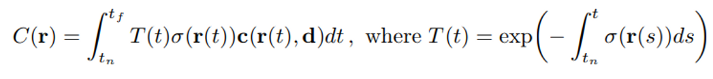
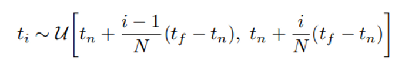
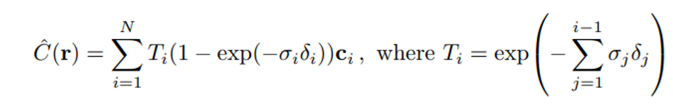
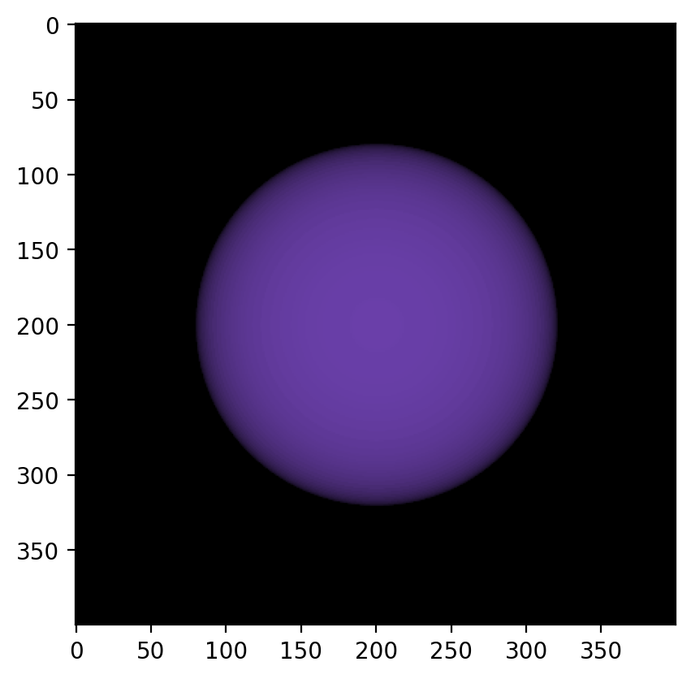

I was going through NeRF (Neural radiance Fields) related topics, and interestingly the basics are pretty neat to visualize due to their 3D nature. It reminded me of things I learned in PUC about vectors, lenses, calculus, and the properties of light. I always wondered why am I learning these and who would even use these in the real world. Well, now I know 😶.

I will not go through the entire NeRF concept, just the things that are easy and fun (or possible) to visualize.

NeRFs are based on the idea of ray tracing. Ray tracing is a method for rendering 3D scenes by tracing rays from the camera to the scene and calculating the color of each ray intersection.

NeRFs use a different type of rendering method called volumetric rendering to render the 3D scene from the neural network's predictions. The neural network predicts the color and brightness of the scene at any point in space. This data is then used to render the scene using volumetric rendering.

Here is an Interactive demo for the basics of volumetric rendering with a radiance field.

## Note: If using mobile, Turn on desktop mode

The exact equation is.

Let's see what the equation describes. You can refer to the paper for proper understanding. Go to the interactive demo for more visualization.

We shoot a ray r, from an origin point (O(0,0,0). This is our screen or camera) along a direction vector (which is a unit vector) and collects infinite points in space at each small interval of distance dt (I have seen many use t for time interval as well).

From these points, we collect the color value C and the intensity/opacity σ of the color. C*σ will give us the total color contribution of the point. We collect many such points per ray from an initial point tn to the final distance tf to get the accumulated color value for one pixel. Assume we sample 100 points per ray and our image size is 512x512, so the total number of pixels would be 2,62,144 and that many rays.

We're looking at 2,62,14,400 calculations for C*σ.

2e6 multiplication operation for rendering one image. You can imagine how much resource it could take for a high-quality 1080P image with more than 100 points to sample.

## So the paper suggests a simple approximation

This equation simply put divides the integral area to be calculated into smaller rectangular chunks and adds the areas of the chunks to get the area under the curve as an approximation (more info).

The paper suggests that - Although we use a discrete set of samples to estimate the integral, stratified sampling enables us to represent a continuous scene representation because it results in the MLP being evaluated at continuous positions over the course of optimization.

Even after sampling a finite number of points in space instead of sampling all points along the ray, we get a continuous representation. That is because, when the ML model runs for N number of epochs, it behaves as a continuous selection of points from the line according to selection criteria from the equation for ti.

Refer to the interactive plot for reference, I have depicted 2 rays emerging from the screen. But there will be as many rays as there are pixels. Each ray collects the pixel value for its emitted pixel position.

In the code, we consider only those points that are inside the sphere and get the density and color values of the points.

## cond =(x[:, 0]-c[0])**2 + (x[:,1]-c[1])**2 + (x[:,2]-c[2])**2 <= r**2

"x" is the point to be checked - if it is inside or outside the sphere (colored with green in the demo), "c" is the center of the sphere and "r" is the radius of the sphere. Here is the rendering of the sphere with the above calculations. A sphere model with RGB values of 137, 77, 205.

If the ray does not hit or intersect with any points of the sphere, we consider it as infinity or as background.

There is still one thing in the equation called accumulated transmittance. The function T(t) denotes the accumulated transmittance along the ray from tn to t, i.e., the probability that the ray travels from tn to t without hitting any other particle. Which says if the light hitting the object is coming from the light source or bounced from another object nearby.

As we continue to explore the potential of NeRF and its applications in fields like computer graphics, virtual reality, and even filmmaking, we open up new possibilities for creating lifelike digital worlds and pushing the boundaries of visual storytelling.
