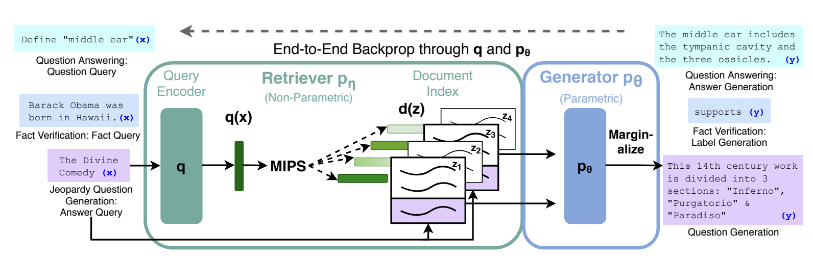
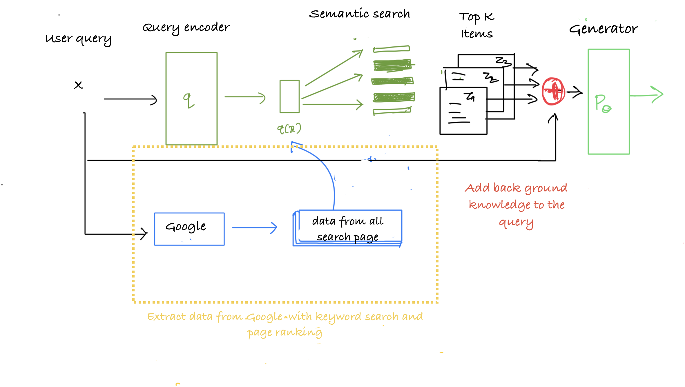
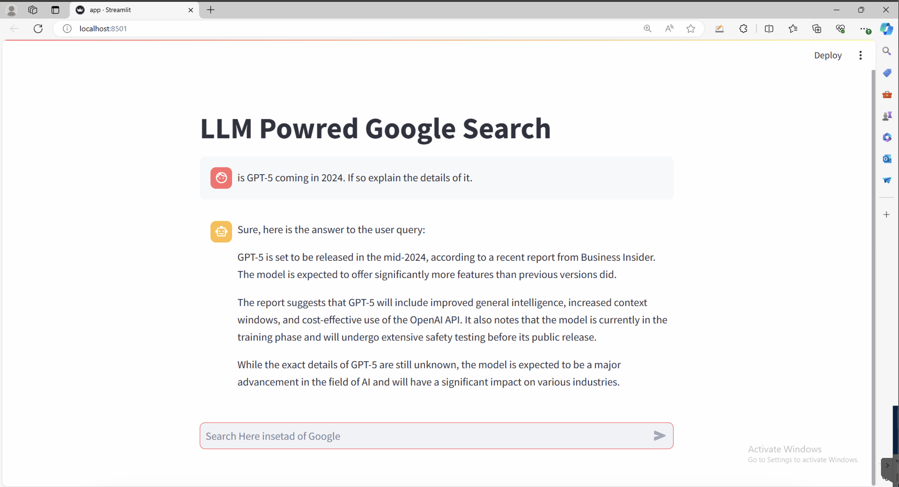

Recently in the world of Large Language Models like GPT, Gemini we have been hearing a word called [Hallucination](https://www.iguazio.com/glossary/llm-hallucination/). It refers to a state where the LLM starts generating output that is factually incorrect. To solve this problem, the ML community invented a method called RAG ([**Retrieval-Augmented Generation**](https://arxiv.org/abs/2005.11401)**)**.

RAG uses a simple technique to append the knowledge of the user query to the prompt, which is fed to the model. Think it like an open book exam. We provide the model with the background knowledge about the users query; the model looks this knowledge to answer the answer. This knowledge can come from anywhere. For instance any PDF, a document or even the internet. Yeha even from google. <mark>The chat LLMs that asks a premium for accessing internet can be done for free.</mark> It will be lot verse than the premium options in terms of speed and accuracy but it will be better than nothing.

So using the RAG method let's build a AI powered search engine.

Enough of background knowledge, let's get technical.

The above figure is the main architecture of the RAG model.

> Overview of our approach. We combine a pre-trained retriever (Query Encoder + Document Index) with a pre-trained seq2seq model (Generator) and fine-tune end-to-end. For query x, we use Maximum Inner Product Search (MIPS) to find the top-K documents zi. For final prediction y, we treat z as a latent variable and marginalize over seq2seq predictions given different documents.

But for our project we are going to make some changes to the architecture

Our document comes from google itself. When a user asks any question, it is directed to the Google, then we extract all the links from the search results for all data except the ads (off course). We need to extract the top K relevant items from the data to feed to the model as context. The Google search already returns the pages ranked according to the page ranking algorithm based on keyword matching and other metadata. But there is still so much irrelevant text in the data we got from the pages. Just for filtering we will re-rank the pages' data. But before we need to break the pages into smaller sentences (with minimum **n** words per sentence chunk), so that it will be easier to encode.

We encode the User Query and the chunks of data with the same model. In our case a [sentence transformer](https://huggingface.co/sentence-transformers)s. These encoded chunks are then used to make a semantic search (cosine similarity) with the user prompt to get the top k items. The top K items are then append as context to the user query with some prompt engineering that will be given as input to the generator model. The generator model I used here is a Googles [Gemma-7b-it](https://huggingface.co/google/gemma-7b-it). It's already an instruction fine-tuned model. It's a pretty great model does outputs a great outputs for the most part. When paired with the RAG approach it performs really well for a 7 billion parameter model.

One main difference between the paper and our approach is the end to end backpropagation. We just use the model in inference mode. The application is a little unstable when there is a large chunk of data to be encoded and stored in GPU. Below are some results of the Streamlit UI and model outputs.

And again you can query the most recent events, not just limited by the LLMs training data and the date when the model was trained. But the Output still feels more generic than a curated for a specific purpose. Maybe I'm expecting more from a 7b model 🙂.

The entire app runs ridiculously slow. The searching in Google and the model inference takes time. If you don't want the hassle of writing things from scratch, you can experiment with [langchain.agent](https://python.langchain.com/docs/modules/agents/) to search google and the use langchain to do most of the stuff.

Searching google pages is all done with python requests and BeautifulSoup to scrape text from HTML. Searching the pages for top k items is given below. It's just a dot product between prompt and all the chunks in the item. Resulting in the top similar items to the query.

%[https://gist.github.com/8bitnand/2d4157bf326a4f190e86a047130c308b]

The Main class is the RAG model. I used LLM from Google gemma-7b-it. The quantization still needs some work. Other than that the model can run on a RTX-4090 with 16 GB vRAM. For more accurate answers, you can tinker with the prompt and check the results.

%[https://gist.github.com/8bitnand/85e1c042af6c78b975084b7ffc1a26e6]

More source code in my [github](https://github.com/8bitnand/Blogs/tree/main/GoogleSearchWithLLM).
