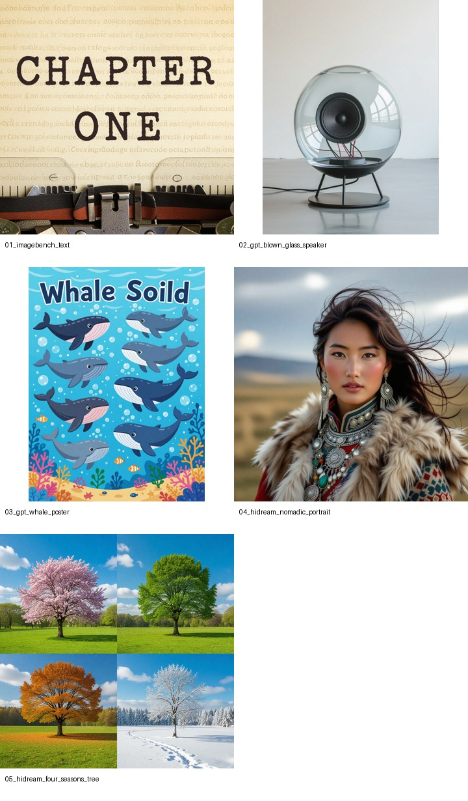
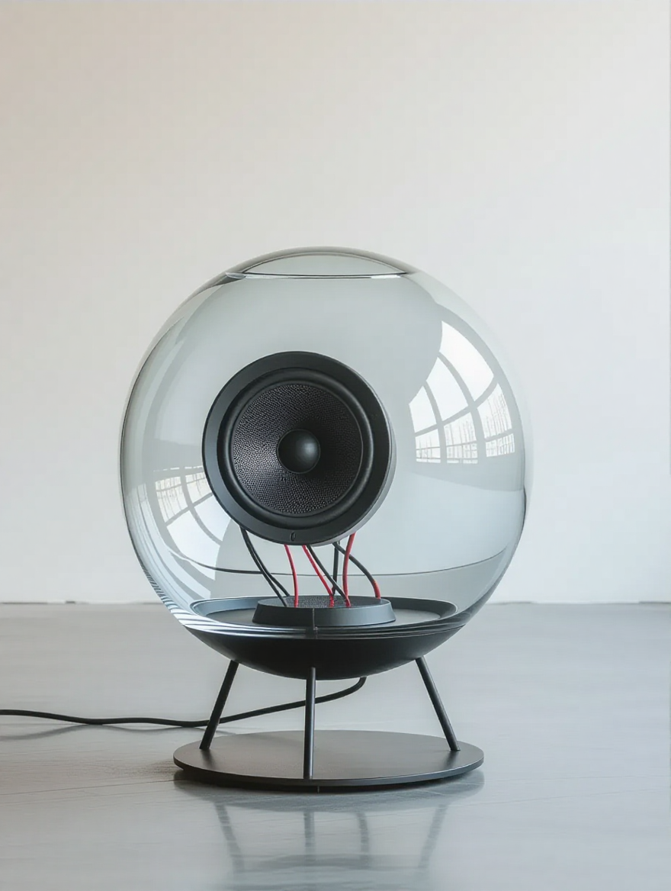
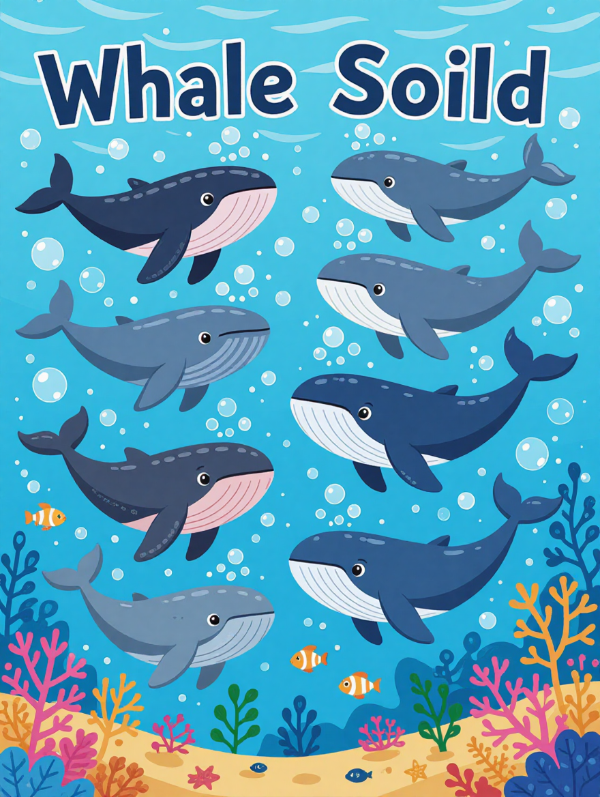
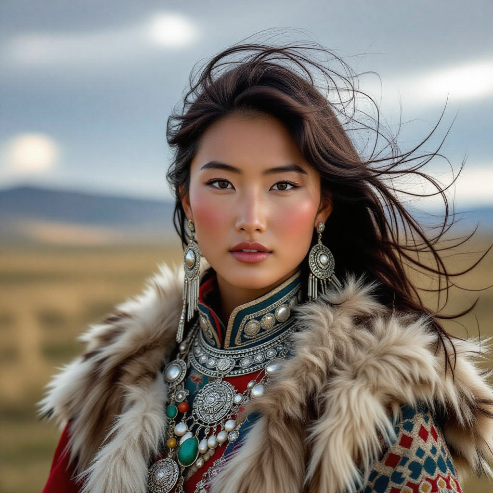
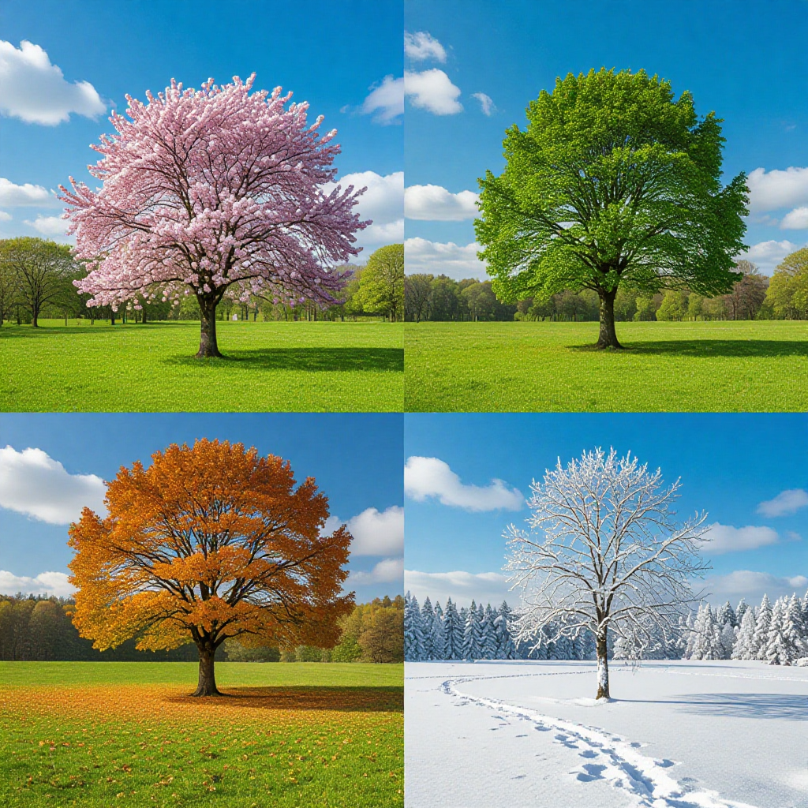

**Another image model, another evening lost to prompts.**

HiDream-I1 looked interesting because it is not just another small SD wrapper with a fancy demo page. The model card says it is a **17B open-source image generative foundation model**, and the public Hugging Face page presents it as a serious text-to-image model, not a toy.

So, as usual, I wanted to check the boring question first:

> Can it follow the kind of prompts where GPT-image models usually look annoyingly good?

Not a huge academic benchmark. Just a practical one. I picked five prompts from public references and demo examples, generated images through Hugging Face Spaces, and compared the outputs by looking at the exact things that normally break image models: text, labels, object geometry, composition, and instruction following.

<aside class="article-callout">
  <strong>Note</strong>
  <p>This article is saved as a draft. I used the working official HiDream-I1-Dev Space for generation because the public HiDream-I1-Full Spaces I found were either OAuth/API-provider wrappers that errored, or cloned templates that were not actually running HiDream-I1-Full.</p>
</aside>

## Setup

The model I wanted to test was:

%[https://huggingface.co/HiDream-ai/HiDream-I1-Full]

But the actual public generation run happened on the official demo Space:

%[https://huggingface.co/spaces/HiDream-ai/HiDream-I1-Dev]

If you want to try it yourself, start here:

- [Official HiDream-I1-Dev Space](https://huggingface.co/spaces/HiDream-ai/HiDream-I1-Dev) — the one I used for this run.
- [HiDream-ai Spaces page](https://huggingface.co/HiDream-ai/spaces) — useful for checking which official demos are currently running.
- [Spaces using HiDream-I1-Full](https://huggingface.co/HiDream-ai/HiDream-I1-Full) — scroll to the Spaces section if you want to gamble on community-hosted Full demos.

I also checked a bunch of community `HiDream-I1-Full` Spaces. The result was a little funny:

- Some Spaces only exposed a login/status endpoint and errored after OAuth.
- Some Spaces named `HiDream-I1-Full` were just SDXL-Turbo Gradio templates.
- The official `HiDream-I1-Dev` Space worked reliably, although slowly.

So the comparison below is best read as:

**HiDream-I1 public HF Space behavior vs public GPT-image style benchmark prompts.**

Not a final verdict on the full model weights running locally with perfect settings.

## The prompts

I used five prompts with different failure modes.

| ID | Prompt type | Source idea | Why I picked it |
| --- | --- | --- | --- |
| 01 | Text rendering | ImageBench / GPT-image style text task | Exact typography is still hard for most diffusion-style models |
| 02 | Product render | Public GPT-image blown glass speaker example | Tests material, transparency, object structure, room placement |
| 03 | Educational poster | Public GPT-image whale poster example | Tests labels, layout, multiple objects, readable text |
| 04 | Portrait | HiDream official demo example | Tests what the model is likely tuned to show well |
| 05 | Concept art | HiDream official demo example | Tests symbolic composition across multiple seasons |

Full generated contact sheet:



The generation config was intentionally simple:

```txt
Model: HiDream-I1-Dev public HF Space
Aspect ratios: 1:1 or 3:4 depending on prompt
Batch size: 1
Seeds: fixed per prompt
Number of prompts: 5
```

Not fancy. No prompt rewriting. No cherry-picking from 20 tries. One run per prompt.

## Prompt 01: text rendering

```txt
The word 'CHAPTER ONE' typed on aged paper with a vintage typewriter font, complete with slightly uneven ink
```


This is the type of prompt where GPT-image models tend to make older models look bad. It is simple in natural language, but it is brutal in image-generation terms. The model has to know the object, the surface, the font style, and the exact letters.

HiDream did better than I expected, but still not good enough.

The page texture and typewriter feeling were fine. The word `CHAPTER` came out clearly. But `ONE` became messy and duplicated. OCR roughly read it as:

```txt
CHAPTER
one ONE
```

That is not a complete failure, but it is not reliable text rendering either. If the task is "make a nice vintage paper image", it passes. If the task is "render exactly this title", it fails.

<aside class="article-callout">
  <strong>Observation</strong>
  <p>HiDream understands that the image needs text. It does not consistently understand that the text is the product.</p>
</aside>

## Prompt 02: blown glass speaker

```txt
Create a minimalist home speaker out of glass. It should have an organic shape as if it was formed by blowing glass. It should be completely translucent, showing some of the wiring and other parts inside. It should be mounted on a floor stand at approximately 3 feet high. Place it in a room with white walls and concrete floor.
```



This was one of the more interesting results.

The model understood the broad product render language: minimal room, glass object, speaker-like body, floor stand. The image looked clean and was visually usable. If this were a moodboard image for a product concept, I would not throw it away.

But the details are where GPT-image type models usually pull ahead. The prompt asks for:

- completely translucent glass
- visible wiring and internal parts
- organic blown-glass shape
- a floor stand around 3 feet high
- white walls and concrete floor

HiDream gets the room and the object category. It gets some transparency. It does not really solve the internal construction. The wiring is not convincing as wiring; it is more like decorative visual noise inside the object.

So this one lands in the "looks good, not precise" bucket.

## Prompt 03: educational whale poster

```txt
Create a cute, visually engaging educational poster featuring illustrations of a bunch of different whale species under the ocean. Clearly label each whale type with its name, and include playful underwater details like bubbles, coral, fish and other sea creatures. Use a friendly cute animation style evoking a classic animated movie.
```



This was the weakest one, but also the most predictable failure.

A labeled educational poster is not just an image. It is layout + typography + taxonomy + visual consistency. You need the model to make multiple whales, separate them spatially, label them correctly, and keep the whole thing poster-like.

HiDream made a cute underwater image. That part is fine. It did not make a reliable educational poster.

The labels were mostly unreadable. OCR could not recover useful names. There were whale-like shapes and underwater decoration, but not the clear species-by-species layout requested in the prompt.

This is exactly the category where GPT-image models have been strong in public examples: infographics, labels, posters, diagrams, and dense instruction following.

HiDream is not there yet, at least from this public Space run.

## Prompt 04: nomadic portrait

```txt
Intimate portrait of a young woman from a nomadic tribe in ancient China, wearing fur-trimmed clothing and intricate silver jewelry. Wind-swept hair and a resilient gaze. Background of a vast, open grassland under a dramatic sky.
```



Now this is where HiDream looks comfortable.

The portrait has the expected cinematic look. Clothing, jewelry, face, background, lighting — all of it is coherent enough. The model follows the high-level description well and gives a polished output.

This was also an official demo-style prompt, so we should not be surprised. Still, it matters. Many models can produce a nice portrait, but not all of them can keep cultural clothing, jewelry, lighting, and landscape in one stable composition.

If I were ranking only aesthetic quality, this would probably be the best image in the run.

## Prompt 05: four seasons tree

```txt
Time-lapse concept: A single tree shown through four seasons simultaneously, spring blossoms, summer green, autumn colors, winter snow, blended seamlessly.
```



This one worked nicely as a concept image.

The model understood the symbolic structure: one tree, different seasonal regions, blended into one composition. This is exactly the kind of prompt where a generative model can win by being visually suggestive rather than technically exact.

There are still small issues. The seasonal boundaries are not perfectly logical, and if you inspect the image too much, the tree becomes more "fantasy painting" than precise time-lapse diagram.

But that is okay for this prompt. The output communicates the idea.

## Result table

| Test | What mattered | HiDream result | My score |
| --- | --- | --- | --- |
| Text title | Exact words and typewriter style | Good texture, partial text, duplicated/mangled `ONE` | 6/10 |
| Glass speaker | Product geometry + transparent material | Nice render, weak internal wiring precision | 7/10 |
| Whale poster | Layout + labels + species names | Cute underwater art, poor labels/poster structure | 4/10 |
| Nomadic portrait | Aesthetic portrait + clothing detail | Strong and coherent | 8/10 |
| Four-seasons tree | Concept composition | Clear visual idea, good composition | 8/10 |

If I had to compress the entire experiment into one line:

**HiDream is strong at beautiful images, weaker at images that behave like documents.**

## What this says about the model

The pattern is pretty clear.

HiDream-I1 does well when the prompt can be satisfied with visual plausibility:

- portrait
- cinematic concept art
- product moodboard
- stylized scene
- symbolic composition

It struggles when the prompt requires exact symbolic control:

- readable typography
- labels
- educational posters
- multi-object layout with names
- diagram-like precision

This is not unique to HiDream. It is the old image model problem. The difference is that GPT-image style models have moved the expectation forward. A few years ago, "the model drew something that looks like a poster" was impressive. Now, if the text is wrong, it feels broken.

Unfair? Maybe. But that is the new benchmark.

## Why I did not call this a full benchmark

Because it is not.

A serious benchmark would need:

- same prompt set across models
- same aspect ratio and seed controls where possible
- multiple generations per prompt
- human preference scoring
- OCR-based text scoring
- object/layout scoring
- local Full model inference, not only public HF Space inference

What I did here is more of a practical smoke test.

I wanted to know: **if I take prompts where GPT-image does well and run them on the public HiDream path, what breaks first?**

Answer: labels and exact text.

## Small note on public Spaces

This part wasted some time.

Many community Spaces had the model name in the title, but were not useful for testing Full. A few used Gradio's `gr.load()` with Hugging Face inference provider auth, and the exposed API only gave a login check. A couple of others were just default SDXL-Turbo templates with the HiDream name.

This is why I used the official `HiDream-I1-Dev` Space.

For anyone trying to reproduce this, check the Space source before trusting the title. If the app has:

```python
model_repo_id = "stabilityai/sdxl-turbo"
```

then it is obviously not a HiDream-I1-Full benchmark, even if the Space name says so.

## Final take

HiDream-I1 is good. The public outputs are not embarrassing at all. In fact, for portraits and concept art, it is very usable.

But compared to the public GPT-image class of outputs, the weakness is visible:

- GPT-image style models are better for text-heavy, poster-like, instruction-dense prompts.
- HiDream is better treated as a strong open image model for aesthetics and general composition.
- The open-source angle is the interesting part: even if it loses on labels today, it gives builders something they can inspect, host, fine-tune, and improve.

That last point matters. Closed models win many benchmarks, but open models let you actually learn from them.

So my current mental model is:

> Use GPT-image when the image must behave like a designed document. Use HiDream when you want open-model image quality and can tolerate some looseness in symbolic details.

That is it for this run. Next proper version should be local `HiDream-I1-Full`, more prompts, and OCR scoring instead of just eyeballing the images.

## References

1. [HiDream-I1-Full model card](https://huggingface.co/HiDream-ai/HiDream-I1-Full)
2. [HiDream-I1-Dev public Space](https://huggingface.co/spaces/HiDream-ai/HiDream-I1-Dev)
3. [HiDream-ai official Spaces](https://huggingface.co/HiDream-ai/spaces)
4. [HiDream-I1 technical report](https://arxiv.org/abs/2505.22705)
5. [ImageBench](https://imagebench.org/)
6. [OpenAI image generation examples](https://openai.com/index/introducing-4o-image-generation/)
