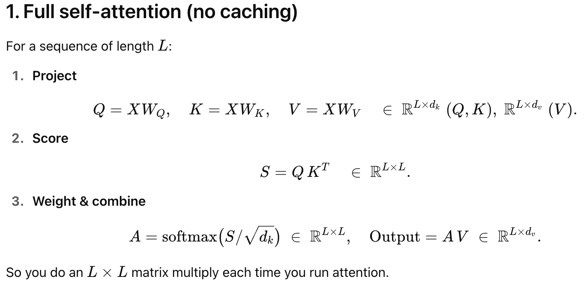
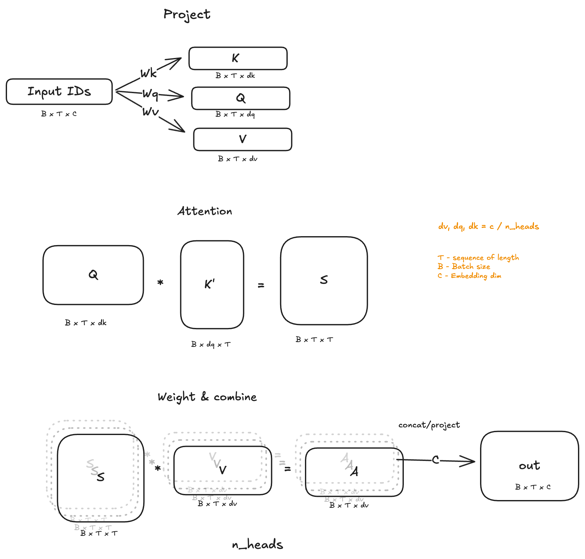
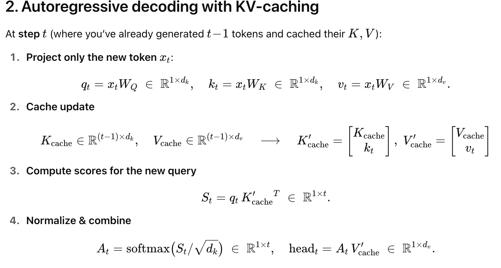
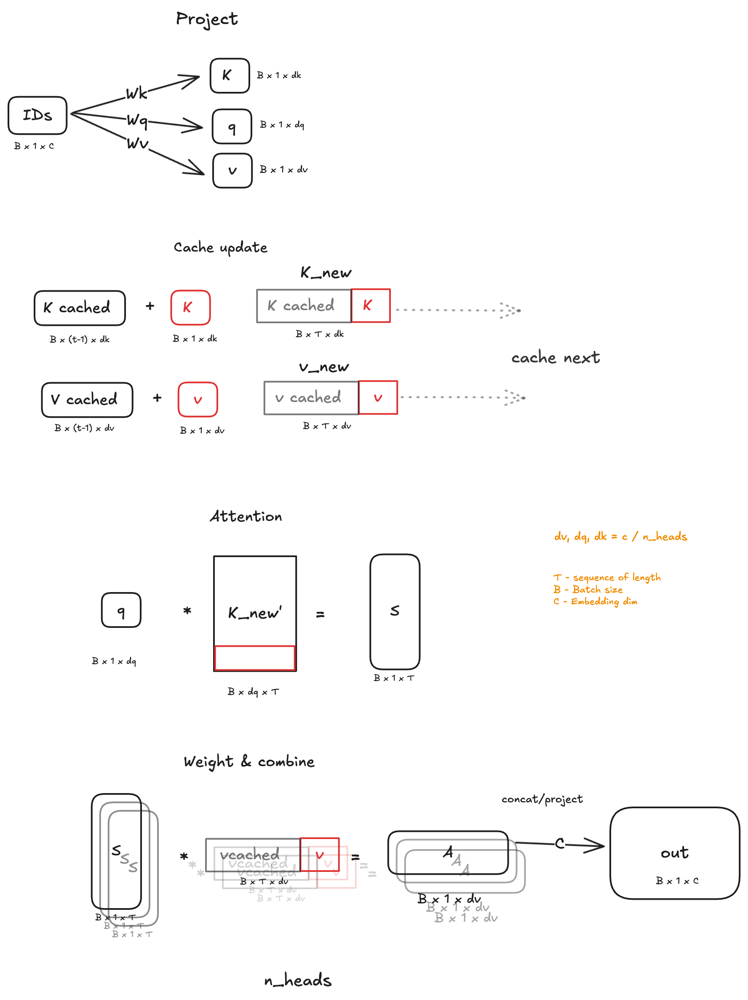

**“This will be a small experiment”**. My thoughts as I started working on it a month ago. It is a simple concept of caching previous results for future calculations, similar to dynamic programming in DSA. I could not have been far from the truth. Well, as I wanted to do things from scratch, as always.

If you use HuggingFace or any transformer library, it is just an argument away to invoke the process, but when doing it from scratch, one needs to go through many codebases, papers and tutorials. Understand the work in all of the boredom (Honestly, it was the most boring work I felt in a long time). Originally wanted to work on grouped attention, but this needed to be done before that.

Enough of ranting, let’s dig into it. But the blog will be small.

In earlier transformer models, each new token would recompute the key and value projections for all previous token IDs and use the full set of key-value pairs to calculate the attention scores. For small context lengths, this overhead is negligible. However, as the context window scales to 100k tokens or more, both memory usage and computational cost increase significantly.





A straightforward solution is to <mark>cache the previously computed key and value tensors and reuse them for subsequent tokens</mark>. At each step, the current token’s key and value are computed and concatenated with the cached ones, allowing the model to avoid redundant computations while maintaining the full attention context.





Let’s implement in a simple way full code is at [transformer-train-kv-cache.ipynb](https://github.com/8bitnand/Blogs/blob/main/transformer-train-kv-cache.ipynb).

```python
'''
Showing only main manuplations
full code  https://github.com/8bitnand/Blogs/blob/main/transformer-train-kv-cache.ipynb
'''
# projection remain the same

self.k = nn.Linear(embedding_size, embedding_size)
self.v = nn.Linear(embedding_size, embedding_size)
self.q = nn.Linear(embedding_size, embedding_size)

B, T, E = x.size()                                  # B, 1, E  new token
k, q, v = self.k(x), self.q(x), self.v(x)           # B, 1, E

# project to E to nh * E//nh nh -> number of heads
k = k.view(B, T, self.nh, E//self.nh).transpose(1,2) # B, nh, 1, hs
v = v.view(B, T, self.nh, E//self.nh).transpose(1,2) # B, nh, 1, hs
q = q.view(B, T, self.nh, E//self.nh).transpose(1,2) # B, nh, 1, hs

# B, nh, 1, hs + B, nh, T-1, hs -> B, nh, T, hs

k = torch.cat([k_cache, k], dim=2) # B, nh, T, hs
v = torch.cat([v_cache, v], dim=2) # B, nh, T, hs

# B, nh, 1, hs x  B, nh, hs, T
attention = q @ k.transpose(-2, -1) * (1.0/ math.sqrt(k.size(-1)))    # B, nh, 1, T
attention = F.softmax(attention, dim=-1)                              # B, nh, 1, T

#  B, nh, T, 1 x B, nh, 1, hs
out = attention @ v                                                   # B, nh, T, hs
out = out.transpose(1,2).reshape(B, T, E)
out = self.concat(out)                                                # B, nh, T, E

return out, (k, v)

# catch k, v and pass for next token as cached values.
```

I tried measuring the impact of KV caching, but with a small model and limited context length, the difference wasn’t significant. This setup might not be ideal to showcase the gains — maybe one of you will find a better workaround. If you do, tag me, I’d love to see it.

The model I was working on is a code completion model for Python. While it works, metrics like CodeBLEU still have room for improvement. It clearly needs a deeper architecture and more training. That’s the plan for the next iteration — stay tuned.

That’s it. You have your KV cache for inference.
