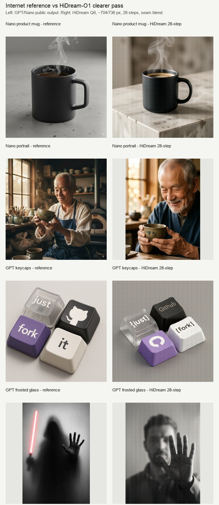
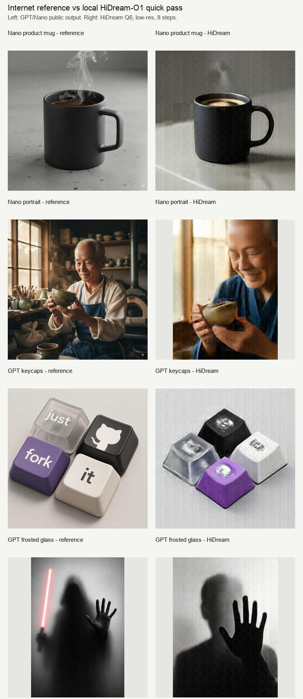
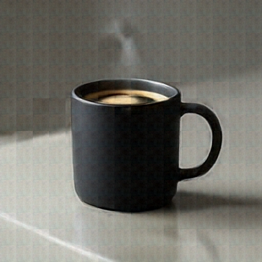
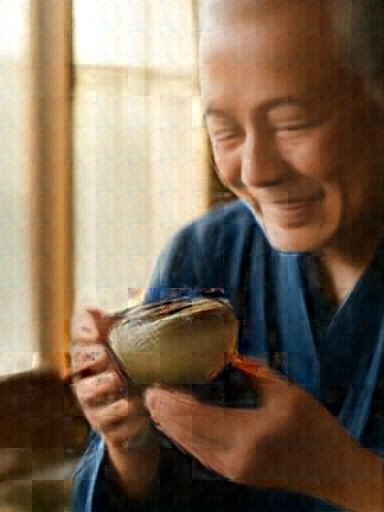
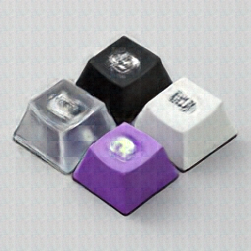
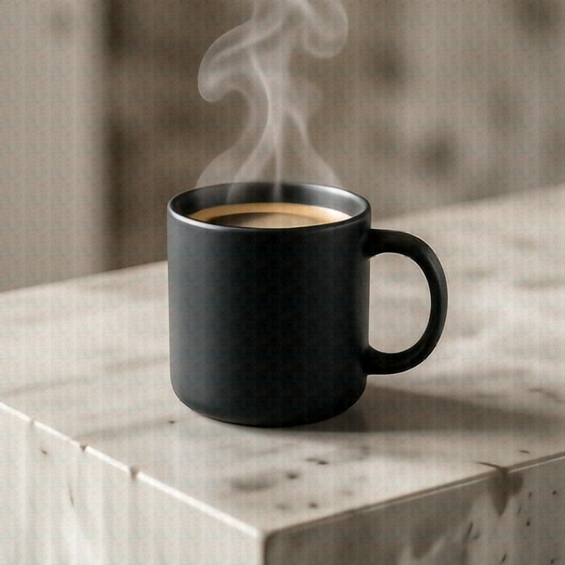
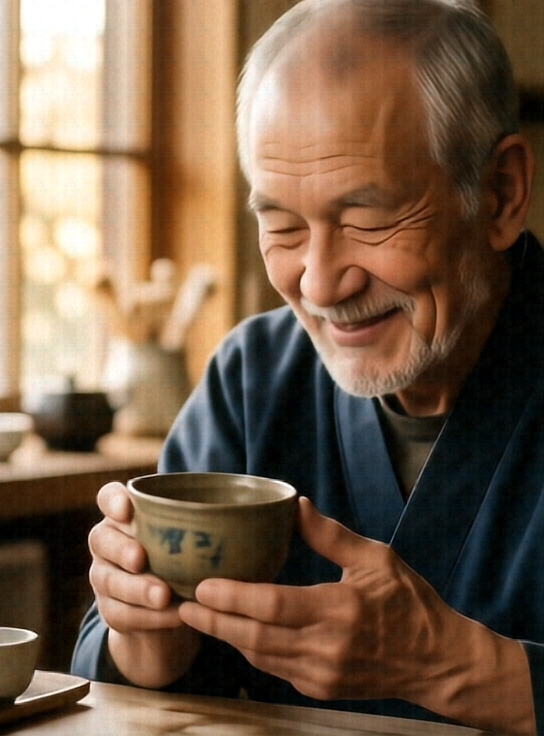
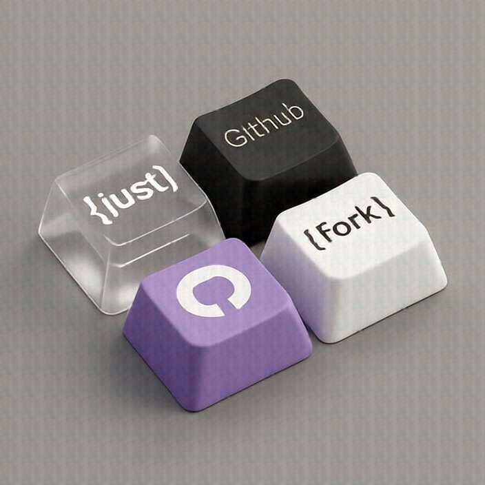
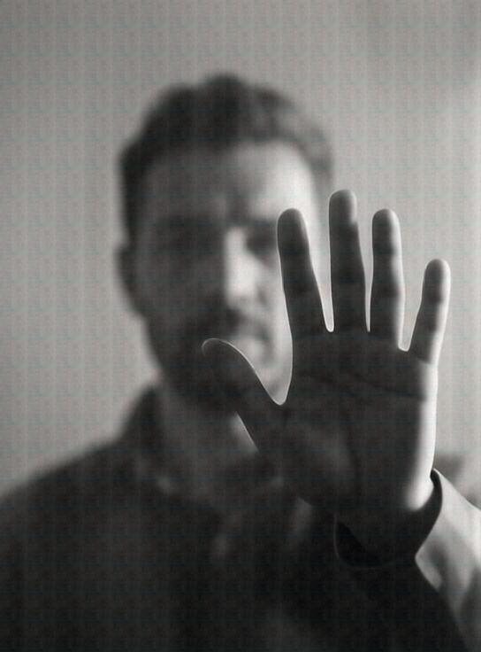

I wanted to answer a very builder-ish question:

> If I take prompts that already produced polished images from GPT Image and Nano Banana, can a local HiDream-O1 model recreate them well enough?

Not a leaderboard benchmark. Not a paper. Just a practical afternoon test with the kind of prompts people actually use when they want images for posts, product concepts, or quick visual experiments.

The result was more interesting than a simple "local model bad, hosted model good" take.

HiDream looked bad when I under-ran it. It looked much more useful once I stopped treating it like a quick thumbnail generator.



## The setup

The local model was **HiDream-O1-Image-Dev**, running as a local MLX Q6 build.

For references, I used public examples from AI Image Prompt:

- [Nano Banana product mug](https://ai-image-prompt.com/cases/nano-banana-case-114)
- [Nano Banana portrait](https://ai-image-prompt.com/cases/nano-banana-case-111)
- [GPT-4o keycaps](https://ai-image-prompt.com/cases/gpt-4o-case-90)
- [GPT-4o frosted glass](https://ai-image-prompt.com/cases/gpt-4o-case-98)

I picked four prompts because each one stresses a different part of an image model:

| Prompt | What it tests |
| --- | --- |
| Matte black coffee mug | Product photography, material, lighting, steam |
| Elderly Japanese ceramicist | Portrait realism, mood, hands, object interaction |
| Mechanical keycaps | Layout, text, logo fidelity, material |
| Frosted-glass silhouette | Atmosphere, composition, contrast, hand shape |

The important part: I used the same prompts for the local HiDream generations.

## The first pass was bad, and that was my fault

The first run used quick-preview settings:

```bash
--num-inference-steps 8
```

The output sizes were also small:

- 512x512 for square images
- 384x512 for vertical images

That made the run fast enough to compare quickly, but the images were obviously blurry.



The model understood the prompts. The mug looked like a mug. The portrait looked like a ceramicist. The frosted-glass image had a hand and silhouette. But the outputs had that familiar half-cooked diffusion look:

- soft boundaries,
- weak surfaces,
- smeared details,
- unstable text,
- faint patch texture.

Here are the actual failure images from that first 8-step run.

| Prompt | Blurry 8-step HiDream output |
| --- | --- |
| Product mug |  |
| Ceramicist portrait |  |
| Mechanical keycaps |  |
| Frosted-glass silhouette |  |

The failure is useful because it shows what "too few steps" looks like in practice. The model has already found the broad scene, but it has not resolved the image. Edges are soft, material boundaries are muddy, and the text/logo prompt collapses into decorative shapes.

So the first lesson was simple:

<aside class="article-callout">
  <strong>Lesson</strong>
  <p>Do not judge HiDream-O1 from an 8-step preview. It is useful for checking prompt direction, not final image quality.</p>
</aside>

## The clearer pass

I reran the same prompts with saner quality settings:

```bash
--num-inference-steps 28
--blend-seams 2
--no-snap-resolution
```

The dimensions were still modest, but less cramped:

- 704x704 for square prompts
- 544x736 for vertical prompts

I used multiples of 32 because HiDream works in patch-like chunks. Weird off-grid sizes are asking for artifacts.

The second run was slower, but much better.


The jump from 8 steps to 28 steps was not subtle. It cleaned up faces, object edges, lighting, hands, steam, and overall structure. The model did not become GPT Image overnight, but it stopped looking like a broken preview.

## Result 1: the matte black mug

The Nano Banana reference is a clean studio product photo: controlled lighting, simple concrete surface, black ceramic mug, delicate steam.

HiDream's 28-step output followed the scene well.



It got:

- the matte black mug,
- the handle,
- the coffee,
- steam,
- a stone/concrete-like surface,
- a reasonable product-photo composition.

Where it fell behind:

- the surface is busier than the reference,
- the lighting is less premium,
- the background has a mild generated texture,
- the patch-grid feel is still faintly visible.

My take: useful for concepting, not final ecommerce polish.

## Result 2: the ceramicist portrait

This was the strongest HiDream result.

The reference shows an elderly Japanese ceramicist inspecting a tea bowl in a warm workshop. It has a nice documentary-photo mood.

HiDream did not copy the exact composition, but it captured the intent very well.



It produced:

- an elderly ceramicist,
- warm window light,
- a tea bowl in hand,
- a soft portrait lens feel,
- a calm workshop mood.

The 8-step version was soft and less believable. The 28-step version became genuinely usable. The face, hands, and bowl all improved.

My take: this is where HiDream is comfortable. Human subject, mood, lighting, object interaction. It is not perfectly controlled, but it can make a good image.

## Result 3: the keycaps

This prompt is nasty for most image models:

> Four mechanical keyboard keycaps in a tight 2x2 grid. One transparent key says "just". Other keys are black, purple, and white. One has the GitHub logo. The other two say "fork" and "it".

The GPT reference is exactly the sort of image that makes older image models look outdated. It has clean text, good layout, and recognizable iconography.

HiDream got the object class and colors, but not the symbolic precision.



It produced four keycaps. The colors were close. The transparent key idea appeared. But the exact labels and GitHub logo were unreliable.

This is the clearest loss in the experiment.

<aside class="article-callout">
  <strong>Observation</strong>
  <p>HiDream understood "make keycaps." GPT understood "make these exact keycaps with these exact labels."</p>
</aside>

That difference matters. If your image needs readable text, logo fidelity, UI labels, posters, or diagrams, HiDream is not the model I would trust.

## Result 4: the frosted-glass silhouette

This one surprised me.

The prompt asks for a black-and-white photo of a human figure behind frosted glass, with a hand sharply pressed against the surface.

HiDream followed the core composition pretty well.



It got:

- monochrome photo styling,
- a figure behind translucent glass,
- a hand pushed toward the viewer,
- soft background contrast,
- the intended mysterious mood.

The GPT reference is more cinematic and dramatic. HiDream's version is more literal and less stylish. But as prompt-following goes, this was a good result.

My take: HiDream is solid when the prompt is about atmosphere and composition rather than exact symbols.

## So, why were the first images blurry?

Because I optimized for speed too aggressively.

The local model needs enough denoising steps to actually refine the image. At 8 steps, it can roughly block out the scene. At 28 steps, it starts resolving the image.

The better recipe from this test:

```bash
# Fast preview
--num-inference-steps 8
--width 512
--height 512

# Better quality
--num-inference-steps 28
--width 704
--height 704
--blend-seams 2
--no-snap-resolution
```

For portrait-style outputs:

```bash
--width 544
--height 736
--num-inference-steps 28
```

The trick is not simply "increase resolution." Higher resolution makes the run slower. The better tradeoff is:

- keep dimensions around 704-768,
- use multiples of 32,
- use the full 28 steps,
- apply light seam blending,
- avoid exact text/logo tasks.

## Where HiDream looked good

HiDream did best on:

- portraits,
- warm photo scenes,
- atmospheric compositions,
- general product concepts,
- object layout without exact text,
- local visual drafting.

The portrait and frosted-glass examples are the useful signal. The model can produce coherent, attractive images when the prompt is visual rather than document-like.

## Where hosted models still win

GPT Image and Nano Banana still look stronger on:

- precise typography,
- logos,
- clean product polish,
- commercial-grade lighting,
- exact layout control,
- "make this specific graphic" tasks.

The keycaps example is the whole story. HiDream made keycaps. GPT made the requested keycaps.

There is a big gap between those two.

## The practical workflow I would use

I would not use local HiDream as a full GPT Image replacement.

I would use it like this:

1. Generate local drafts privately.
2. Use 704-768 px and 28 steps for anything worth judging.
3. Pick the best composition.
4. Upscale or lightly enhance the image.
5. Add text, logos, labels, and UI details manually or with a deterministic editor.

That is a strong workflow. Local generation gives you fast private exploration. Manual or hosted finishing gives you the precision image models still struggle with.

## Final takeaway

This experiment started with "why are the images blurry?"

The better answer is:

**They were blurry because the model was under-run.**

With 28 steps and reasonable dimensions, HiDream-O1 becomes much more interesting. It still loses to GPT Image and Nano Banana on polish, text, logos, and exact symbolic control. But for local portraits, moodboards, product concepts, and atmospheric drafts, it is genuinely useful.

That is the right mental model:

> HiDream-O1 local is not a hosted image-model killer. It is a strong local visual drafting engine.

And honestly, that is already useful.
