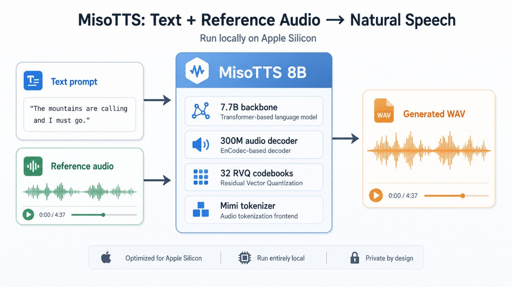

Local TTS sounds great in theory: no API calls, no vendor lock-in, no waiting on a hosted demo, and full control over the generated audio.

MisoTTS looks especially interesting because it can use both text and audio context, which makes it useful for more than plain text-to-speech. The real question is whether that promise holds up on a local Apple Silicon setup.

This test runs MisoTTS through MLX, generates real WAV files, measures speed and memory use, and checks where the output holds together or falls apart.

The result: local generation works, but it is not real-time here, text fidelity is uneven, and voice cloning only becomes usable with a carefully controlled workflow.


## What was tested

A local MLX version of MisoTTS generated five short WAV files across a few common speaking styles: calm assistant, excited demo, serious warning, sad reflective, and fast product update.

Each output was **6.48 seconds** long because the run capped audio at about 6.5 seconds.

## What MisoTTS is

MisoTTS is an **8B text-to-speech model from Miso Labs**. The useful thing about it is that it is not only a text-to-audio model. It can condition on both **text** and **audio context**, which is why this test used short reference audio clips along with the target text.

According to the [Miso Labs release post](https://www.misolabs.ai/blog/miso-tts-8b), the model uses a hierarchical RVQ transformer design: a **7.7B-parameter backbone** models the text/audio sequence and predicts the first audio codebook, while a **300M-parameter decoder** predicts the remaining codebooks across RVQ depth. The [Hugging Face model card](https://huggingface.co/MisoLabs/MisoTTS/blob/main/README.md) describes the released model as a Sesame-style CSM architecture with a Llama-style backbone, a smaller autoregressive audio decoder, **32 audio codebooks**, **2,051 audio vocabulary**, Mimi audio tokenizer, and a max sequence length of **2,048**.



In simpler words: MisoTTS does not directly predict a waveform sample-by-sample. It predicts compact audio codes. Those codes are then decoded back into speech. The RVQ part matters because it lets the model represent a much wider space of speech sounds without using one enormous flat audio vocabulary.

## The local run

The model loaded in about **10.1 seconds**. After that, each sample produced a WAV file.

| Sample | Duration | Generation time | Real-time factor | Peak memory |
| --- | ---: | ---: | ---: | ---: |
| calm assistant | 6.48s | 37.04s | 5.66x | 10.50 GB |
| excited demo | 6.48s | 26.74s | 4.11x | 10.94 GB |
| serious warning | 6.48s | 26.16s | 4.03x | 10.95 GB |
| sad reflective | 6.48s | 29.94s | 4.61x | 11.08 GB |
| fast product update | 6.48s | 28.46s | 4.38x | 11.08 GB |

That means the run was stable at the file-generation level, but slow. The fastest sample still took roughly **4x the audio duration** to generate. The slowest one took more than **5.6x**.

<aside class="article-callout">
  <strong>Result</strong>
  <p>Local MisoTTS on MLX wrote 5/5 WAV files successfully. It was reliable as a local generation run, but not fast enough for real-time voice applications in this setup, and the output text fidelity was mixed.</p>
</aside>

## The local infra

This was the actual local setup:


The run wrote outputs to:

```txt
artifacts/misotts_mlx_local/experiments_2026_06_08/
```

For each sample, the script passed:

- target text,
- reference text,
- reference audio,
- sampler temperature,
- `top_k`,
- `max_audio_length_ms=6500`,
- `stream=False`,
- `voice_match=False`.

The model load happened once. Then each case generated one WAV file and appended a timing/memory line to `run_log.txt`.

## The audio samples

Here are the actual outputs from the local run. The generated text column is the target prompt sent to the model, not a verified transcript of the generated audio. The reference text column is the `ref_text` argument used by the script, not a verified transcript of the reference audio.

### MisoTTS sample comparison table

<div class="audio-table-wrap">
<table class="audio-comparison-table">
  <thead>
    <tr>
      <th>Sample</th>
      <th>Reference text</th>
      <th>Reference audio</th>
      <th>Generated audio</th>
      <th>Generated text</th>
    </tr>
  </thead>
  <tbody>
    <tr>
      <td>Calm assistant</td>
      <td>I just heard the news, and I honestly cannot stop smiling right now!</td>
      <td><audio controls preload="metadata" src="./ref_misolabs_friend_sample.wav"></audio></td>
      <td><audio controls preload="metadata" src="./01_calm_assistant.wav"></audio></td>
      <td>Here is the short version. The local model is stable, but the hosted Space still needs a separate reliability check.</td>
    </tr>
    <tr>
      <td>Excited demo</td>
      <td>I just heard the news, and I honestly cannot stop smiling right now!</td>
      <td><audio controls preload="metadata" src="./ref_misolabs_friend_sample.wav"></audio></td>
      <td><audio controls preload="metadata" src="./02_excited_demo.wav"></audio></td>
      <td>Wait, this sounds much better than I expected. The pacing is surprisingly natural.</td>
    </tr>
    <tr>
      <td>Serious warning</td>
      <td>No, stop. I am serious now. That is absolutely not acceptable.</td>
      <td><audio controls preload="metadata" src="./ref_misolabs_voiceover_sample.wav"></audio></td>
      <td><audio controls preload="metadata" src="./03_serious_warning.wav"></audio></td>
      <td>No, pause the rollout. If this fails in production, the recovery path is going to be painful.</td>
    </tr>
    <tr>
      <td>Sad reflective</td>
      <td>I do not know what to say. I really thought things would be different.</td>
      <td><audio controls preload="metadata" src="./ref_misolabs_teacher_sample.wav"></audio></td>
      <td><audio controls preload="metadata" src="./04_sad_reflective.wav"></audio></td>
      <td>I thought the result would be cleaner by now, but this still gives us useful signal.</td>
    </tr>
    <tr>
      <td>Fast product update</td>
      <td>I just heard the news, and I honestly cannot stop smiling right now!</td>
      <td><audio controls preload="metadata" src="./ref_misolabs_friend_sample.wav"></audio></td>
      <td><audio controls preload="metadata" src="./05_fast_product_update.wav"></audio></td>
      <td>Quick update. I generated five local samples, logged the timings, and saved everything under artifacts.</td>
    </tr>
  </tbody>
</table>
</div>

Notes from the ASR spot-check: the excited demo was the cleanest prompt match; calm assistant and fast product update were partially recognizable but clipped by the short output cap; serious warning and sad reflective drifted badly from the requested generated text.

## The useful part: it actually produced files

This sounds obvious, but for local AI tooling this is the whole game.

A hosted demo can look nice and still be useless if the queue is down, the backend is broken, or the UI hides the error. A local run that writes WAV files is boring in the best possible way.

The output folder had five generated audio files plus the timing log.

The important thing is that all five samples completed and were saved cleanly. That does **not** mean all five were good readings of the requested prompt. In this run, the excited demo was the cleanest prompt match, calm assistant and fast product update were partially recognizable but clipped by the short output cap, and the serious warning plus sad reflective clips drifted badly.

## Voice cloning follow-up

After the first run, MisoTTS was also tested as a local voice-cloning system instead of just a style-conditioned TTS system.

This was the more useful workflow:

- use a clean **8 second reference** clip,
- pass matching `ref_text`,
- set `voice_match=True`,
- split the target paragraph into sentences,
- generate each sentence separately,
- concatenate the WAV chunks afterward.

That worked better than asking the model to generate the whole paragraph in one shot. Longer reference clips and full-paragraph generation were less stable in these local tests.

The reference clips below are only voice prompts. The generated clips speak the same target paragraph beginning with: "Fable 5 is a serious frontier release..."

<div class="audio-table-wrap">
<table class="audio-comparison-table">
  <thead>
    <tr>
      <th>Voice</th>
      <th>Reference audio</th>
      <th>Generated audio</th>
      <th>Generation notes</th>
    </tr>
  </thead>
  <tbody>
    <tr>
      <td>HSBC announcer</td>
      <td><audio controls preload="metadata" src="./ref_hsbc_announcer_8s.wav"></audio></td>
      <td><audio controls preload="metadata" src="./clone_hsbc_fable_paragraph.wav"></audio></td>
      <td>19.84s output. This was the best voice-clone result from the follow-up run.</td>
    </tr>
    <tr>
      <td>Porsche ad read</td>
      <td><audio controls preload="metadata" src="./ref_tpx_porsche_8s.wav"></audio></td>
      <td><audio controls preload="metadata" src="./clone_tpx_porsche_fable_paragraph.wav"></audio></td>
      <td>22.80s output. Generated with the same sentence-by-sentence clone workflow.</td>
    </tr>
    <tr>
      <td>Alan Cross / Porter</td>
      <td><audio controls preload="metadata" src="./ref_tpx_alancross_8s.wav"></audio></td>
      <td><audio controls preload="metadata" src="./clone_tpx_alancross_fable_paragraph.wav"></audio></td>
      <td>18.00s output. Generated successfully, but still needs human listening judgment.</td>
    </tr>
  </tbody>
</table>
</div>

The important lesson: `voice_match=True` is not magic. It can work, but the workflow matters a lot. In this local MLX setup, short clean references plus sentence-level generation were much more reliable than long references or one-shot long-form cloning.

## Extra listening references

A few older benchmark samples from other TTS systems are useful as listening references, but they are **not** a clean apples-to-apples benchmark because they were not generated from the same five MisoTTS prompts above. These are not transcript-verified comparisons; they are here only as audio references.

Still, they help answer the real social-media question:

> Does this local voice sound anywhere close to the cloud models people already know?

### ElevenLabs v3 sample

<audio controls preload="metadata" src="./compare_elevenlabs_v3_10s.wav"></audio>

Notes:

- source: older ElevenLabs v3 benchmark sample
- duration: 10.00s

### OpenAI Alloy sample

<audio controls preload="metadata" src="./compare_openai_alloy.wav"></audio>

Notes:

- source: older OpenAI TTS Alloy benchmark sample
- duration: 6.96s

### Sesame CSM sample

<audio controls preload="metadata" src="./compare_sesame_csm_10s.wav"></audio>

Notes:

- source: older Sesame CSM benchmark sample
- duration: 10.00s

<aside class="article-callout">
  <strong>Important</strong>
  <p>The MisoTTS samples above are from this local MLX run. The ElevenLabs, OpenAI, and Sesame clips are previous benchmark artifacts. A fair ranking needs a follow-up run where every model speaks the exact same text.</p>
</aside>
