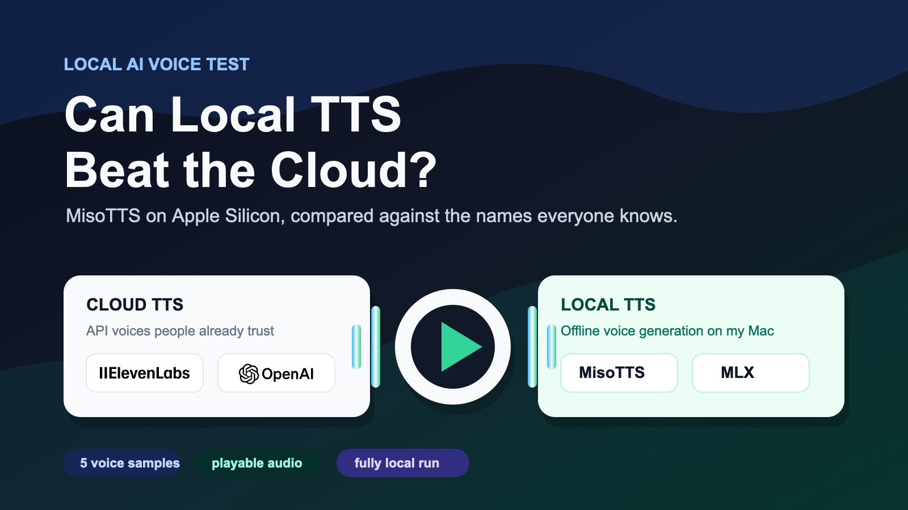
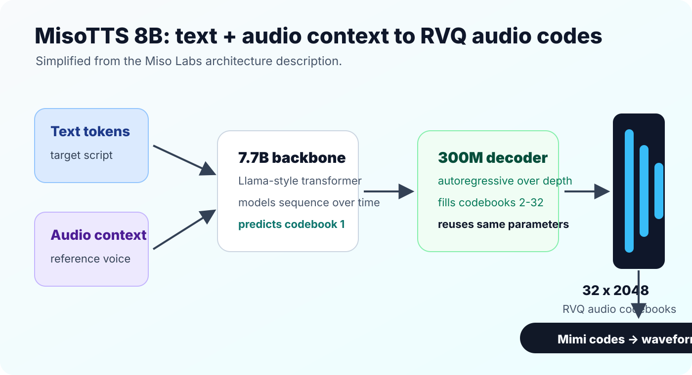
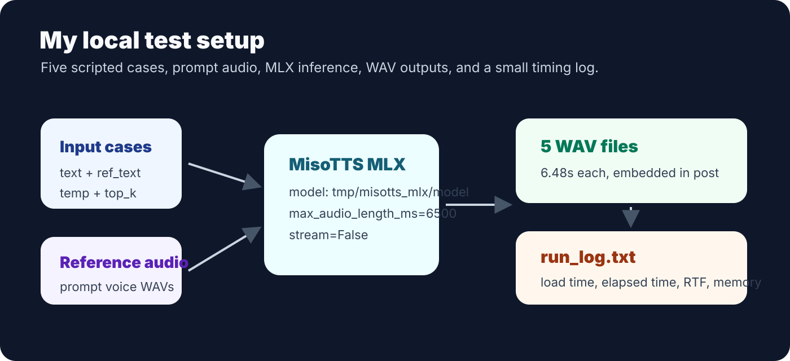

I wanted to test a very simple thing:

> Can I run MisoTTS locally, generate a few emotionally different voice samples, and get usable audio without depending on a hosted demo?

Short answer: **yes**.

Longer answer: the local MLX path worked reliably, but it was not real-time.

This is not a polished academic benchmark. It is the kind of test I actually care about as a builder: install it, run it, produce audio, measure how painful it is, and keep the artifacts.



## What I tested

I used a local MLX version of MisoTTS and generated five short WAV files.

The goal was not to find the best possible voice. The goal was to stress a few common speaking styles:

| Sample | Intent |
| --- | --- |
| `01_calm_assistant.wav` | calm assistant voice |
| `02_excited_demo.wav` | excited product demo voice |
| `03_serious_warning.wav` | serious warning voice |
| `04_sad_reflective.wav` | sad reflective voice |
| `05_fast_product_update.wav` | faster product update voice |

Each output was **6.48 seconds** long.

## What MisoTTS is

MisoTTS is an **8B text-to-speech model from Miso Labs**. The useful thing about it is that it is not only a text-to-audio model. It can condition on both **text** and **audio context**, which is why this test used short reference audio clips along with the target text.

According to the [Miso Labs release post](https://www.misolabs.ai/blog/miso-tts-8b), the model uses a hierarchical RVQ transformer design: a **7.7B-parameter backbone** models the text/audio sequence and predicts the first audio codebook, while a **300M-parameter decoder** predicts the remaining codebooks across RVQ depth. The [Hugging Face model card](https://huggingface.co/MisoLabs/MisoTTS/blob/main/README.md) describes the released model as a Sesame-style CSM architecture with a Llama-style backbone, a smaller autoregressive audio decoder, **32 audio codebooks**, **2,051 audio vocabulary**, Mimi audio tokenizer, and a max sequence length of **2,048**.



In simpler words: MisoTTS does not directly predict a waveform sample-by-sample. It predicts compact audio codes. Those codes are then decoded back into speech. The RVQ part matters because it lets the model represent a much wider space of speech sounds without using one enormous flat audio vocabulary.

## The local run

The local model path was:

```txt
tmp/misotts_mlx/model
```

The model loaded in about **10.1 seconds**. After that, each sample generated successfully.

| Sample | Duration | Generation time | Real-time factor | Peak memory |
| --- | ---: | ---: | ---: | ---: |
| calm assistant | 6.48s | 37.04s | 5.66x | 10.50 GB |
| excited demo | 6.48s | 26.74s | 4.11x | 10.94 GB |
| serious warning | 6.48s | 26.16s | 4.03x | 10.95 GB |
| sad reflective | 6.48s | 29.94s | 4.61x | 11.08 GB |
| fast product update | 6.48s | 28.46s | 4.38x | 11.08 GB |

That means the run was stable, but slow. The fastest sample still took roughly **4x the audio duration** to generate. The slowest one took more than **5.6x**.

<aside class="article-callout">
  <strong>Result</strong>
  <p>Local MisoTTS on MLX generated 5/5 samples successfully. It was reliable, but not fast enough for real-time voice applications in this setup.</p>
</aside>

## The local infra

This was the actual local setup:



The run used the local model under `tmp/misotts_mlx/model` and wrote outputs to:

```txt
artifacts/misotts_mlx_local/experiments_2026_06_08/
```

For each sample, the script passed:

- target text,
- reference text,
- reference audio,
- sampler temperature,
- `top_k`,
- `max_audio_length_ms=6500`,
- `stream=False`,
- `voice_match=False`.

The model load happened once. Then each case generated one WAV file and appended a timing/memory line to `run_log.txt`.

## The audio samples

Here are the actual outputs from the local run. The text below each player is the prompt that was sent to the model, not a verified transcript of the audio. A couple of clips drifted from the requested text, which is useful to hear as part of the local-run result.

### Calm assistant

<audio controls preload="metadata" src="./01_calm_assistant.wav"></audio>

Prompt sent:

> Here is the short version. The local model is stable, but the hosted Space still needs a separate reliability check.

Reference style:

> I just heard the news, and I honestly cannot stop smiling right now!

### Excited demo

<audio controls preload="metadata" src="./02_excited_demo.wav"></audio>

Prompt sent:

> Wait, this sounds much better than I expected. The pacing is surprisingly natural.

Reference style:

> I just heard the news, and I honestly cannot stop smiling right now!

### Serious warning

<audio controls preload="metadata" src="./03_serious_warning.wav"></audio>

Prompt sent:

> No, pause the rollout. If this fails in production, the recovery path is going to be painful.

Transcript check:

> Automatic ASR did not match this prompt reliably. Treat this clip as a failed/drifted generation, not a clean reading of the line above.

Reference style:

> No, stop. I am serious now. That is absolutely not acceptable.

### Sad reflective

<audio controls preload="metadata" src="./04_sad_reflective.wav"></audio>

Prompt sent:

> I thought the result would be cleaner by now, but this still gives us useful signal.

Transcript check:

> Automatic ASR did not match this prompt reliably. Treat this clip as a failed/drifted generation, not a clean reading of the line above.

Reference style:

> I do not know what to say. I really thought things would be different.

### Fast product update

<audio controls preload="metadata" src="./05_fast_product_update.wav"></audio>

Prompt sent:

> Quick update. I generated five local samples, logged the timings, and saved everything under artifacts.

Reference style:

> I just heard the news, and I honestly cannot stop smiling right now!

## The useful part: it actually produced files

This sounds obvious, but for local AI tooling this is the whole game.

A hosted demo can look nice and still be useless if the queue is down, the backend is broken, or the UI hides the error. A local run that writes WAV files is boring in the best possible way.

The output folder had:

```txt
01_calm_assistant.wav
02_excited_demo.wav
03_serious_warning.wav
04_sad_reflective.wav
05_fast_product_update.wav
run_log.txt
```

The important thing is that all five samples completed and were saved cleanly.

## Extra listening references

I also had a few older benchmark samples lying around from other TTS systems. These are useful as listening references, but they are **not** a clean apples-to-apples benchmark because they were not generated from the same five MisoTTS prompts above.

Still, they help answer the real social-media question:

> Does this local voice sound anywhere close to the cloud models people already know?

### ElevenLabs v3 sample

<audio controls preload="metadata" src="./compare_elevenlabs_v3_10s.wav"></audio>

Transcript:

> Okay, so like I finally beat level 42 of that game I said I'd quit like a month ago and then for the final big scary mega-boss, it's just... Ahhh Ahhh Ahhh Ahhh Ahhh Ahhh Ahhh Ahhh

Notes:

- source: older ElevenLabs v3 benchmark sample
- duration: 10.00s
- file: `compare_elevenlabs_v3_10s.wav`

### OpenAI Alloy sample

<audio controls preload="metadata" src="./compare_openai_alloy.wav"></audio>

Transcript:

> The sun rises in the east and sets in the west. This simple fact has been observed by humans for thousands of years.

Notes:

- source: older OpenAI TTS Alloy benchmark sample
- duration: 6.96s
- file: `compare_openai_alloy.wav`

### Sesame CSM sample

<audio controls preload="metadata" src="./compare_sesame_csm_10s.wav"></audio>

Transcript:

> Sounds like you have a real heart for other people. No one's ever accused me of that before. Oh no, now you're remain half. Yet.

Notes:

- source: older Sesame CSM benchmark sample
- duration: 10.00s
- file: `compare_sesame_csm_10s.wav`

<aside class="article-callout">
  <strong>Important</strong>
  <p>The MisoTTS samples above are from this local MLX run. The ElevenLabs, OpenAI, and Sesame clips are previous benchmark artifacts. A fair ranking needs a follow-up run where every model speaks the exact same text.</p>
</aside>

## What I would test next

This first run answered the basic question: local MisoTTS generation works.

The next useful tests would be:

- compare it against ElevenLabs, OpenAI TTS, and Piper on the same text,
- test longer paragraphs instead of 6.48 second clips,
- measure whether batch generation improves throughput,
- try different voices and prompts for emotional control,
- profile where the generation time is actually going,
- check whether quantization or smaller variants reduce memory without ruining quality.

I would also like to test streaming. A model can be slow overall and still feel usable if it starts speaking quickly enough. This run only measured completed WAV generation, not time-to-first-audio.
