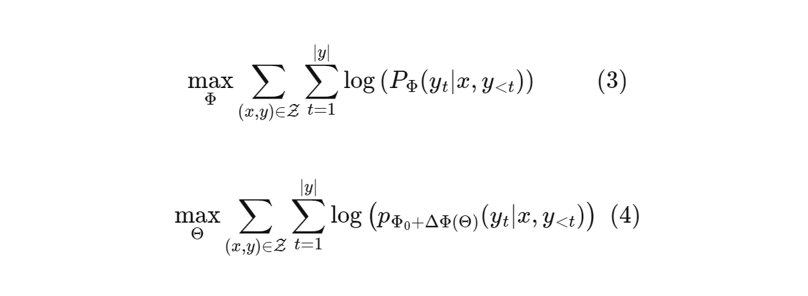
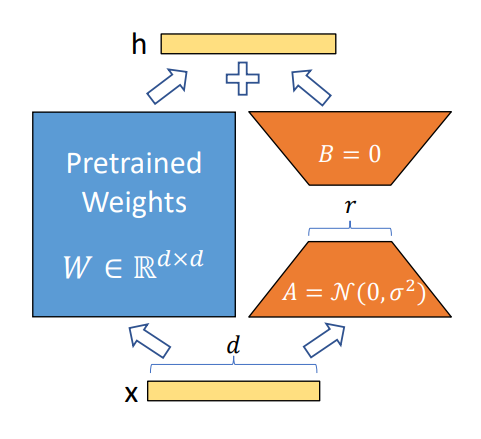

In the last part of [Compression of NN](/blog/compression-of-deep-neural-networks-p-1/)*\[1\]*, we delved into methods for reducing the memory footprint of large ML models, in this part let's look into how to fine-tune these large models in consumer grade resources with less memory. As we all know these models require huge amount of resources like compute and memory to operate, which is not feasible for everyone or for companies to fine-tune these models in their entirety for every new/downstream tasks. Just for this task we use [LoRA](https://arxiv.org/pdf/2106.09685.pdf)*\[2\]*.

So as usual, let's check out what is happening under the hood. The paper\*\[2\]\* talks about freezing the pre-trained model weights and injecting trainable rank decomposition matrices into each layer of the Transformer(or any other large models) architecture, greatly reducing the number of trainable parameters for downstream tasks.

The main hypothesis for the LoRA comes from another paper INTRINSIC DIMENSIONALITY EXPLAINS THE EFFECTIVENESS OF LANGUAGE MODEL FINE-TUNING\*\[3\]\*. This paper questions that, "\****Why can we use relatively vanilla gradient descent algorithms (e.g., without strong regularization) to tune a model with hundreds of millions of parameters on datasets with only hundreds or thousands of labeled examples?***"\*

It's a common knowledge that the amount of data should be in an order of magnitude more than the number of trainable parameters\*\[4\]\*. Otherwise your model is going to overfit (memorize the data), which in turn is not able to generalizes. But this rule does not seem to apply to pre-trained models. Somehow these large pre-trained models can be fine-tuned on a fairly small amount of data without any regularization with just basic gradient descent, the model will still perform well without the problem of overfitting (mostly).

And they hypophyse that the act of pre-training is just lowering the intrinsic dimension of the NLP task. i.e. The model once pre-trained parameters/weights of the model can now be represented in a lower dimensions than what they currently are. But for a randomly initialized weights this hypothesis may not apply.

Intrinsic dimension represents the lowest dimensional subspace in which one can optimize the original objective function to within a certain level of approximation error. let's say that I want to optimize a function ***f(-,θ), θ*** are the set of parameters. Instead of optimizing over the orginal ***D*** dimensions, they find a set of re-parameterized ***θ*** in subspace with dimension ***d*** where ***d << D***.

$$\displaylines{ θ^D = θ^D_0 + P(θ^d) \ \ \ \ \ P : R^d → R^D \ \ \ \ (1)\\ \\ θ^D = θ^D_0 + θ^dM \ \ \ \ \ M = HGΠHB \ \ \ \ \ (2) }$$

<details data-node-type="hn-details-summary"><summary>More Math you can ignore if not interested</summary><div data-type="detailsContent">This is how it is done eq 1. <code>θD</code> is projected to a lower <code>d</code> dimension matrix with linear projection and optimized in this small subspace. These optimized parameters are projected back to <code>D</code> dimension and merged with the original parameters <code>θo</code>. This projection is costly sometimes. To avoid this the paper<em>[3] </em>uses something called <a target="_blank" rel="noopener noreferrer nofollow" href="https://arxiv.org/pdf/1408.3060.pdf" style="pointer-events: none">Fastfood transform</a><em>[5] </em>eq 2. where this costly projection is replaced by a Binary matrix <code>M.</code>(Not going in to deep).This just means that <em>H</em> is a <a target="_blank" rel="noopener noreferrer nofollow" href="https://en.wikipedia.org/wiki/Hadamard_matrix" style="pointer-events: none">Hadamard matrix</a><em>[6]</em>. This makes matrix multiplication simpler and efficient than naive linear projection. These models are not like other mathematical function. They consists of multiple layers, to calculate the projections matrix for each layer will consume too much memory. To avoid this some of the layers are excused while calculating the projection matrix, retaining only important layers that are influencing the current task, guided by a scaling factor <code>λ</code> (a parameter learned at training). For more details go through the paper <em>[5]</em>.</div></details>

So now with a little bit information the paper INTRINSIC DIMENSIONALITY\*\[3\]\*. LORA *\[2\]* states that (*rephrasing a bit*). **If these learned over-parametrized models in fact reside on a low intrinsic dimension then the change in weights during model adaptation also has a low “intrinsic rank”**.Which just means that the change in weight `Δθ` the derivatives value we find during backpropagation[*\[7\]*](https://towardsdatascience.com/neural-networks-backpropagation-by-dr-lihi-gur-arie-27be67d8fdce) also have an intrinsic dimension, that is much less than the dimension of the original. Thus we can store the reparameterized `Δθ` in GPU/CPU memories of certain modules of the model that are overparameterized, instead of the original. This greatly reduces the chance of OOM errors.



Let's dig through more math. Equation 3 represents objective for conditional language generation, based on next token prediction. Maximize the probability of the token predicted at time **t** conditioned on the input **x** and we optimize parameters **Φ** till we maximize the objective over all the data points. This poses a drawback. For each parameter updates we need to store **∆Φ** (change in weights matrix) whose dimensions are as big as the pre-trained model. So storing and deploying many independent instances of fine-tuned models can be challenging.

So (*rephrasing a bit*) **the paper adopts a more parameter-efficient approach, where the task-specific parameter increment ∆Φ = ∆Φ(Θ) is further encoded by a much smaller-sized set of parameters Θ with |Θ| << |Φo|. The task of finding ∆Φ thus becomes optimizing over Θ.**

LoRA methods proves to be better than including adapter layers in between the pret-rained models\*\[8\]\*, Even though low-rank representation is done on selected modules of model.

LOW-RANK-PARAMETERIZED UPDATE MATRICES



$$\displaylines { W_0 + ∆W = W_0 + BA \ \ \ (5) \\ h = W_0x + ∆W x = W_0x + BAx \ \ \ (6) \\ W_0 ∈ R^{d×k}, \ \ B ∈ R^{d×r} , \ \ A ∈ R^{r×k} }$$

Consider any NN update policy\[7\]*, Initial weights* `Wo` are updated to learn a new task at hand, These change in weight are represented with a lower rank matrices eq 5. Instead of storing full size change matrix with dim **d** x **k** we store two matrices **A,B** with dimensions **d** x **r, r** x **k** where **r << k,d**. Resulting in a reduced memory usage. while A and B contain trainable parameters, but initially set to Gaussian and zero respectively. So when an input **x** is given it's forward pass is shown in eq 6. and in the figure above. But there is one thing still need to be taken into consideration: the LoRA code\[9\] You will find instances where you see an operation like **A@B** (eq 6). I was confused that if this operation would take place then the resulting matrix would be same size as of the original resulting in no difference in memory usage. But the results are stored in a temporary variable not used in the computational graph\[10\]\* during forward and backward propagation.

I did a little experiment with LoRA module provided by 🤗\*\[11\]*, I tried to train a transformer with 1 billion parameters bigcode/starcoderbase-1b*\[12\]*. To train python question answer dataset from stackoverflow*\[13\]\*. Obviously It could not run the full fledged model on gpus of Google collab. HuggingFace also provides you full features to train all peft models with ease.

```python
# Without LoRA - Bigcode model
GPTBigCodeForCausalLM(
  (transformer): GPTBigCodeModel(
    (wte): Embedding(49152, 2048)
    (wpe): Embedding(8192, 2048)
    (drop): Dropout(p=0.1, inplace=False)
    (h): ModuleList(
      (0-23): 24 x GPTBigCodeBlock(
        (ln_1): LayerNorm((2048,), eps=1e-05, elementwise_affine=True)
        (attn): GPTBigCodeAttention(
          (c_attn): Linear(in_features=2048, out_features=2304, bias=True)
          (c_proj): Linear(in_features=2048, out_features=2048, bias=True)
          (attn_dropout): Dropout(p=0.1, inplace=False)
          (resid_dropout): Dropout(p=0.1, inplace=False)
        )
        (ln_2): LayerNorm((2048,), eps=1e-05, elementwise_affine=True)
        (mlp): GPTBigCodeMLP(
          (c_fc): Linear(in_features=2048, out_features=8192, bias=True)
          (c_proj): Linear(in_features=8192, out_features=2048, bias=True)
          (act): PytorchGELUTanh()
          (dropout): Dropout(p=0.1, inplace=False)
        )
      )
    )
    (ln_f): LayerNorm((2048,), eps=1e-05, elementwise_affine=True)
  )
  (lm_head): Linear(in_features=2048, out_features=49152, bias=False)
)
```

Configure LoRA for overparameterized modules **c\_attn, c\_proj, c\_fc, wte, wpe**

```python
from peft import LoraConfig, get_peft_model
import copy

config = LoraConfig(
    r=16,
    lora_alpha=8,
    target_modules=["c_attn", "c_proj", "c_fc", "wte", "wpe"],
    lora_dropout=0.1,
    bias="none",
)
lora_model = get_peft_model(copy.deepcopy(model), config)
# Output

PeftModel(
  (base_model): LoraModel(
    (model): GPTBigCodeForCausalLM(
      (transformer): GPTBigCodeModel(
        (wte): lora.Embedding(
          (base_layer): Embedding(49152, 2048)
          (lora_dropout): ModuleDict(
            (default): Dropout(p=0.1, inplace=False)
          )
          (lora_A): ModuleDict()
          (lora_B): ModuleDict()
          (lora_embedding_A): ParameterDict(  (default): Parameter containing: [torch.FloatTensor of size 16x49152])
          (lora_embedding_B): ParameterDict(  (default): Parameter containing: [torch.FloatTensor of size 2048x16])
        )
        (wpe): lora.Embedding(
          (base_layer): Embedding(8192, 2048)
          (lora_dropout): ModuleDict(
            (default): Dropout(p=0.1, inplace=False)
          )
          (lora_A): ModuleDict()
          (lora_B): ModuleDict()
          (lora_embedding_A): ParameterDict(  (default): Parameter containing: [torch.FloatTensor of size 16x8192])
          (lora_embedding_B): ParameterDict(  (default): Parameter containing: [torch.FloatTensor of size 2048x16])
        )
        (drop): Dropout(p=0.1, inplace=False)
        (h): ModuleList(
          (0-23): 24 x GPTBigCodeBlock(
            (ln_1): LayerNorm((2048,), eps=1e-05, elementwise_affine=True)
            (attn): GPTBigCodeAttention(
              (c_attn): lora.Linear(
                (base_layer): Linear(in_features=2048, out_features=2304, bias=True)
                (lora_dropout): ModuleDict(
                  (default): Dropout(p=0.1, inplace=False)
                )
                (lora_A): ModuleDict(
                  (default): Linear(in_features=2048, out_features=16, bias=False)
                )
                (lora_B): ModuleDict(
                  (default): Linear(in_features=16, out_features=2304, bias=False)
                )
                (lora_embedding_A): ParameterDict()
                (lora_embedding_B): ParameterDict()
              )
              (c_proj): lora.Linear(
                (base_layer): Linear(in_features=2048, out_features=2048, bias=True)
                (lora_dropout): ModuleDict(
                  (default): Dropout(p=0.1, inplace=False)
                )
                (lora_A): ModuleDict(
                  (default): Linear(in_features=2048, out_features=16, bias=False)
                )
                (lora_B): ModuleDict(
                  (default): Linear(in_features=16, out_features=2048, bias=False)
                )
                (lora_embedding_A): ParameterDict()
                (lora_embedding_B): ParameterDict()
              )
              (attn_dropout): Dropout(p=0.1, inplace=False)
              (resid_dropout): Dropout(p=0.1, inplace=False)
            )
            (ln_2): LayerNorm((2048,), eps=1e-05, elementwise_affine=True)
            (mlp): GPTBigCodeMLP(
              (c_fc): lora.Linear(
                (base_layer): Linear(in_features=2048, out_features=8192, bias=True)
                (lora_dropout): ModuleDict(
                  (default): Dropout(p=0.1, inplace=False)
                )
                (lora_A): ModuleDict(
                  (default): Linear(in_features=2048, out_features=16, bias=False)
                )
                (lora_B): ModuleDict(
                  (default): Linear(in_features=16, out_features=8192, bias=False)
                )
                (lora_embedding_A): ParameterDict()
                (lora_embedding_B): ParameterDict()
              )
              (c_proj): lora.Linear(
                (base_layer): Linear(in_features=8192, out_features=2048, bias=True)
                (lora_dropout): ModuleDict(
                  (default): Dropout(p=0.1, inplace=False)
                )
                (lora_A): ModuleDict(
                  (default): Linear(in_features=8192, out_features=16, bias=False)
                )
                (lora_B): ModuleDict(
                  (default): Linear(in_features=16, out_features=2048, bias=False)
                )
                (lora_embedding_A): ParameterDict()
                (lora_embedding_B): ParameterDict()
              )
              (act): PytorchGELUTanh()
              (dropout): Dropout(p=0.1, inplace=False)
            )
          )
        )
        (ln_f): LayerNorm((2048,), eps=1e-05, elementwise_affine=True)
      )
      (lm_head): Linear(in_features=2048, out_features=49152, bias=False)
    )
  )
)
```

1. [Compression of deep neural networks: P-1](/blog/compression-of-deep-neural-networks-p-1/)

2. [LORA: LOW-RANK ADAPTATION OF LARGE LANGUAGE MODELS](https://arxiv.org/pdf/2106.09685.pdf)

3. [INTRINSIC DIMENSIONALITY EXPLAINS THE EFFECTIVENESS OF LANGUAGE MODEL FINE-TUNING](https://arxiv.org/pdf/2012.13255.pdf)

4. [The Size and Quality of a Data Set](https://developers.google.com/machine-learning/data-prep/construct/collect/data-size-quality)

5. [Fastfood: Approximate Kernel Expansions in Loglinear Time](https://arxiv.org/pdf/1408.3060.pdf)

6. [https://en.wikipedia.org/wiki/Hadamard\_matrix](https://en.wikipedia.org/wiki/Hadamard_matrix)

7. [Neural Networks Backpropagation Made Easy](https://towardsdatascience.com/neural-networks-backpropagation-by-dr-lihi-gur-arie-27be67d8fdce)

8. [Parameter-Efficient Transfer Learning for NLP](https://arxiv.org/pdf/1902.00751.pdf)

9. [LoRA:github.com](https://github.com/microsoft/LoRA/blob/4c0333854cb905966f8cc4e9a74068c1e507c7b7/loralib/layers.py#L68)

10. [Computational graph](https://www.geeksforgeeks.org/computational-graphs-in-deep-learning/)

11. [LoRA](https://huggingface.co/docs/peft/main/en/conceptual_guides/lora)\-🤗

12. [bigcode/starcoderbase-1b](https://huggingface.co/bigcode/starcoderbase-1b/tree/main)

13. [Blogs-LoRA](https://github.com/8bitnand/Blogs)
