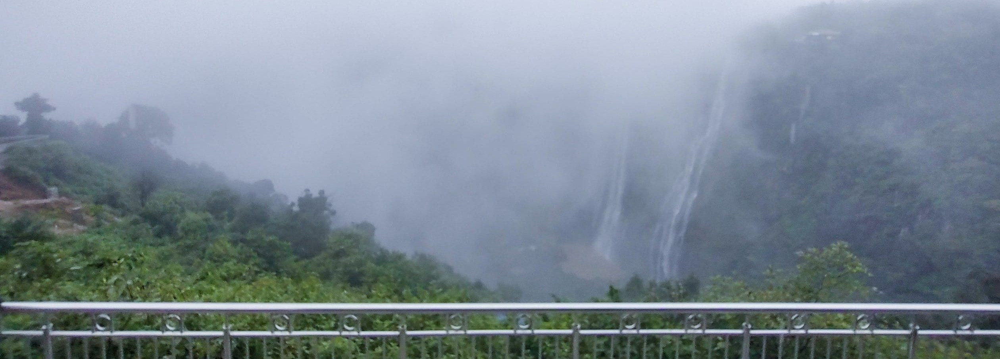

It all started when I was running late from my office, running in the light showers of rain, to somehow plan to reach Jog by the next day. Yes, just planning, you know…, the plan that always gets canceled. I did not want this one to be the plan that gets canceled. I hurried to the room, checked for ways to reach Jog falls. Yes google, it did not suggest any train routes initially but somehow (yes of course through google and friends) I found out the way to reach Jog by train. I packed my bag, and I was ready as a bee to hunt for the honey.

It took more than an hour to reach the station, just in time to catch the train (Yeha. so filmy). My reservation for tickets got canceled twice, so I hopped on to the general compartment. It really was a hunt!.., not a single person showed me mercy to let me sit beside them, well there started a war between people for the seats. It was my first time traveling in a general compartment.so I was cautious enough not to sleep, else someone would steal my items.

Fast forward I am one step near to Jog, hopped on to a bus as soon as I got out from the station, such a view, I met a stranger who made me jealous of all of his visits to tourist places, but by the end of my bus travel he had become my guide, pointed me the places to visit and enjoy. We reached Jog, and we said our goodbyes. I met another stranger (spoiler alerts) with whom I would share most of the trip. Just as we got out of the bus, many guides approached me to show different places, explained the cost and places they would show us and yes, we bargained and set to move to visit our first place.

Eyes which have seen tall buildings and traffic all day, this place is a treat. Fog all around. The time was at about 9 AM. there are not enough adjectives to decorate the view. It was like the water shy of the sky, hiding behind the thick fog, revealing itself like a modern film actress, part by part and hiding back again masked her face back in the fog. Raja, Rani, Roarer, and Rocket follow the path of the rocks and valleys, moving in slow motion to meet the ground. And yet, not revealing herself completely, she gives the glimpse now and then.

As far as I know, it is the closest view of the waterfall, other than the viewpoints.

We completed the ritual of taking ridiculous amounts of photographs in ridiculous poses. This makes the end of one spot suggested by our driver cum guide, Devraj uncle. He is fun to talk to. Maybe all the people from that place are that nice and fun. He’s been working as a guide and driver for the past 23 years. There Are many people like him. These places and the tourists are the source of their food. Some have land where they farm. But he has one skill which he has mastered (from interaction with him I had), is to drive and talk about the places (well they are two actually) and he does them as good as it gets. Driving in those curves while it’s raining, you can imagine it might feel like an adventure to him. Then we visited the main viewpoint. And our quick trip was over (ahh.. Not yet)

I went out to search for a room to stay for the night, i was out of luck searched for half an hour and I get a call from my early trip partner, that he has struck a deal from a driver to get us to some more places nearby ,I was searching for the rooms and I met Devraj again. He said he would offer us a better deal and take us to the same place and you guessed it right; we boarded the car and here we go for the next half of the trip.

We went to a dam nearby called Niply. It started raining again, this time it wouldn't want to stop. We met some localities who showed us the way to the backwater. The water gets collected when it flows from the mountains. When it rains, and creates a lake kind of thing. We took a bath in the lake while it was raining. Yes…! What was I thinking? From there, we went to another viewpoint where you can look at the electrical projects related to the dam.

we went back to the main viewpoint and our trip with Devraj ended. We got out of the vehicle and he returned to his work, calling out loudly, “Jog, Niply …”

The waterfall was still not coming out of the cloud and fog, hiding in there to see who would stay for her grand entry. It was 2PM, and I waited till to get a time-lapse video of the fog disappearing and the grand entry of the Jog...
