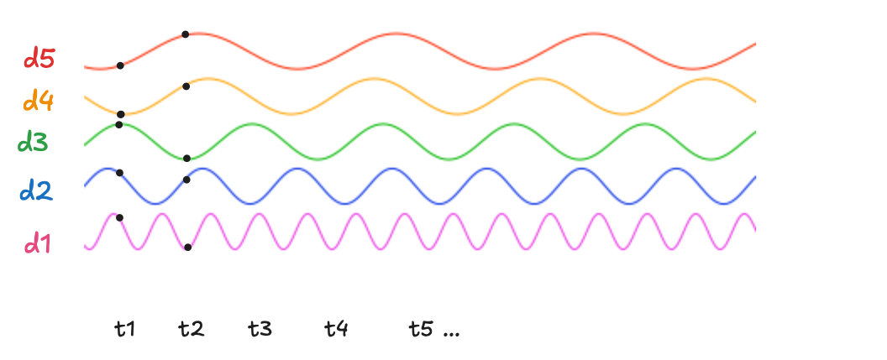
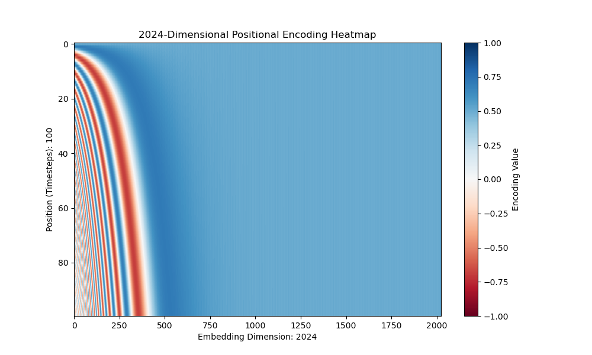
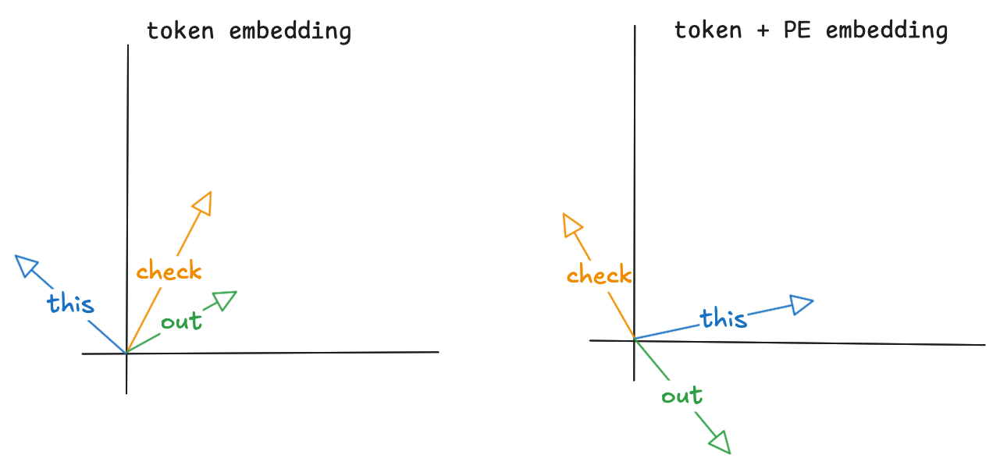
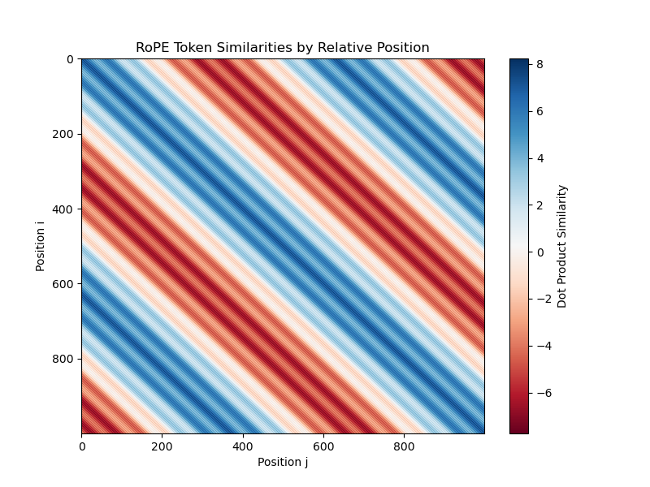
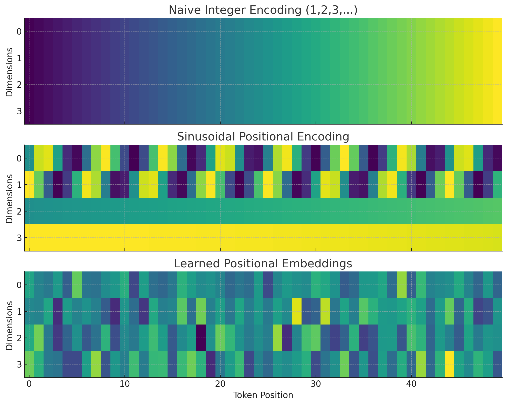

Where Am I?

This is the second part of our [**Transformer series**](/blog/kv-cache-in-transformers/) blog, where we will deep dive into a topic called positional embedding. In this part, we’ll see what PE is and the types of PEs.

### Background

Classical NLP and text generation used sequence-to-sequence models, RNNs. These models process words (tokens) one after another (sequentially), so the position of the token is inherently understood. With the attention mechanism, the tokens are processed in parallel, which means we need to encode the position of each token before the attention mechanism.

### Absolute Positional Encoding

To encode the position information, a simple way is to add the position number to the token and let the model extract the position. But if you do so, the embeddings would explode with the sequence length. For a long sentence, the earlier tokens would have smaller position additions, and the later tokens would have larger additions. **And on top of your model has to memorise (yes, memorise, not learn) the number sequence, that 1000 is larger than 1 and all other numbers before 999**.

So memorising is not a great idea, but if there were a way the model could detect patterns that implicitly encode the position of the current token with respect to others. This is where sinusoidal embeddings are useful.

### Sinosudal Positional Encoading

$$PE_{(pos, 2i)} = \sin\left(\frac{pos}{10000^{2i/d_{model}}}\right), \quad PE_{(pos, 2i+1)} = \cos\left(\frac{pos}{10000^{2i/d_{model}}}\right)$$

You might have seen this formula, but what does this do?

```python
d_model = 2
seq_len = 32
n = 10000

idx = torch.arange(0, d_model, 2)
dnom = 1/n**(idx/d_model)
pos = torch.arange(0, seq_len).unsqueeze(1)
pe = torch.zeros(seq_len, d_model)

pe[:,0::2] = torch.sin(pos*dnom) # even embedding positions
pe[:,1::2] = torch.cos(pos*dnom) # odd embedding positions
```



The formula generates a matrix of sine and cosine waves, each oscillating at different frequencies. Here, **d** refers to the embedding dimension (like *i1, i2, …* in the diagram), and **t** refers to the token’s position.

Lower dimensions (e.g., **d1**) oscillate rapidly, while higher dimensions (e.g., **d5**) oscillate much more slowly. You can think of this like digits in a number system: **d5** captures the “big picture” (most significant), while **d1** captures fine details (least significant).

* Tokens that are **close together** (nearby positions) produce **similar wave patterns**.

* Tokens that are **far apart** produce **very different patterns**.


This gives the model a natural way to sense both **closeness** and **distance** between tokens.



This heatmap shows that each token (each row) has a **unique signature of values** across the embedding dimensions. As you move from **d0 to d2024**, the oscillations become slower and more subtle. However, the **relative differences between positions** are preserved — nearby tokens still produce similar patterns, while distant tokens look increasingly different.



In this example, the tokens from the sequence `[check, this, out]` are represented as 2D vectors. When we add positional encodings (derived from sinusoidal functions) to these token embeddings, each token vector now carries both **semantic meaning** and **positional information**. This enriched representation allows the model to infer not only what each token means but also its absolute position in the sequence.

### RoPE - Rotary Positional Encoadings

RoPE, proposed more recently, represents a hybrid approach, applying a rotation to the query and key vectors based on their absolute position. When calculating the dot product for attention, this rotation implicitly encodes relative position.

RoPE rotates the query and key vectors of each token by an angle that depends on their absolute position. When the dot product is taken between a query vector at position m and a key vector at position n, the rotation ensures that the resulting attention score inherently captures the relative distance (m−n). It does this by embedding the concept of relative position into the self-attention formulation through rotation matrices.

$$\begin{align*} &\text{Given a vector } x \in \mathbb{R}^d, \text{ split into pairs: } (x_{2i}, x_{2i+1}). \\[6pt] \\ &\begin{bmatrix} x'_{2i} \\ x'_{2i+1} \end{bmatrix} = \begin{bmatrix} \cos\theta_m & -\sin\theta_m \\ \sin\theta_m & \cos\theta_m \end{bmatrix} \cdot \begin{bmatrix} x_{2i} \\ x_{2i+1} \end{bmatrix} \\[10pt] &x'_{2i} = \cos\theta_m \cdot x_{2i} -\sin\theta_m \cdot x_{2i+1} \\[6pt] &x'_{2i+1} = \sin\theta_m \cdot x_{2i} + \cos\theta_m \cdot x_{2i+1} \\[6pt] \\ &\theta_m = \frac{m}{10000^{2i/d}} \quad \text{(position-dependent angle)} \end{align*}$$

Once you get the odd and even terms of token embeddings you concat them and the resulting vector captures relative positions of the embedings.

```python
n = 10000
d_model = 2
seq_len = 1000

idx = torch.arange(0, d_model, 2)
dnom = n ** -(torch.arange(0, d_model, 2)/d_model)

m = torch.arange(0, seq_len).unsqueeze(1)
theta = m*dnom

# tokens.shape -> [seq_len, d_model]
x_odd = tokens[:,1::2]
x_even = tokens[:,0::2]

sin = torch.sin(theta)
cos = torch.cos(theta)

x_odd_rot = sin * x_even + cos * x_odd
x_even_rot = cos * x_even - sin * x_odd

x = torch.stack([x_even_rot, x_odd_rot], dim=-1).reshape_as(tokens)
```



The heatmap shows the similarity (dot-product/angle) between token positions ranging from 0 to 1000. The repeating diagonal stripes reveal that similarity depends on the **relative distance** **(| *i-j* | *)*** between tokens, not their absolute positions. This pattern reflects a key property of **RoPE**: attention is governed by relative positions rather than absolute token indices.

One more thing, a heat map comparing all the three encoadings.



Full code and experiments are available at [github](https://github.com/8bitnand/ML_from_scratch/blob/main/pytorch_practice/RoPE.ipynb).
