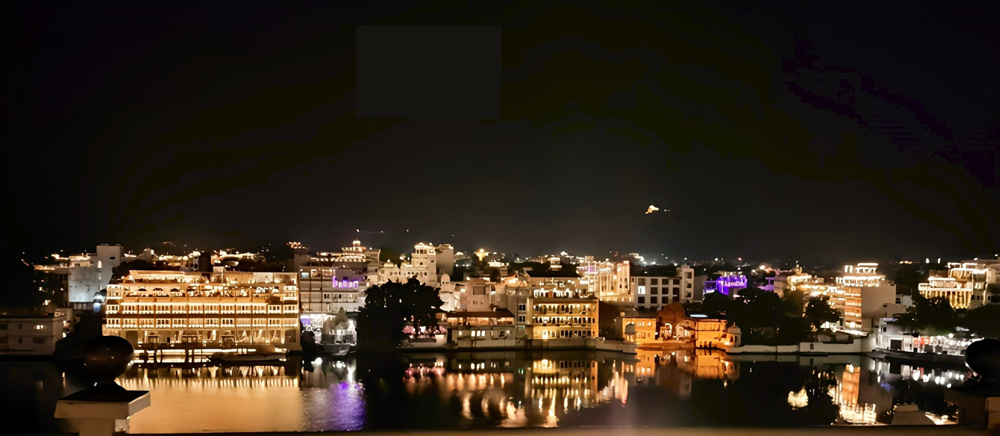
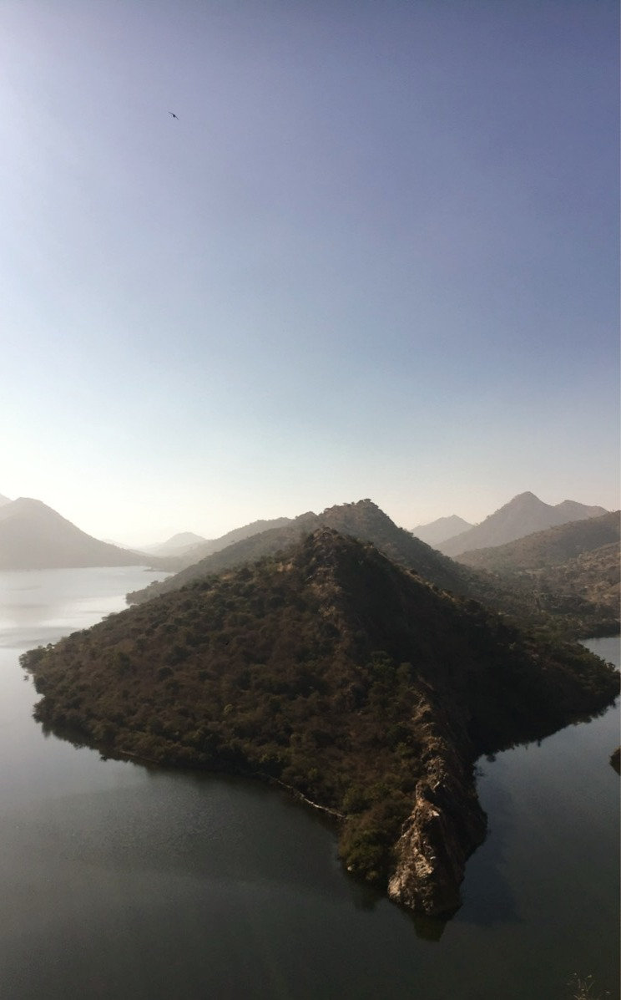
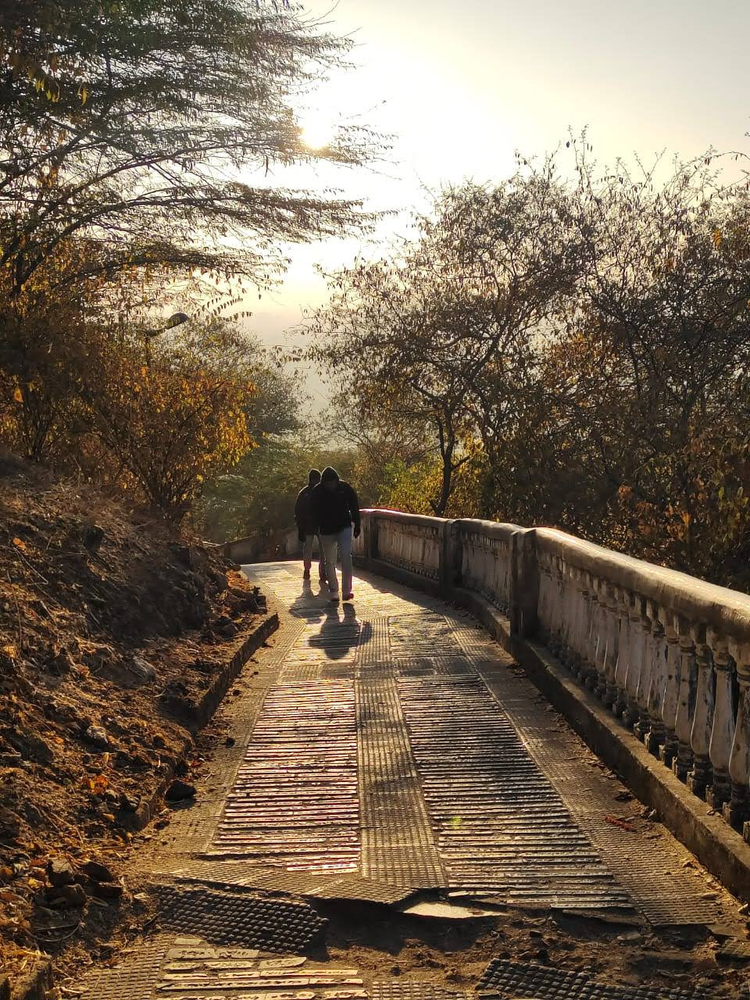
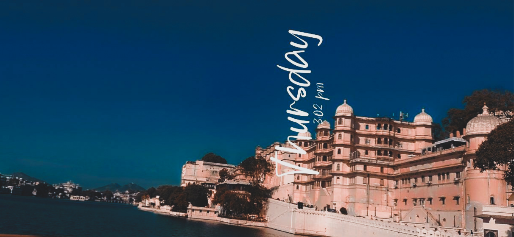
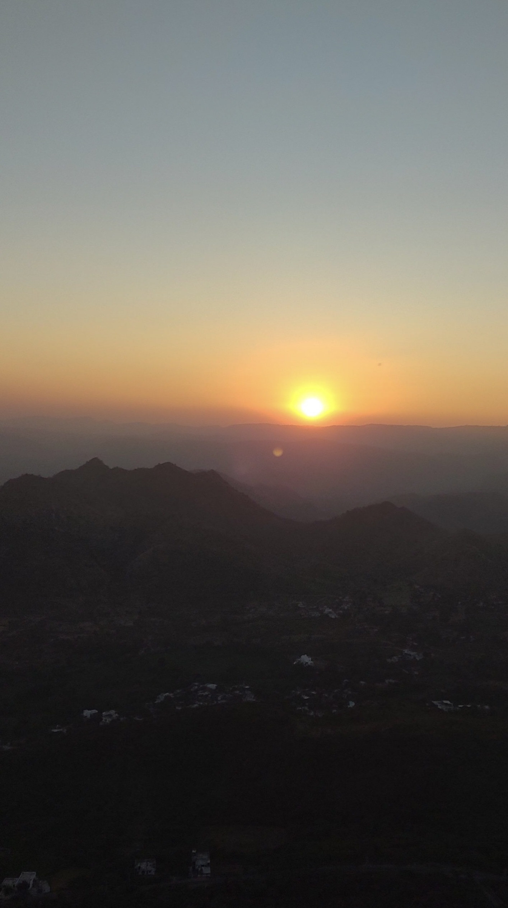
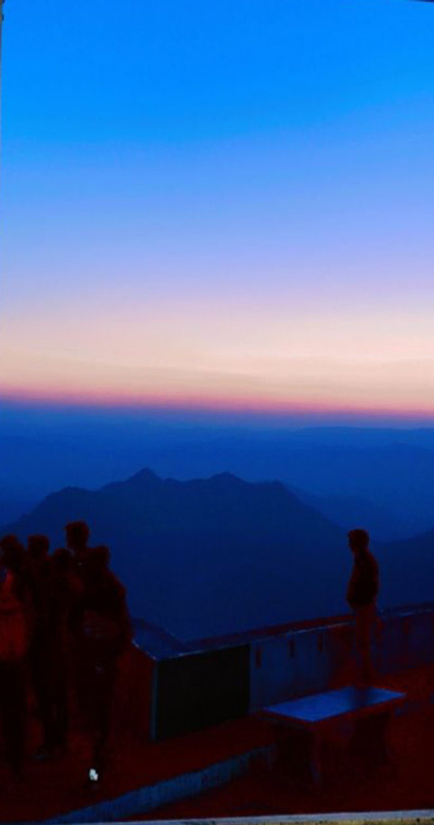

[...Previous day](/blog/rajasthan/)

## Udaipur - the Next day

Next day we went hiking to Neemach Mata temple. We had Udaipur famous tiffin poha and kachori. We headed to Bahubali hills, one of the destination for pre-weddings.

I had seen more pre-wedding shoots there than I have seen marriages in my entire life.

Again..! We had to climb another hill. I wonder how the bride and groom reach the summit, in all their glory costumes.

As I stood on top of the hills, I saw the hill piercing its way through water and making its way to meet another. Sun rising from the calm water and its reflection undisturbed by the waves.

There is a garden Saheliyon-ki-bari, which has the best in town water fountain, lotus pool and marble elephants. Story is that the fountains were operated without electricity back in the days and the water flowing was taken from the lakes in the city. The fountain quiets down when you clap and starts back when you clap again. When some people were taking videos and they clapped, the fountain stopped. When they clapped again, the fountain started flowing. Waw..!

Being an engineer, I had to see how it works. I thought it was some kind of prank, but I saw it from my own eyes. It's real. Until you are taking a picture or a video from the guide. When we went back side, we met a person who was controlling a lever to the fountains. Which he operated as signaled by the guide..

There is a museum called Baghor ki haveli. Which tells a tale of hundreds of years, about the culture of the city, how people lived and celebrated. Celebration of many events are captured by the artist as if it was all happening now. Each article preserved tells a story connected to the city and the culture.

We ate and headed right away to the city palace. One of the major attractions of the city. It's located just on the bank of the lake, which makes it feel like a ship on the sea, if you see it from the top. luxurious palace. Royals from Rajasthan still visit the place now and then. Palace is mostly converted to a museum, which displays many arts and belongings of the families. It took us almost 4 hours to finish the tour of the palace.

From there we headed to the Monson palace. It's standing at an altitude of almost 1 km from sea level. Not to worry, it has got road till the end. You can take a car or a bike. We had a scotty, thanks to @whereismanthan. We reached there exactly at the time of sunset. The sun sets so romantically from here. We waited for some time. The sun slowly melts in to the orange sky, behind the hills of Aravalli. I still can relive the experience. It's called monsoon palace coz, it was built to watch clouds during the monsoon season. While you are going to the summit, you can feel clouds piercing through the cliff.

I thought there would be no one other than us, but it was packed with people. Just like expectation vs. reality.

As the sun sank lower, the sky began to change, the deep blue of day slowly giving way to shades of pink, orange, and purple. The clouds, which had been scattered across the sky earlier, now formed a striking silhouette against the colorful backdrop,

The air grew cooler as the sun disappeared completely below the horizon, leaving behind a stunning display of colors that slowly faded to a deep blue. The Monsoon Palace, now illuminated by a soft light, looked serene and mystical in the evening calm.

The stars appeared, one by one, in the darkening sky, creating a dazzling canopy above.

I was hungry from all the climbing and walking. We directly put a map to Sukhadia Circle Food Market, where you get all the street food you are craving for. From there, we went to Lake Pichola and enjoyed the peaceful night. Looking at the light and fire lantern of many rooftop restaurants, looks like some events about to happen.

As we sat there making plans for the next day, we were still fighting about where to go for the next two days. I suggested some place and my friend suggested another place. Gradually the temperature started decreasing, as was the time left for us to stay in such a beautiful place.

[Next day..](/blog/rajasthan-3/)
