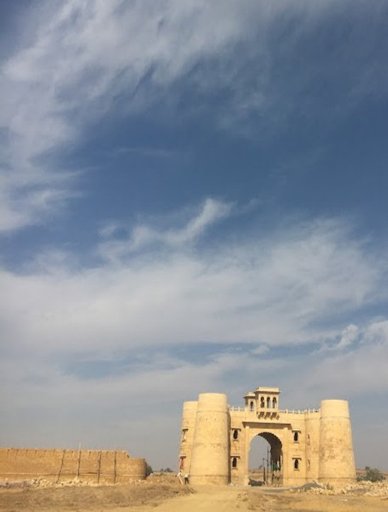
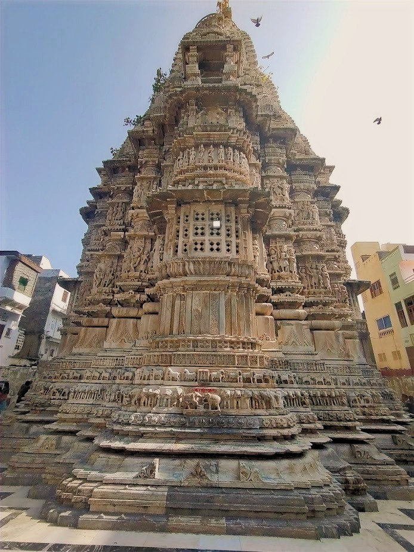
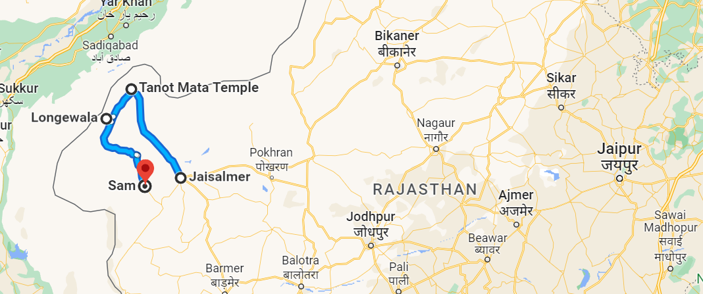
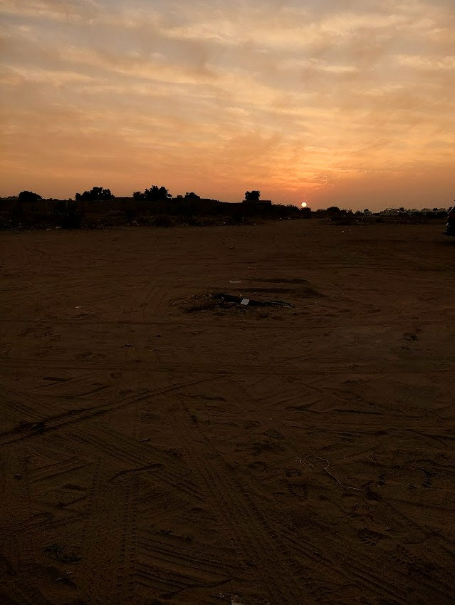

## Jaisalmer - First day

[... Previous day](/blog/rajasthan-2/)

It's decided then, our next destination is Jaisalmer. After all the discussion on how to spend the next two days of our vacation. We still had one day to spend in Udaipur. So I spend some more time near the lake and went to Jagadish temple. One has to climb 32 steps to reach the temple and another 13 steps to reach the shrine. It has such great carvings on the temple stones. Intricate details sculpted outside and as well as inside of the temple.

We booked a bus to Jaisalmer and in the meantime some shopping for the extreme cold in the Thar desert. It was around 9pm in Udaipur at the bus stop. I was not having a great feeling going to Jaisalmer. Of course I wanted to go, in a place where we know no one and no plans for where to stay or anything. I started having some second thoughts. We hoped on to a bus that we did not book, but the driver assured us that all the buses are same and he'll take us to Jaisalmer. Okay, that was not scary at all. What bad can happen? We would end up in Pokhran or worse, in Thar desert.

I slept like as if I was sleep deprived for a week. When I woke up, all I could see was glowing sand. We had entered the golden city. I was in Jaisalmer. Thank god. As soon as we got out of the bus, someone approached us to book a room in a hotel. We booked a room. I am not as good as a negotiator as I thought I was. Anyway, as planned, our agenda was to rent out a bike and go to Longewala and Tanot and return to Sam dune.

As we were making plans the day before, I saw the map. I had no idea how the trip would go. It is a trip around 200 + km on a bike and that to in a desert zone. If something goes south, no one knows how far the help is.

We took off for Sam and now we are lost in the desert, coz I suck at navigation. We reached a desert camp in Sam. Crap, we were supposed to come here at night. My friend was so mad at me, I could tell. Anyway, we left for Longewala from there. God, that is a tiring journey. It's like the read never ends. As If I was having a déjà vu. I saw the same turn 10 minutes back. Did I come back? The place is so deserted, not a soul around, not a car, not even a camel for god’ sake.

As I was riding the bike I was thinking we'll reach now, we'll reach now, anytime now. Half an hour elapsed, another half an hour elapsed. Where is it? Did we lose the track again?

The wind whips through my hair as I pedal my bike through the vast expanse of the desert. The sun beats down on my bag pack, baking the sand beneath my tires to a fiery glow. But despite the heat and the unending stretch of sand, I want to reach Longewala. So desperately that we did not even take another break in between.

Finally, we are here. It was almost 3 pm. We were in Longewala. There is a glorious history associated with the place. The battle of Longewala. The major attraction Longewala war memorial. It has the collection of various battle remnants, like tanks, planes, war equipment like guns, bullets, walkie-talkies. Illustrates war strategy with models. A tribute to all the soldiers fought in the war.

We spent some time in there. The next destination was to Tanot. It's where you can see the Indian border. But it was already late, we had to go back another 100+ km to reach Sam. Ahh.. the same never ending road again. But something was different while returning.

As the day begins to wane and the sun begins its slow descent towards the horizon, I begin my return journey back to Sam. As I ride, I feel a sense of peace in me. The world around me is silent, save for the occasional sound of my bike's wheels as they crunch through the sand. The colors of the sky change constantly, with the sun casting its light in ever-shifting patterns across the desert landscape. I see shadows that seem to stretch on for miles, and clouds that look like brushstrokes against the sky.

As I finally arrive back in Sam, I feel a sense of satisfaction and fulfillment that is hard to put into words. I have completed a journey that few have taken (literally).

The hotel service comes with a night stay facility. We stayed in tents in the freezing temperature. It was 4 degrees outside. With all 4 jackets, I could still feel the cold.

[Next day ...](/blog/rajasthan-4/)
