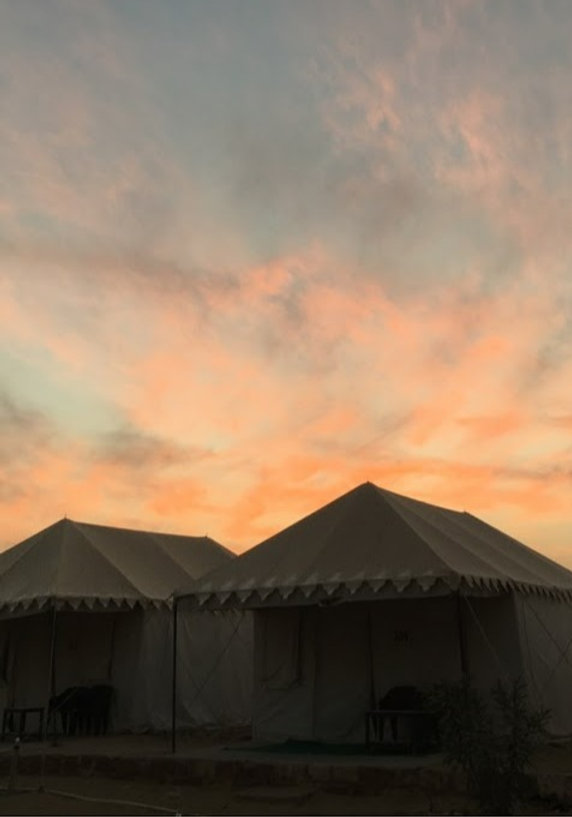
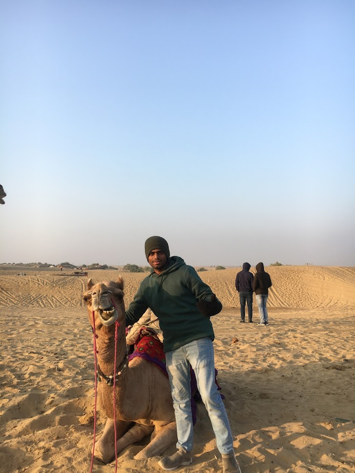
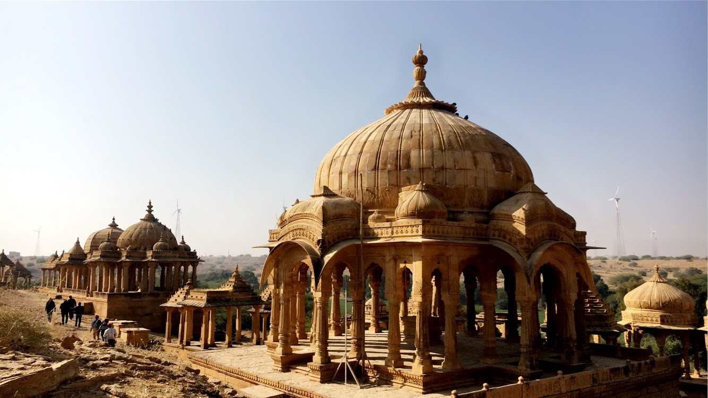
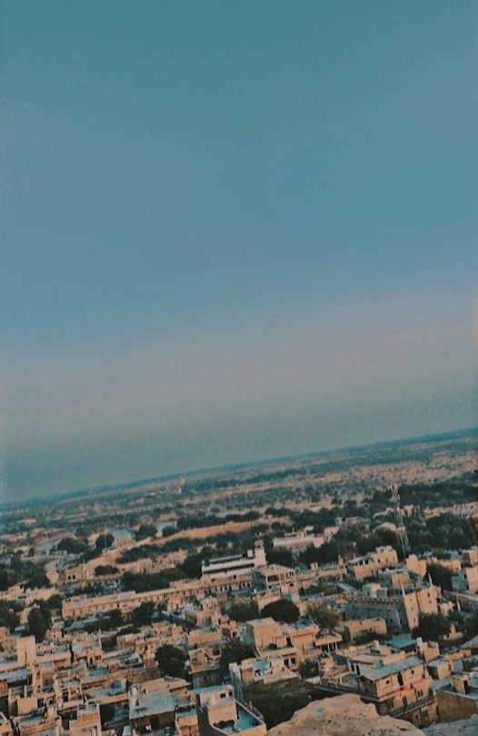
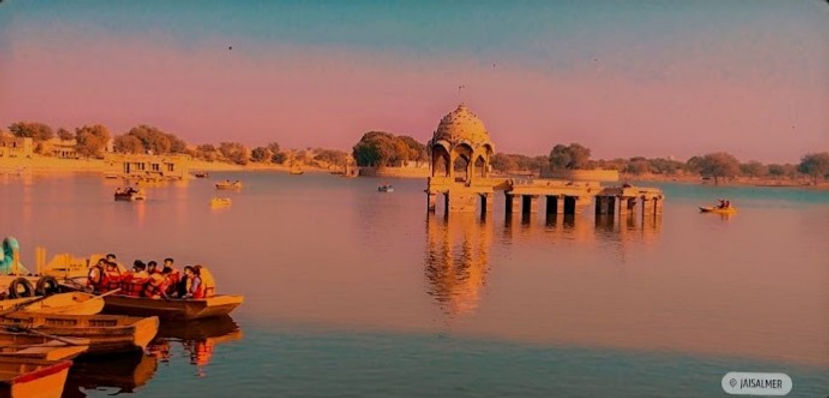

## Jaisalmer - the next day

[... Previous day](/blog/rajasthan-3/)

As I woke up at 4 in the morning, looking for an amazing sun rise. There was none. It was cold and dark outside. I woke up again at 6, still nothing! Finally, I woke up at my phone ringing. We were supposed to leave for a desert safari. My driver Ali was calling us all morning.

We hopped on to the truck. The vehicle is rugged, built to navigate the harsh terrain of the desert with ease. As we begin our journey, the surrounding landscape seems to shift and change, with sand dunes rising on either side like waves on the ocean. The sun beats down on us, casting the desert in an eerie light that is both beautiful and unforgiving. The truck bounces and jolts as we traverse the desert landscape, with the driver expertly navigating the twists and turns of the terrain.

All I was praying while I was in the truck was not to fall off. Five people were on the back of the jeep. As the jeep was surfing the waves, we were bouncing like bone broken patients. I held on to the sidebar so tight as if I were going to be launched into outer space.

Up next, it was time for a camel ride. This camel is not even getting up. Lazy as a panda, the person tried to make it stand up. It was upset; I guess. We sat on the camel and after some time it stood up. God, this camel ain't got any shock-absorber. This is even scarier than the truck ride. What if the camel started running? Or worse, throw me off. I held on to it tight. It started running."No, stop running". Why does it do that? Intentionally because I called it Lazy. I got off it as early as I could.

I think I am done with the desert ride. That was enough for 8 lifetimes. Well, if I got another chance, I would do it again. We had fun with the camels. I started taunting it. I think it got irritated by me.

We headed back to our camp. It was time to return to Jaisalmer. Packed up and ready to leave. Meanwhile, we visited Bada bagh. Memorial carved in stones. The place looks as if it was made recently. It is a sunset view point. The sun goes down beautifully from here.

It was time for a tour of Jaisalmer. The major attraction is the Jaisalmer Fort, also known as the Sonar Quila or Golden fort, is a stunning architectural masterpiece that has stood the test of time. Located in the heart of the city of Jaisalmer. As you approach the fort, you'll be awestruck by its massive walls, which rise over 250 feet high and stretch for over 1.5 miles. Built from golden sandstone, the fort glows in the sunlight and looks like a magnificent golden crown atop the city. It's a truly breathtaking sight that will leave you mesmerized.

As we entered the fort, there were people living in it, selling tourist stuffs, clothes, fashion items, etc. The fort has temples, houses rented, hotels, shops. It's the only living fort in India.

We hung out near Gadisar lake. Slept in the middle of the day till the dusk. We then got back to the fort. Wandered around to find a good roof top cafe to witness one last sunset of the trip.

As the sun sets over the horizon, a warm golden glow spreads across the Jaisalmer Fort, casting a spellbinding aura over the entire city. The fort, made entirely of golden sandstone, takes on a radiant glow as the sun's rays dance across its walls, casting enchanting shadows that seem to come alive in the warm evening breeze.

From the top of the fort's walls, you can see the entire city of Jaisalmer stretching out before you, with the sand dunes of the Thar Desert in the distance. The air cools down, and the stars twinkle in the night sky. The fort takes on a new life as the darkness sets in with the illuminated streets.

And what was I seeing in such an awe moment? another pre-wedding shoot. At night, in a rooftop cafe. We were done being reminded that we were single. So we left.

As we walked down the road, away from the fort. I was ruminating on all the fun I had until then. We were now running for a bus we booked, with all the baggage and endless phone calls from the bus driver. I had booked multiple seats without payment. One blunder from my side cost 2 seats to the driver.

As I woke up, I was in Ahemdabad, at around 5 am. No where to go or do. We spent some time till the sun was up and the buses started arriving. We visited Sabarmati ashram. Hung out there for a while and learned some history about M Gandhi, and it was time for us to leave for the airport.

As the plane takes off and I bid farewell, As I looked out of the window and see the beautiful landscape slowly disappear from view. I felt grateful for the incredible experience I've had. From the beautiful lakes of Udaipur to the stunning forts and dune of Jaisalmer. Remembering the bustling markets filled with vibrant textiles and handicrafts, the colorful festivals and celebrations, and the lively music and dance performances that I have witnessed.

My journey to a part of the north of India Was now over.

Picture credits to Inzamam who tolerated me over the trip, over all my torturing and presence.

And that was Rajasthan, where the dune meets the palace.
