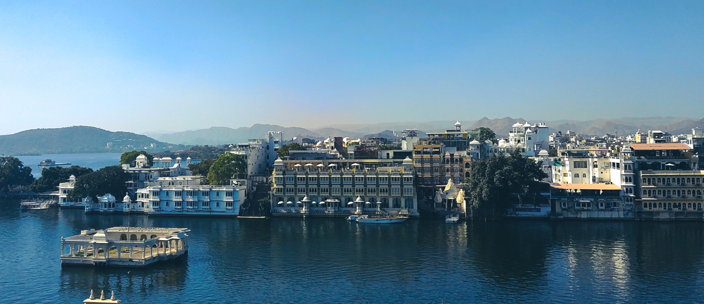
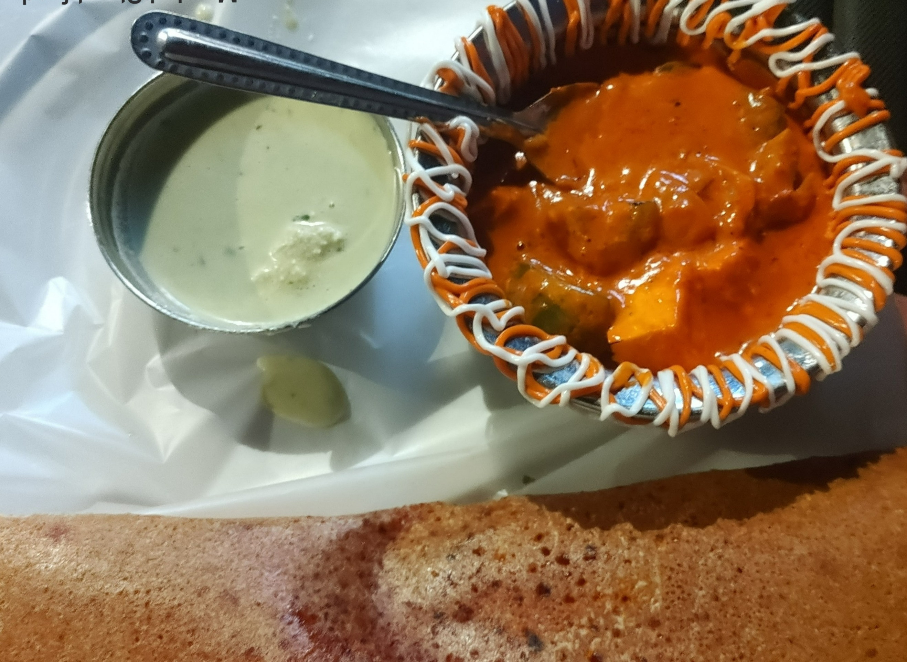
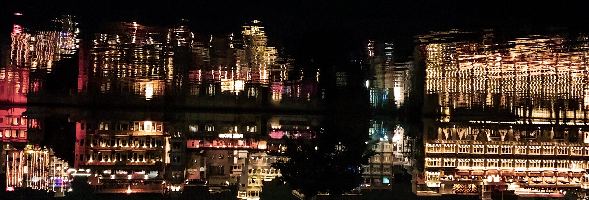
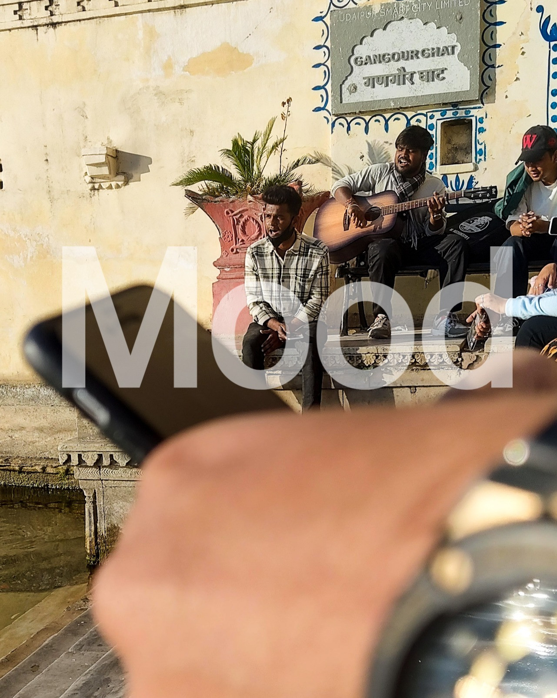
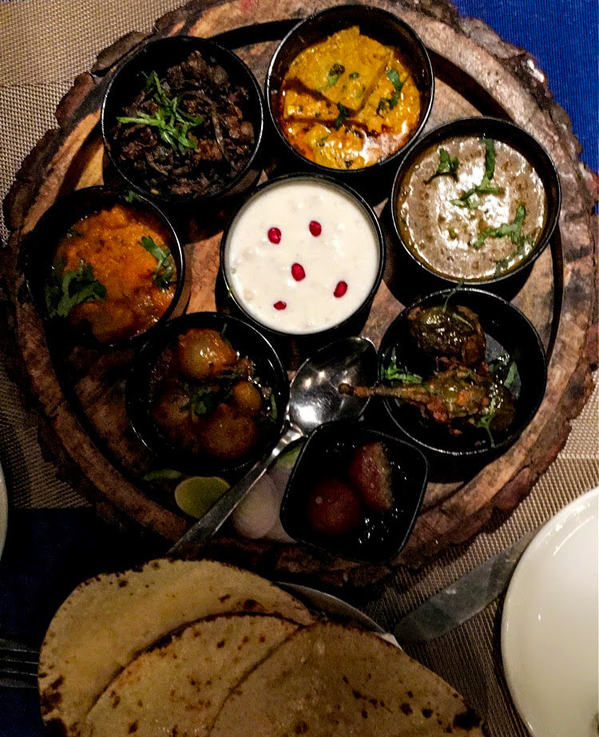

## Udaipur - First Day

Days before the celebration of the new year (2023), out of nowhere, my friend said he was heading to #Rajasthan. And I was like, "What? I want to go to north India as well. Let's go". I'm like the Betal 👻 of every friend Vikram who is ready to travel.

The search for trains starts. Our plan was to go to Udaipur and make other decisions from there. We still did not know what to do once we reach Udaipur, so we started putting some place together. At first it was like, we have so much time and we can go to any place. Once we started looking for places to go, there are so many! We asked many friends for suggestion. Each one told different places to visit. I was thinking of going to Agra Delhi if time permits. My friend had other plans and places. All these, we didn't even have a train booked or a bus.

We left for Mumbai. The plan was to catch the train from Mumbai at night, which will reach Udaipur at midday. It was my first time in Mumbai. It's a completely unique experience, local people, the place, street food, you cannot forget the trains. In about 9 hours of stay in Mumbai, it introduced me to a different lifestyle of people.

The local people of Mumbai are the unsung heroes of the city, and they play a vital role in keeping its spirit alive. From the street vendors and rickshaw drivers to the business executives. Train transport is one of the integral part of the localites. And one of the best street food experience I ever had.

We left for Udaipur at around 9 pm. Ahh.. the trains in Mumbai, a story for another time. A unique thing I noticed in Mumbai is the people's' spirit of working, despite problems and challenges. From street vendors selling delicious street food to small business owners offering unique and creative products. I don't think the city ever sleeps.

It was at around 2 in the middle of the day when we reached Udaipur. The city of lakes as it is known as, now I know why. The city is surrounded by lush hills and dotted with peaceful lakes, making it the perfect escape from the hustle and bustle of city life. As you approach Udaipur, the city's iconic palaces come into view, their white marble walls and intricate carvings reflecting in the tranquil waters of the lakes. It's cold out there, for someone who's seen only the hot weather of south India. I never thought I would see the temperature in a single digit.

We booked a room near lake Pichola. The view at all the time of the day is magnificent. In the morning, the sun floating above the lake in all its shine and still can't beat the cold. Chery on top is the screaming of the birds, in the background music of singers. At night, as the sun sets behind the majestic Aravalli Hills, watch the stars twinkle above, as the city lights create a glittering tapestry below.

For people getting married, this place is a go to spot for pre-wedding shoots. I saw some people singing romantic songs with the guitar, people feeding the birds.

Sit on the bank of the lake with your friends or loved ones and forget all things that are happening in your life. It's that peaceful. There is something magical energy in nature, the sound of splashing of water, the background music, the birds, the heat and cold just right for your comfort level. Heals all your worries and makes you ready for the next day.

We had plenty of time to spend, so we went out to hang out. My friend wanted to see the sunset from Karni Mata temple, but apparently I suck at navigation with google maps, so we had to settle to wander around the city.

So many art and artists come here to learn. Painting, crafting, knitting, music. Anything creative you think they have it. All displayed on the streets for sale and free to look. Even the street food is awesome. All fried and cold items. Dinner in a rooftop restaurant, you should to try the Rajasthani thali with five unique items and three different rotis.

## Next day
