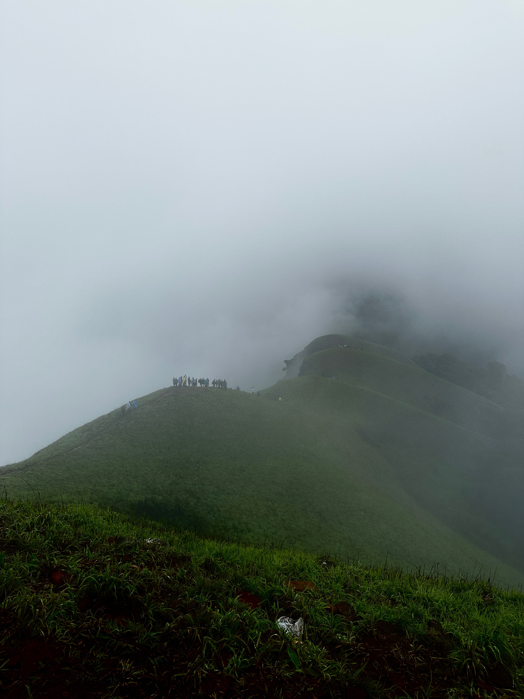
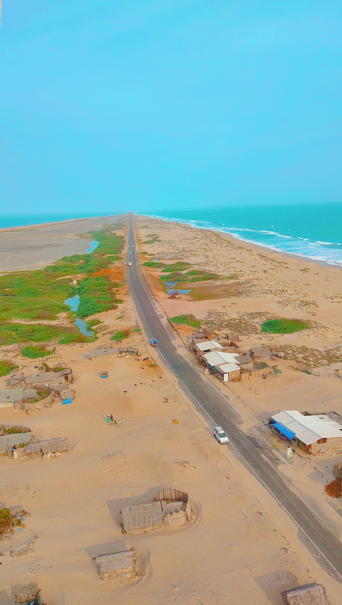
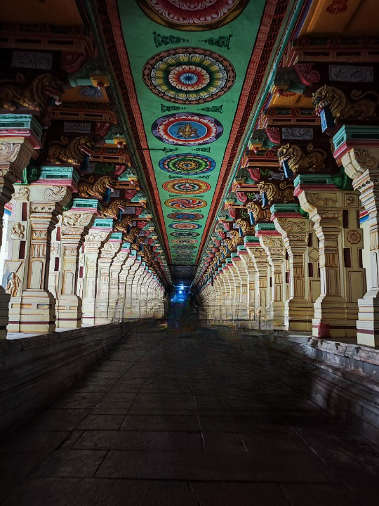

After all the yeses and nos, we were finally ready to embark on one of the most mesmerizing journey of our lives. The planning went for weeks and the night arrived, for which we all were waiting. Despite people being far and having work, we somehow gathered at one place to begin our journey. The journey needed that amount of preparation. We shopped for clothes, medicine, food, god knows what.

We had plenty of time till our vehicle arrives. We taunted, roasted, made fun of each other. By then, our ride has come. We hopped on to it. People were prepared for sleepless nights and the consequences that come with it.

We reached our stay. From there, the plan was to trek to Netravati peak. When the rain showered down, it felt like nature's tender caress, invigorating. The raindrops danced on leaves, and the fragrance of wet earth enveloped us in pure delight.

It was the perfect mixture of rain, thick fog, a hint of sunshine, and the birds chirping in the background. It felt like everything was just right, nature working in our favor. Nature's beauty seemed to unfold its secrets exclusively for us, as if it chose us to witness this mystical display. With fewer people around, we cherished the solitude until it lasts. As we ascended Netravati Peak, every step seemed like the last climb. The view from each vantage point was breathtaking, and we thought we had reached the pinnacle of beauty. But as we continued, the trail led us further, revealing that the true summit lay beyond.

It poured. Suddenly, like a magician's spell, the fog lifted, and before our eyes stood a breathtaking panorama of lush greenery and the magnificent nature. We danced in the crowd to old Kannada songs while we descend the peak, talking picture, sliding and falling in the wet mud. It was fun.

Next day it was time for another treck, RaniJhari. It's a viewpoint. It felt like as if we were walking into the heart of forest. We were just alone in the woods, no one else. At the top, a mixture of awe and fear gripped us tightly. The steep drop-offs and narrow ridges created a sense of fear. The magnificent view seemed to stretch infinitely.

There is a legend to the peak that Rani Padmini Devi jumped from here to escape from the Tipu Sultan of Mysore. And I started thinking. If I were to jump, I would look at the lush greenery and say, let's just step back and enjoy the view. At the top, it felt like we were in the air, floating through the clouds. The sound of rain and the feel of wet earth brought pure delight.

From there, we went to a nearby waterfall. As we were looking at the water falling down, sipping tea accompanied by Maggie, I felt a sense of completeness and joy. The soothing sound of the cascading water blended harmoniously with the laughter and chatter of our group. Laughter and joy echoed off the rocks as we splashed and played like carefree children.

We returned to our home stay and the usual, hanging out with friends and taunting eath other, playing cards.

The next day, we headed to Kuppalli, the birthplace of Kuvempu. We walked down to the village of Kuvempu's old house, lovingly called "Kavishaila". They fill the rooms of the house with memorabilia, manuscripts, and belongings of the poet, creating an intimate connection with his life and creative journey. Each corner seems to whisper tales of his literary pursuits and philosophical musings. How can one not be a poet when he is in this place? Now I know where his inspiration for all such beautiful creations would come from.

As our journey neared its end, a sense of incompleteness lingered within us. We realized that this feeling was a call to return and revisit it.

Until next time...

We had just recovered from the trip to Chikkamagaluru, and another one was awaiting our arrival—this time to Rameswaram. Just like other plans, we had postponed this one twice. After a month's gap, we finally secured two-way tickets to Rameswaram. The train was scheduled to depart around 9.15 pm from Bangalore. It takes a staggering 2 hours to reach Majestic by bus. We were already late to catch the bus, and to add to the chaos, it started raining. We started blaming each other for the mess. The bus arrived exactly at 9 pm to Majestic. We were all hungry and feared missing the train, so we did not eat anything while coming.

Fortunately or unfortunately, the train was delayed for 30 minutes, so we stopped to pack some food. As we looked at the timings, the train was delayed for another half hour. We waited and ate up all the food we packed. It's a 16 hour journey to Madurai. As usual, we began playing cards and teasing each other. We managed to get all six seats together. So you get the amount of noise we made till we slept.

At around 8 am, we reached Madurai. None of us can properly speak or read Tamil. It was still summer in Rameswaram (Monson has already begun in Banglore by this time). We were struggling to find a bus, we somehow got an auto and reached the bus stand. Another 4 hours of journey to reach Rameswaram. It was 2 pm we reached our hotel. From here our journey to visit all the temples, historic places and finally Dhanuskodi begin.

Rameswaram, known for its religious stories of Lord Rama, holds an eternal place in the hearts of devotees. His timeless tales are woven into the very fabric of the town, cherished and worshipped by its people. The sacred temples dedicated to Rama and Shiva stand as monuments of divine reverence. And the legend of Rama's valiant feat, building the "Rama Setu," bridges the gap between faith and history, echoing through the ages as a symbol of devotion and unwavering belief.

The road to Dhanushkodi seems to defy the might of the seas, a delicate bridge between two vast bodies of water. The road meanders through sandy stretches, flanked by the azure waters of the Bay of Bengal on one side and the turbulent waters of the Indian Ocean on the other. Beyond the ruins and the confluence, the Dhanushkodi Beach stretches into infinity, inviting us to lose ourselves in the ethereal beauty of the landscape.

From the nearby lighthouse, a panoramic view unfolds, offering a bird's-eye perspective of the coastline and the meeting point of the two mighty oceans. The rhythmic sound of waves crashing against the shore resonates through the air. Standing atop the lighthouse, one can witness the grandeur of nature in its full glory. The vastness of the ocean, the endless stretch of the beach. Sun dipped lower behind the clouds. Waters of the two seas reflected the colors of the setting sun.

En route to Dhanushkodi, we came across a train station and a church, both bearing the scars of a devastating cyclone that struck in 1964. The ruins stand as a poignant reminder of nature's true power and its ability to reshape the course of history. In these places, some people live, catching fishes and shells, attracting tourists to sustain their way of life.

After we reached Rameswaram, we started preparation for the next day. To visit the Ramanath temple. At sharp 5 am, some of us got up went to the beach to witness the sacred rituals of Rameswaram. Legend has it that Lord Rama himself established this divine abode to seek forgiveness for the sin of killing Ravana, a great devotee of Lord Shiva. The temple's significance is further enhanced by the belief that a pilgrimage to Rameswaram and a dip in the holy waters of the Agni Theertham will cleanse one's soul of all sins.

The temple of Ramanathaswamy is a celestial marvel. The temple's magnificent architecture showcases intricate carvings and towering entrances that stand as a testament to the artistic brilliance of ancient artisans.

We packed up our stuff and hoped on to an auto for our next destination. You get to go on the Pamban bridge on your return to Madurai. Looking down through the gaps in the bridge, we saw the shimmering waters below, as if inviting us to dive into the sea of memories we had created in Rameswaram. The Pamban Bridge is not just a means of transportation; it is a portal that takes you on a journey of emotions and reflections. With every passing moment, we felt a profound connection to the place we were leaving behind, and a sense of anticipation for the journey ahead.

It was around 6 pm we reached the temple of Meenakshi. In Madurai, the bustling streets blend with tradition and modernity. Flower markets, spice bazaars, and bustling shops offer a delightful sensory experience, showcasing the vibrant energy of the city.

We wandered through the temple, cherishing every moment. Inside, we discovered the grand Thousand Pillar Hall, where intricately carved pillars showcased exquisite sculptures of mythological scenes and celestial beings. The Nataraja temple left us in awe of its marvelous beauty.

As the lights softly glowed, signaling the end of our visit, we reluctantly prepared to depart.
