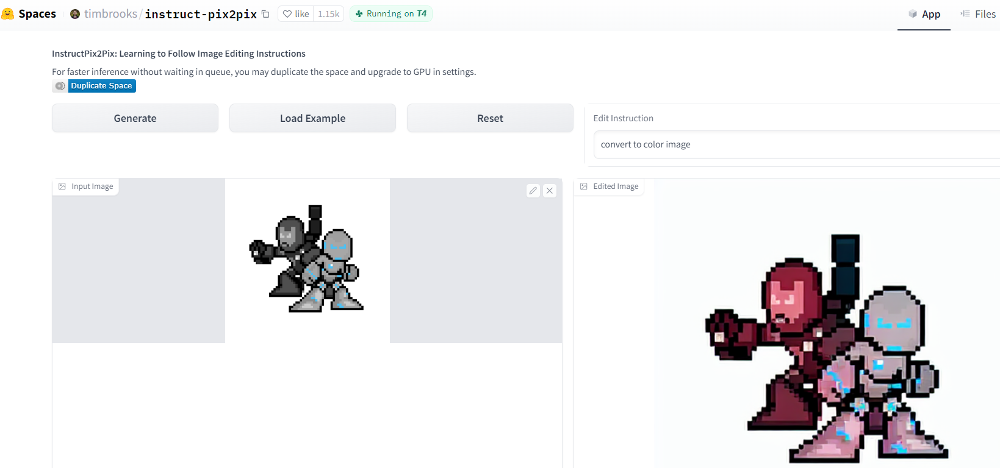
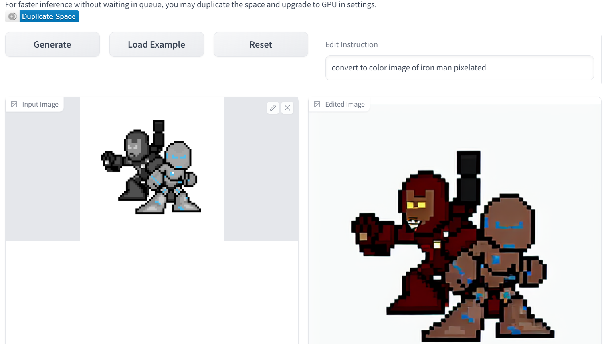
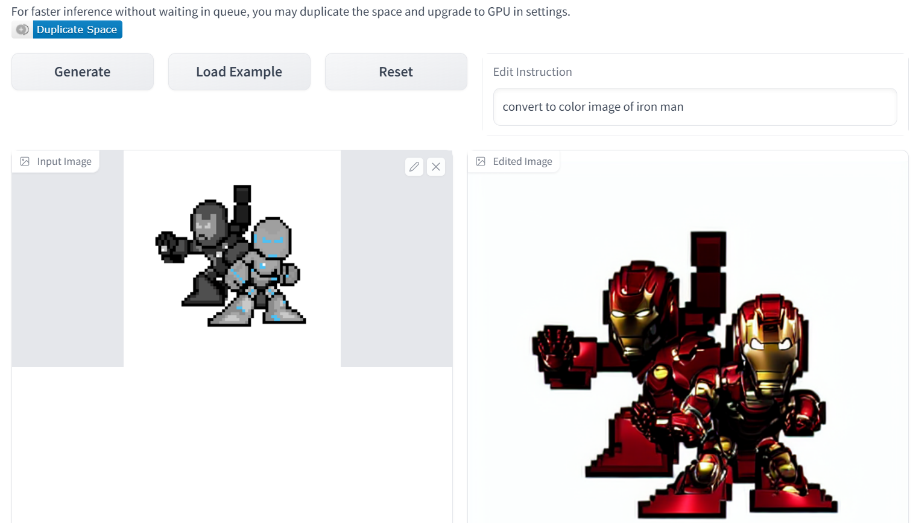
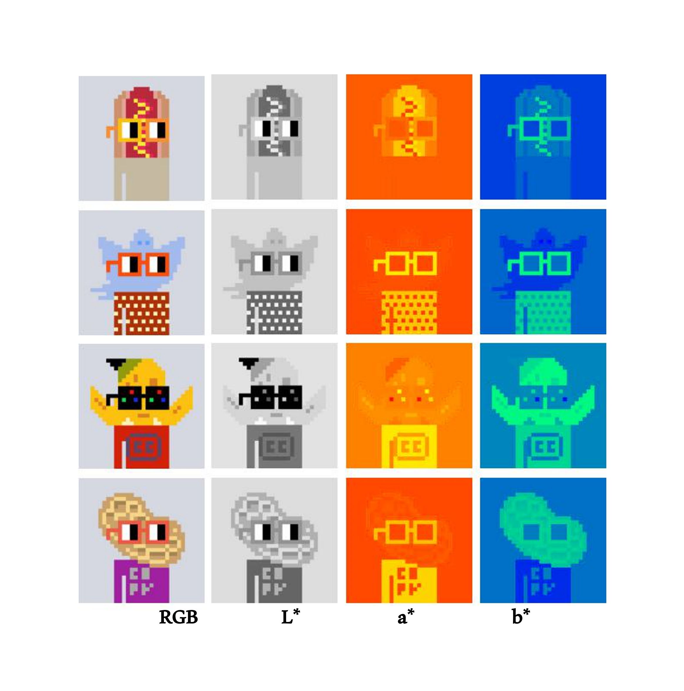
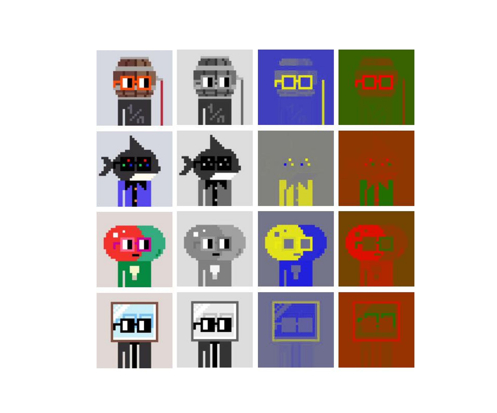
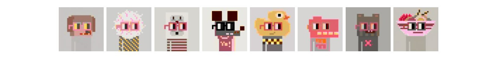

In the realm of artistry, where creativity and imagination intertwine, a captivating scene often begins as a humble sketch on paper. Though fascinating in their monochrome simplicity, these lines and contours often leave our minds yearning for a vivid splash of color.

Coloring sketches is a creative and artistic process, and AI is getting better at making such artistic work look easy. Here in this post, we will add that splash of color to our sketches using AI.

Many solutions are out there to color a sketch image. Some use [UNet](https://arxiv.org/abs/1505.04597)\-based Conditional [GANs](https://arxiv.org/abs/1411.1784). Some use just GANs.

In the previous [part](/blog/unconditional-image-generation/), we explored the basics of diffusion models (most of them). Let's proceed to add color to B&W images.

<mark>My main problem statement was clear. No extra information other than the gray image is provided to the model. No prompts, no color patches nothing</mark>. I spent almost 3 months to get satisfactory results. Numerous repositories attempt to address this problem statement. None of them worked for me.

The first idea that I had after learning conditional image generation with diffusion was to pass the gray image with 3 channels as input and let the model figure out the colors to add to each pixel. Add two loss functions one to guide the diffusion noise and the other to make the generated image have the color that is same as the RGB colors of the same gray image.

$$\mathcal{L_c} = \frac{1}{N} \sum_{i=1}^{N} d(U(x_{i}),\theta, \mathcal{t} )-x'_i$$

$$\displaylines{ where\ \mathcal{L_c} \ is \ color \ loss \\ d\ is\ the\ denoise\ function \\\mathcal{U}\ the\ unet\ model \ \\ x'\ is\ rgb\ image\ of\ the\ gray\ image\ x \\ }$$

Here, the gray image is **x** and its ground truth RGB image **x'**. ***d*** is the denoising function; the scheduler's [step](https://github.com/huggingface/diffusers/blob/1d686bac8146037e97f3fd8c56e4063230f71751/src/diffusers/schedulers/scheduling_ddpm.py#L353) function is modified a little. Which returns a less noisy image(***xi*** ) from the current noisy image, the noise(***θ*** ) predicted by the model and the current time step(***t*** ). The assumption was to make the output predicted by this function as close as it gets to the RGB image.

This assumption did not go well. There were many mistakes. The total loss did not converge. Inference did not yield any good results. All I got back was the gray images during inference and some added color *(we will see why, later)*. I tried tweaking the hyperparameters and model nothing worked. After a lot of wasted time, I gave up on the idea.

I studied some more papers and articles. I came across [**InstructPix2Pix**](https://huggingface.co/spaces/timbrooks/instruct-pix2pix). which edits your image based on the instructions. This is based on diffusion as well. So I had a simple idea, give the model a gray image and instruct it to convert back to the color image. `Try this yourself. Hashnode does not let me embed the direct link`.



But this again needs prompt engineering to get proper colors on characters. I thought `"convert to color image"` is a constant prompt for all the images. If I can modify the model it can learn this without any prompt. Additionally, If I can generate the text embeddings of the gray image, with [CLIP](https://github.com/fkodom/clip-text-decoder) or any other model that can be passed to the model as prompts without me explicitly writing any prompts could generate good results. This would provide some extra info about the image.



`"convert to a color image of Iron Man pixelated".` I thought that the info about Ironman in the image might give more details about the colors. It worked sometimes and it didn't often. This too crafted prompts for the embeddings might produce anything that I can not control. Below is the instance. Just removing word `"pixelated"` changes the output completely. The output is quite impressive though.



Running two models in a single GPU is quite prone to out-of-memory errors`OOM`. I had to drop this idea too.

The next thought was to use [ControlNet](https://huggingface.co/docs/diffusers/using-diffusers/controlnet) and [BBDM](https://arxiv.org/abs/2205.07680): Image-to-image Translation with Brownian Bridge Diffusion Models. Both address my problem statement perfectly. Fine-tuning with the pre-trained model would have resulted in the output I was looking for. [BBDM](https://arxiv.org/abs/2205.07680) paper unlike classical diffusion models adds noise not to get complete Gaussian noise at the end of timestep (t=T), but to get the Image(To be precise, to the image latent) of the other domain. So my domain A can be the grayscale images and domain B can be the RGB counterpart for those images.

But this did not fit my budget😁😂😭. It consumed too much GPU memory and time to train, errors etc, so I scrapped both ideas.

I read more about converting black-and-white images to color images, and I found an article; [color-diffusion](https://medium.com/@erwannmillon/color-diffusion-colorizing-black-and-white-images-with-diffusion-models-269828f71c81). It used a different type of representation of images. instead of using RGB channels to represent images. It uses something called [CIELAB](https://en.wikipedia.org/wiki/CIELAB_color_space); This breaks an image into 3 channels, a grayscale kind of channel that represents the lightness value, and two channels that represent how much red, green, blue and yellow each pixel should have. It's like selecting HSV values instead of RGB. Visit this site for an intuition [link](https://colorizer.org/).





The above is a near-close representation of `Lab*` image.(Idk why it is noted like that). I used `Matplotlib.pyplot` to plot both visualizations. L\* represents the brightness or intensity of the color. A higher L\* value indicates a lighter color and a lower value indicates a darker color. *a represents the values on the green-to-red axis. Positive values represent shades of red, and negative values represent shades of green. b\** represents the values on the blue to yellow axis. Positive values represent shades of yellow, and negative values represent shades of blue. Values of channel a\* and b\* range from -128 to 127 and L\* range from 0 to 100. `But somehow conversion from LAB to RGB with`[`scikit-image`](https://scikit-image.org/docs/stable/api/skimage.color.html#skimage.color.lab2rgb)`throws an error saying values are not in range even if they are`

You can see in both images, the change in the pixel values in the blue-yellow and red-green axis. I have shown two images using different [cmap](https://matplotlib.org/stable/users/explain/colors/colormaps.html#choosing-colormaps), the second one is closer to the actual representation of the LAB image. Unfortunately, I did not come across any tool to confirm the accuracy of these representations. Eventually, all screens render RGB values, and at the end, any LAB image is converted back to RGB it seems.

Now I had a method to represent any image as structure (L) and color (ab). I needed a different way of representing images. In the previous attempt at directly using RGB images, I used gray images with 3 channels, assuming the model would figure out the colors for RGB channels with color loss. It didn't. It learned to generate gray images back.

According to the color-diffusion article. The model learns to understand **ab** channels only. Noise is added to these 2 channels, and L is not learned. However model takes L channels as well to properly add colors according to the lightness values.

```python
            ...
            # Split image to L and ab channel
            images = batch["rgb"]
            l = rgb_images[:, :1]
            ab = rgb_images[:, 1:]

            # Sample noise to add to the ab channel
            noise = torch.randn(ab.shape).to(device)
            bs = images.shape[0]

            # Sample a random timestep for each image
            timesteps = torch.randint(
                0,
                noise_scheduler.config.num_train_timesteps,
                (bs,),
                device=device,
            ).long()

            # Combine L and noisy ab channels
            noisy_images = torch.cat(
                [l, noise_scheduler.add_noise(ab, noise, timesteps)], dim=1
            )

            with accelerator.accumulate(model):
                # Predict the noise residual on ab channel
                noise_pred = model(        # 2 channels
                    noisy_images,          # 3 channels
                    timesteps,
                    return_dict=False,
                )[0]
                # noise pred is only on last 2 channels
                loss = F.mse_loss(noise_pred, noise)
                ...
```

The UNet is modified to take 3-channel images as input and return 2-channel images to predict the added noise on **ab** channels. Just note that during inference, grayscale images are utilized, having been converted to LAB rather than RGB.

```python
def transform_stc(batch):
    tfms = transforms.Compose(
        [
            transforms.Resize((config.image_size, config.image_size)),
             transforms.ColorJitter(
              brightness=0.3, contrast=0.1, saturation=(1.0, 2.0), hue=0.05
            ),
            transforms.ToTensor(),
        ]
    )
    # train images
    rgb_images = [
        tfms(I.fromarray(rgb2lab(image.convert("RGB")).astype(np.uint8)))
        for image in batch["image"]
    ]
    # eval / test images
    gray_images = [
        tfms(I.fromarray(rgb2lab(image.convert("L").convert("RGB")).astype(np.uint8)))
        for image in batch["image"]
    ]
    return {"rgb": rgb_images, "gray": gray_images}
```

After some modifications to the 🤗 [ddpm\_pipeline](https://github.com/8bitnand/Blogs/blob/2c3d2eb9199efe0a3990d644ddea0375ab83a990/Image%20generation/unconditional%20image%20generation/part%20%3A2%20-%20B%26W%202%20color/ddpm_pipeline.py).py function for evaluation, I got some convincing results.



These are not as vibrant as the training dataset. Maybe running more iterations might have improved the results. I stopped training after 60 epochs. The conversion from LAB to RGB drove me crazy during the inference. I thought the training had collapsed. I was getting too bright images with no proper colors. Turns out that the range requirements for conversion from LAB to RGB were wrong.

There are still some improvements to be made. Till then enjoy.

%[https://huggingface.co/nand-tmp/gray2color_on_m1guelpf_nouns/blob/main/README.md]

%[https://github.com/8bitnand/Blogs]

`This was supposed to be the first part of the blog. But nothing had worked at the time. The initial dataset was scraped from the internet stock images, but due to model size and other constraints, I ended up using these pixelated images. I thought of dropping the project plenty of times. But here we are😉.`
