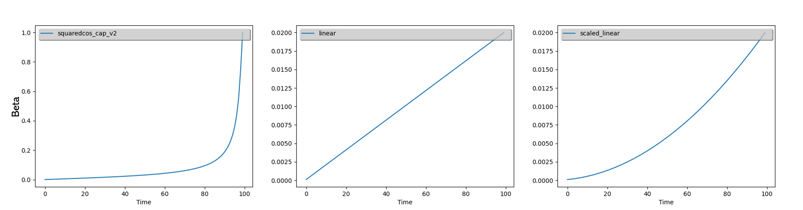
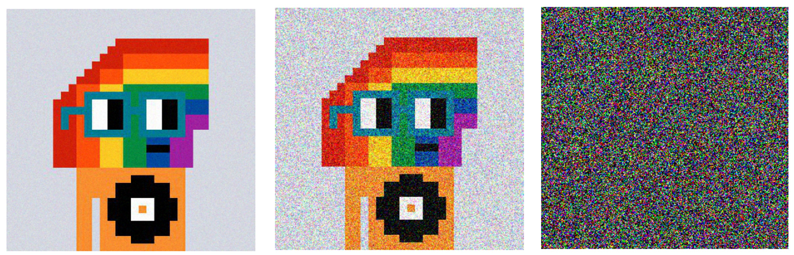

I know I'm late for the party. It's been a long time since the diffusion models have been introduced. There have been massive improvements in image generation since I have known image generation with ML, from [GANs](https://en.wikipedia.org/wiki/Generative_adversarial_network) to diffusion models. So it's time to have some fun with AI. As there are multiple tutorials explaining the workings of diffusion models ([link](https://huggingface.co/datasets?task_categories=task_categories:unconditional-image-generation&sort=trending), [link](https://huggingface.co/docs/diffusers/tutorials/basic_training)) we will do something a little different.

This idea for me to work on diffusion started when I learned we could control image generation with a condition. Like a depth map, edge of images or from another image without any prompt. So I thought why not convert black and white images to color images? Or generate images from sketches. But before that, we need to understand how diffusion works (unconditional for our use case).

The main idea behind diffusion is that we train a model to predict the amount of noise we add during the forward diffusion process. Unlike GANs, where the noise is converted to (or removed from) an image in a single shot, diffusion models iteratively remove the Gaussian noise during the inference.

The core of diffusion models relies on the [UNet](https://en.wikipedia.org/wiki/U-Net) architecture. When training, we introduce noise into an image, and the model's job is to predict this added noise. The way we add this noise follows a specific schedule, and I've made use of the [DDPMScheduler](https://huggingface.co/docs/diffusers/v0.8.0/en/api/schedulers) from Hugging Face, which offers various noise addition strategies, including linear, scaled linear, and squared cosine.

$$x_t = \sqrt{1 - \beta_t} x_{t-1} + \sqrt{\beta_t} \epsilon$$

The idea is to transform our training image into pure Gaussian noise at the end of the iteration. Our iteration starts from `0` to `T`. at time `t=0`, all we have are pure images from the training sample. At time `t=T`, which is the last iteration/timestep, we should have pure Gaussian noise. `Beta` is a parameter, we increase the value based on the scheduling rule. See the below plots.



`Xt` is the image at time step t and `Xt-1` is the image at time step `t-1`. The noise added at timestep `t` is dependent on the amount of noise at timestep `t-1`. `Beta` controls the amount of information kept from the previous noisy image and `epsilon.` *(random noise tensor sampled from Gaussian distribution)*

$$q(x_{t}|x_{t-1}) = \mathcal{N}(x_{t}; \sqrt{1 - \beta_{t}} x_{t-1}, \beta_{t} I)$$

The below images are some samples from noise sampled along 100 timesteps, according to `squaredcos_cap_v2`, at t = 0, 50, 99. You can see that the initial image transforms into pure noise at the end of the timestep. This is called the forward diffusion process donated by `q`. This is done by the noise scheduler's `add_noise` function [#](https://github.com/huggingface/diffusers/blob/16a32c9dab03d41204120b63cdae71c40b279bdf/src/diffusers/schedulers/scheduling_ddpm.py#L310).



These cute pixelated images are from the training dataset, taken from 🤗 [dataset](https://huggingface.co/datasets/m1guelpf/nouns). We will train our mode to generate these images and see a visualization of removing noise.

So how is this noise removed?

We have the original image, noise and noisy image (image after introducing noise), timestep t. The UNet takes the noisy image and timestep and predicts the amount of noise added to the original image. We train the model to predict this added noise. In the reverse diffusion process, we use this model to remove the noise to get a less noisy image from pure noise. Iterating this process from timestep `t=T` to `t=0`. Till we get the image that looks like the one from the training set [#](https://github.com/huggingface/diffusers/blob/16a32c9dab03d41204120b63cdae71c40b279bdf/src/diffusers/schedulers/scheduling_ddpm.py#L216).

```python
# https://huggingface.co/docs/diffusers/tutorials/basic_training
timesteps = (0, T)
for t in timesteps:
    noise_predected = UNet(image, t)
    # 2. compute previous image: x_t -> x_t-1
    image = noise_scheduler.step (noise_predected, t, image)
```

The timestep is necessary coz; the model has to know how much noise to remove in each iteration from the previous image according to the variance schedule `(beta)`.

Let's get some cool GIFs, of noise being converted to our pixelated dataset and how I trained the diffusion model. The code is largely influenced by [resources](https://huggingface.co/docs/diffusers/tutorials/basic_training).

let's walk through the changes I made.

%[https://gist.github.com/8bitnand/ade2d6d5e2a7dfd3193e1baaa7b32e1f]

I tried the stable diffusion v1.5 model but it was an overload for the task I am doing and does not fit in the memory without optimizations. So the [repo](https://huggingface.co/mrm8488/ddpm-ema-butterflies-128) has a pre-trained model on butterflies that gets our job done. Load the UNet model from this pipeline. Load the [m1guelpf/nouns](https://huggingface.co/datasets/m1guelpf/nouns) dataset from the Huggingface. Launch your training. After about 62 epochs you have a diffusion pipeline ready to generate images.

%[https://gist.github.com/8bitnand/fea25507ffb5d0ab72d9590c0e7d5a15]

And as promised the GIFs.


The entire [Source code](https://github.com/8bitnand/Blogs/tree/1dcca96f7709b9059d5412463a87243af5fb5ba1/Image%20generation/unconditional%20image%20generation/part%20%3A1%20-%20diffusion) is available. You can modify and change according to your use case

Let's look at the images generated by my model.

%[https://youtu.be/tc5Ytkv5LA0]
